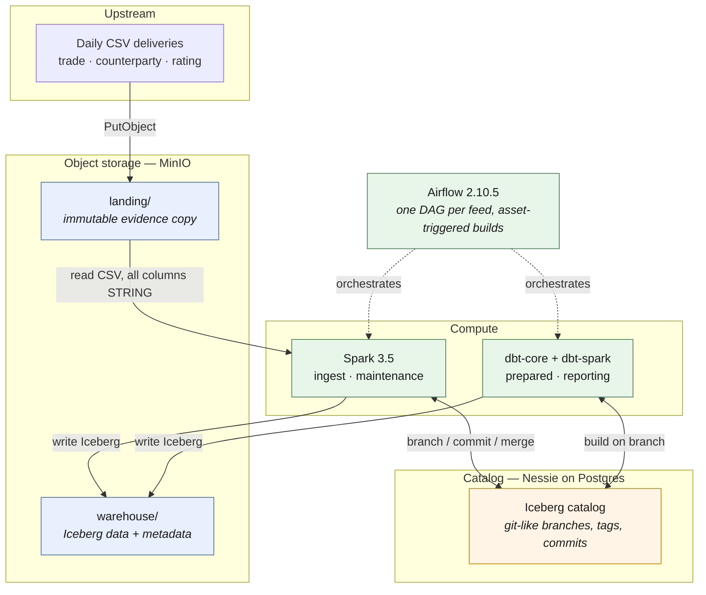
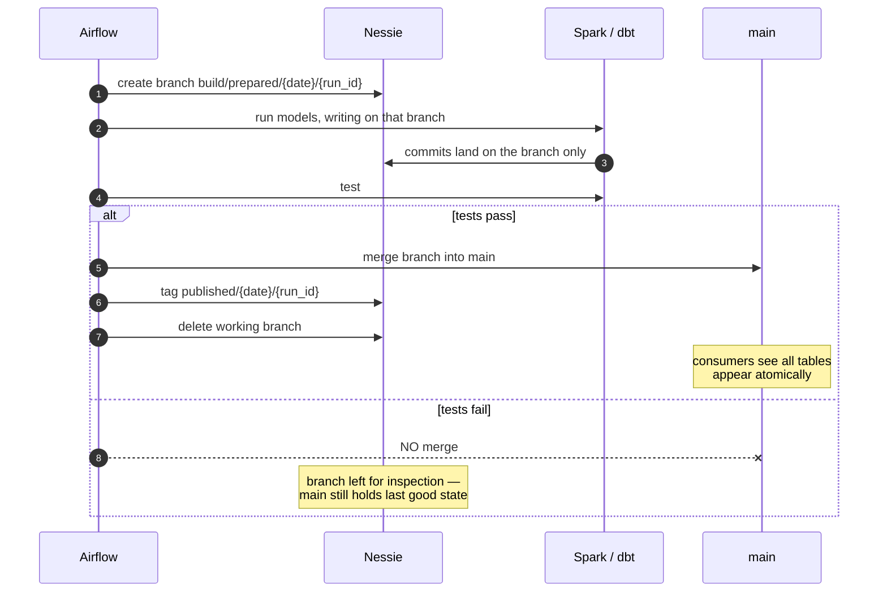
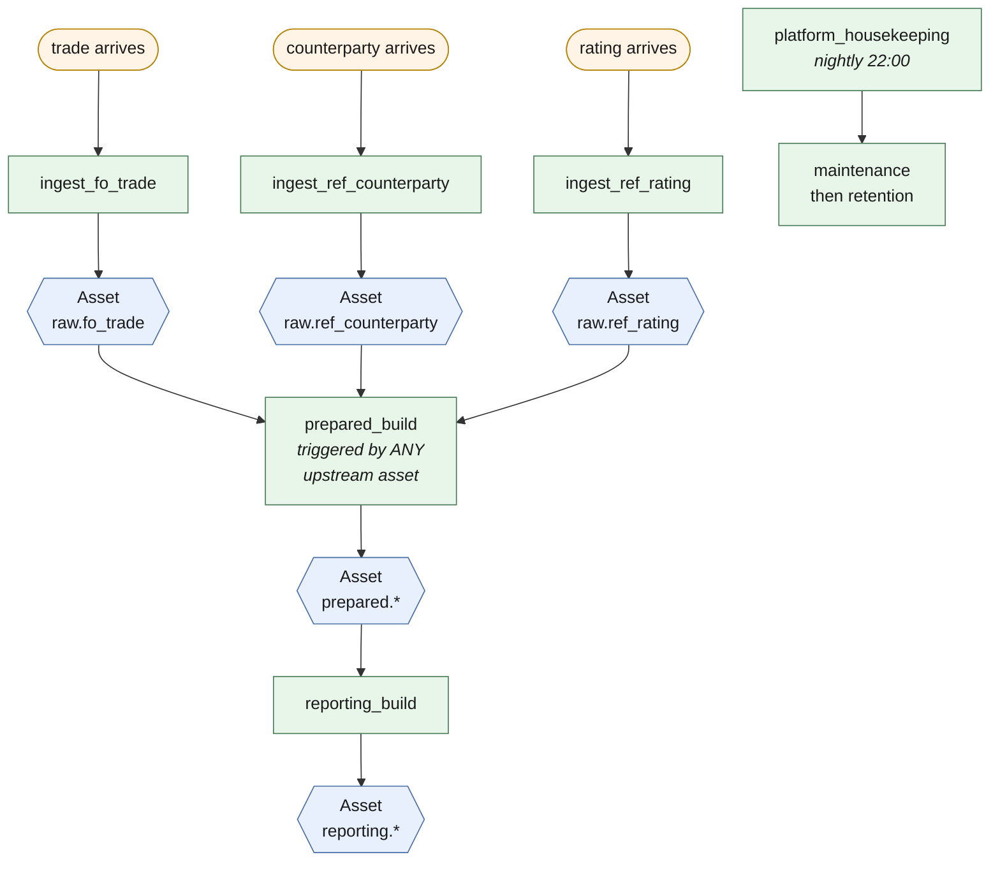

# Reporting Platform — Local Full-Stack Approximation

> **Empty project.** No feeds, no models: `feeds.yml` has an empty `feeds:`
> list and `dbt/models/` holds only the schema-file skeletons. The platform,
> its macros, the console, the inbox watcher, retention, maintenance and the
> build DAGs are all intact and wait for the first feed. Examples below name
> feeds that no longer exist; they are illustrative.
> See [docs/ADDING-A-FEED.md](docs/ADDING-A-FEED.md).


A laptop-runnable approximation of the target lakehouse: on-prem S3-compatible
object storage, OpenShift compute, Airflow, Iceberg, Nessie, dbt and Spark —
replacing the legacy ETL / RDBMS / scheduler ingest-and-report chain.

**What it does:** consumes daily upstream CSVs → lands them immutably in object
storage → loads to Iceberg `raw` → builds a conformed `prepared` layer → builds
several reports from `reporting`, all sharing one lineage graph → maintains the
Iceberg tables → enforces retention equivalent to the legacy "10 working days
plus 80 month-ends" partition-switch job.

## Architecture

Every component here has a 1:1 counterpart in the OpenShift target, so the code
that runs locally is the code that runs in the cluster — only configuration
changes. See [docs/OPENSHIFT-MAPPING.md](docs/OPENSHIFT-MAPPING.md).



### Layer model

Each layer has one job. The rule that shapes everything: **a load must never
fail because a value was unparseable** — it must land, and then fail a *test*.

```mermaid
flowchart LR
    A["<b>landing</b><br/>CSV as received<br/><i>never rewritten</i>"]
    B["<b>raw</b><br/>Iceberg, 1:1<br/><i>every column STRING</i>"]
    C["<b>prepared</b><br/>typed, conformed<br/>deduplicated"]
    D["<b>reporting</b><br/>marts sharing<br/>one lineage graph"]
    E["<b>serving</b><br/>RDBMS export<br/><i>not implemented</i>"]

    A -->|"Spark ingest<br/>+ lineage columns"| B
    B -->|"dbt: cast, trim,<br/>null-normalise, test"| C
    C -->|"dbt: ref() the<br/>shared spine"| D
    D -.->|"gated on the<br/>same asset"| E

    classDef done fill:#e8f5e9,stroke:#4a7c59,color:#1a1a1a
    classDef todo fill:#f5f5f5,stroke:#999,color:#666,stroke-dasharray:5
    class A,B,C,D done
    class E todo
```



Casting happens in `prepared`, not at load, so a bad value fails a test instead
of aborting a 3am load. Every `raw` row carries `_business_date`,
`_ingest_ts`, `_source_file`, `_file_version`, `_row_number` and `_batch_id` —
the lineage back to the exact delivery.

### Write-audit-publish

This is the safety net the whole design leans on. Every ingest and every dbt
build runs on a Nessie **branch**; publication is a merge, and a merge only
happens if the tests passed. `main` never holds a half-built or failed state.



Three things this buys that the legacy RDBMS never did cheaply: **atomic multi-table
publication** (a nine-table refresh is one merge, so consumers never see a
half-built mart), **rollback** (reset `main` to the prior commit — the data
files are still there), and **reproducibility** (re-run a report as at a commit
hash, so "what did we publish on the 5th?" is answerable).

### Orchestration

Requirement: *each feed must be processed as soon as it is received.* So there
is no nightly batch — one DAG per feed, generated from `feeds.yml`, and builds
triggered by Airflow **assets** rather than by schedule.



#### Inside a build: one task per dbt model

`prepared_build` and `reporting_build` are not two `dbt run` / `dbt test`
shell-outs any more. [Astronomer Cosmos](https://astronomer.github.io/astronomer-cosmos/)
reads the dbt project and **renders one Airflow task per model**, wired in the
models' own `ref()` order, with a test task closing the layer:

```
open_branch ─► dbt.ref_counterparty_run ┐
            ├─► dbt.ref_rating_run      ├─► dbt.dbt_test ─┬─► publish
            ├─► dbt.fo_trade_run       │                 └─► keep_failed_branch
            └─► dbt.ref_collateral_run  ┘
```

The shape of the build is unchanged — branch, build, test, merge only if clean
— but a broken model is now a red task **carrying that model's name**, and a
clear-and-retry restarts from the model that failed rather than from the top of
the layer.

The graph is derived from the dbt project on every DAG parse, so **a new
`.sql` file under `models/prepared/` becomes a new task by itself**, with no
DAG edit — the same property `feeds.yml` already had for ingest DAGs. Verified
live: a model added to the project appeared as a task within one parse
interval.

Three settings in `dbt_builds.py` are load-bearing rather than stylistic
(`InvocationMode.SUBPROCESS`, the `lakehouse_write` pool on every rendered
task, and `LoadMode.DBT_LS`); the module docstring explains what each one
prevents and what went wrong without it.

A late feed does not block the feeds that did arrive — the reporting layer
carries forward the last good version of that dimension and a freshness test
flags it. That is a deliberate behavioural change from the legacy scheduler's gated model
and needs report-owner sign-off.

## Component versions

Everything is pinned. Several of these pins are load-bearing — they were
arrived at by something breaking, and the "why" column says which. Check
the notes in this table before moving one.

| Component | Version | Pinned in | Why this version |
|---|---|---|---|
| **Airflow** | **2.10.5** (python3.11) | `Dockerfile.airflow` | **Not 3.x, deliberately.** Under Airflow 3.0.2 no DAG run here could ever complete: tasks ran, logged, returned values and pushed xcom, and the scheduler never recorded them. Airflow 2's LocalExecutor writes the result straight to the metadata DB. |
| **Spark** | **3.5.3** (Scala 2.12, JDK 11) | `Dockerfile.spark` | Must match the Iceberg and Nessie Spark runtimes below, which are published per Spark minor. `pyspark` in the Airflow image is pinned to the same 3.5.3. |
| **Nessie** | **0.99.0** | `docker-compose.yml`, `Dockerfile.spark`, `Dockerfile.airflow` | Server, Spark extensions and the `nessie-gc` CLI jar must all be the same version. Serves REST API v2 (spec 2.2.0) and an Iceberg REST catalog. |
| **Apache Iceberg** | **1.6.1** | `Dockerfile.spark`, `dbt/profiles.yml` | `iceberg-spark-runtime-3.5_2.12` and `iceberg-aws-bundle`. |
| **Postgres** | **16** | `docker-compose.yml` | Backs both the Airflow metadata DB and the Nessie version store. Nessie is JDBC-backed rather than in-memory on purpose, so the local stack exercises the same version-store path as the cluster. |
| **MinIO** | `RELEASE.2024-09-22T00-33-43Z` | `docker-compose.yml` | Stand-in for the on-prem S3-compatible store. `mc` is pinned separately for the bucket-init job. |
| **dbt-core** | **1.8.7** | `Dockerfile.airflow` | Held back deliberately. It is what every DAG runs on and what has been validated; a bump needs a planned re-verification of both layers, not an opportunistic one. |
| **dbt-spark** | **1.8.0** (`[PyHive]`) | `Dockerfile.airflow` | The only dbt adapter installed — see below. |
| **astronomer-cosmos** | **1.15.1** | `Dockerfile.airflow` | Renders the dbt project into Airflow tasks. Installed `--no-deps`, and that is **not** an optimisation: installing it under Airflow's constraint file downgrades `typing_extensions` 4.16 -> 4.12, and dbt's `mashumaro` needs `evaluate_forward_ref` from 4.13+, so **every dbt invocation dies at import** — in dbt, not in cosmos, and not until something runs dbt. The image build now runs `dbt --version` as a smoke check so that can never ship silently again. |
| **DuckDB** | **1.5.5** | `Dockerfile.airflow` | For `scripts/duckdb_console.py` only. 1.1.3's iceberg extension has no catalog `ATTACH` at all and fails with `Binder Error: Unrecognized storage type "ICEBERG"`. |
| **Hadoop AWS / AWS SDK** | 3.3.4 / 1.12.262 | `dbt/profiles.yml`, `reporting_platform/common/context.py` | S3A filesystem for reading landing CSVs. Deliberately **not** baked into `Dockerfile.spark`: the driver resolves it via `spark.jars.packages` and ships it to the executors, so there is one place the version is set. |

**There is no `dbt-duckdb`, on purpose.** Spark is the only build engine —
a build has to land on a Nessie branch and only the Spark path can address one
— so the DuckDB adapter had nothing left to do, and its presence made
`dbt --version` report `duckdb: 1.9.6 - Not compatible!` at anyone debugging.
DuckDB itself stays as a **read-only query tool** for analysts and developers
(`scripts/duckdb_console.py`). The reasoning is in
[docs/ARCHITECTURE.md](docs/ARCHITECTURE.md#engine-strategy-spark-runs-the-pipeline-duckdb-serves-people).

Two version rules worth stating separately, because breaking either is quiet
rather than loud:

- **Nessie server, Nessie Spark extensions and `nessie-gc.jar` move together.**
  They are three artefacts of one release.
- **Iceberg and Spark minors are coupled.** `iceberg-spark-runtime-3.5_2.12`
  exists because Spark is 3.5 and Scala is 2.12; changing either means
  changing the artefact name, not just the version.


## Documentation

| Document | Read it for |
|---|---|
| **[docs/QUICKSTART.md](docs/QUICKSTART.md)** | **clone → running stack → data published to `reporting`, in nine commands. Start here.** |
| [docs/ARCHITECTURE.md](docs/ARCHITECTURE.md) | layer model, Nessie write-audit-publish, per-feed DAG topology, why Spark is the only build engine |
| **[docs/ADDING-A-FEED.md](docs/ADDING-A-FEED.md)** | the five files a new feed touches, in order, with a worked example |
| **[docs/ADDING-A-MODEL.md](docs/ADDING-A-MODEL.md)** | the two files a new dbt model touches, and why Cosmos means there is no DAG to edit |
| [docs/FEED-UI.md](docs/FEED-UI.md) | the feed console on :8082 -- the same five files through a form, plus land/ingest/build buttons |
| [notebooks/explore.py](notebooks/explore.py) | marimo notebook on :8083 — query landing files and every Iceberg layer through one read-only DuckDB session |
| [docs/RETENTION.md](docs/RETENTION.md) | the two-stage delete model, why tags are data retention, policy config |
| [docs/MAINTENANCE.md](docs/MAINTENANCE.md) | the five Iceberg procedures, ordering, metric-driven triggering |
| [docs/OPENSHIFT-MAPPING.md](docs/OPENSHIFT-MAPPING.md) | what changes on promotion, and the three things that genuinely differ |
| [docs/DEV-PROCESS.md](docs/DEV-PROCESS.md) | ticket-to-prod path, why dbt and DAG changes carry different risk, the CAB digest gate |

## Layout

```
docker-compose.yml        MinIO, Nessie, Postgres, Spark, Airflow
reporting_platform/            the platform library (NOT named `platform` — that
  config/                 shadows a Python stdlib module)
    feeds.yml             feed registry — adding a feed edits only this
    retention.yml         retention policy, per environment
    maintenance.yml       maintenance thresholds
  common/                 config loading, Spark session, Nessie REST client,
                          business-date keep-set calculation
  ingest/                 arrival detection + CSV -> raw Iceberg
  maintenance/            metric-driven compaction, manifests, deletes
  retention/              branch/tag/row/snapshot/orphan expiry, in order
airflow/dags/
  feed_ingest.py          one DAG per feed, generated from feeds.yml
  dbt_builds.py           asset-triggered prepared and reporting builds;
                          the dbt tasks inside them are rendered by Cosmos
  platform_housekeeping.py  nightly maintenance then retention
dbt/                      prepared + reporting models, tests, exposures
docs/                     architecture, retention, maintenance, OpenShift
                          mapping, dev process
scripts/
  generate_feeds.py       sample feed generator
  land_feeds.py           landing helper
  bulk_ingest.py          ingest everything pending, in subprocess batches
  _ingest_chunk.py        one batch within a single JVM
  _open_build_branch.py   open a throwaway Nessie build branch for a manual
                          write-audit-publish test
```

---

# Manual walkthrough

*In a hurry? [docs/QUICKSTART.md](docs/QUICKSTART.md) is the same journey in
nine commands, with the URLs and credentials collected in one table. This
walkthrough is the version that explains why.*

`make up` will start everything, but working through it by hand once is worth
the twenty minutes — most of the design decisions only become obvious when you
watch a stage happen. Each step says what to look at and why.

## 0. Prerequisites

Docker with ~8 GB available, and Python 3.11+ on the host for the seed
generator. Everything else runs inside containers.

```bash
cp .env.example .env
```

**`make` is optional and is not present on a stock Windows box.** The
`Makefile` and the "Automated route" below are a convenience wrapper; every
step of this walkthrough is a plain `docker compose` command that works
without it. Where a section names a `make` target it also gives the raw
equivalent. On Windows use Git Bash for anything with single-quoted JSON in it
— PowerShell mangles the quoting — or run the equivalent from the PowerShell
examples.

## 1. Generate sample upstream data

```bash
python3 scripts/generate_feeds.py --months 30 --end 2026-08-19 --out seed
```

Pass `--end` explicitly. It defaults to `date.today()`, and every filename and
date below is derived from it — leave it off and the specific files this
walkthrough names will not be the ones you get. `make seed` pins the same date.

30 months matters. You cannot meaningfully test "10 business days plus 80
month-ends" against three days of data, and retention bugs that only appear at
month boundaries are exactly the ones that reach production.

The generator deliberately injects the awkward cases — read its docstring. It
includes a re-delivered date, an absent counterparty feed, an orphan
counterparty reference, an unparseable notional, and a new upstream column
appearing partway through. Each one exercises a specific design decision.

```bash
ls seed/fo_trade | tail -5        # note TRADE_20260813_v2.csv
head -1 seed/ref_counterparty/CPTY_20260810.csv   # note lei_code appeared
ls seed/ref_counterparty/CPTY_20260817.csv        # absent: the late-feed case
```

## 2. Start storage and catalog only

```bash
docker compose up -d minio minio-init postgres nessie
```

Wait for Nessie, then look at an empty catalog:

```bash
curl -s http://localhost:19120/api/v2/config | python3 -m json.tool
curl -s http://localhost:19120/api/v2/trees | python3 -m json.tool
```

One branch, `main`, at the empty hash. Everything that follows is commits
against this — the catalog is version-controlled in exactly the way the SQL
Server schema never was.

MinIO console: http://localhost:19001 (`minioadmin` / `minioadmin123`).

## 3. Start compute

```bash
docker compose up -d --build spark-master spark-worker airflow
docker compose logs -f airflow | grep -m1 "Airflow is ready"
```

Airflow: http://localhost:8081 (`admin` / `admin`). Spark: http://localhost:8080.

Create the pool that serialises lakehouse writes. This is not optional —
`remove_orphan_files` running concurrently with a write corrupts the table:

```bash
docker compose exec airflow airflow pools set lakehouse_write 1 "serialise all Iceberg writers, incl. maintenance"
```

**One pool, not two.** Ingest, dbt builds and nightly maintenance all contend
for this single slot. An earlier version created a second `iceberg_maintenance`
pool, which looked deliberate but enforced nothing: a task belongs to exactly
one pool, so two one-slot pools run happily in parallel with each other and the
corruption window stayed open.

## 4. Land one file, by hand

Resist the urge to load everything. Land a single day:

```bash
docker compose exec airflow python -m scripts.land_feeds \
  --source /opt/platform/seed --feed ref_counterparty --limit 1
```

Look at it in MinIO under `lakehouse/landing/ref_counterparty/`. This object is
immutable and is never rewritten. It is the evidence copy — the thing that lets
you answer "what did upstream actually send us" without asking upstream.

## 5. Ingest it, by hand

```bash
docker compose exec airflow python -m reporting_platform.ingest.ingest_feed \
  --feed ref_counterparty \
  --object landing/ref_counterparty/CPTY_20240229.csv
```

Watch what the output tells you, then check the catalog:

```bash
curl -s http://localhost:19120/api/v2/trees | python3 -m json.tool
```

The ingest branch was created, written to, merged into `main`, and deleted. If
you want to see it mid-flight, run the same command with `--dry-run` — the
branch is created and left behind.

Now query the raw table and look at what landed:

```bash
docker compose exec spark-master /opt/spark/bin/spark-sql -e \
  "SELECT * FROM lakehouse.raw.ref_counterparty LIMIT 5"
```

Note that **every source column is a string**. That is deliberate. Casting
happens in dbt, in `prepared`, where a bad value fails a *test* rather than
aborting a *load*. Note also the `_` metadata columns: `_business_date`,
`_file_version`, `_source_file`, `_batch_id`. Those are the lineage back to the
exact delivery.

## 6. See re-delivery handled

Land and ingest both versions of the same trade date:

```bash
docker compose exec airflow python -m scripts.land_feeds \
  --source /opt/platform/seed --feed fo_trade

docker compose exec airflow python -m reporting_platform.ingest.ingest_feed \
  --feed fo_trade --object landing/fo_trade/TRADE_20260813.csv
docker compose exec airflow python -m reporting_platform.ingest.ingest_feed \
  --feed fo_trade --object landing/fo_trade/TRADE_20260813_v2.csv

docker compose exec spark-master /opt/spark/bin/spark-sql -e \
  "SELECT _business_date, _file_version, count(*)
   FROM lakehouse.raw.fo_trade WHERE _business_date = DATE '2026-08-13'
   GROUP BY 1,2 ORDER BY 2"
```

Both versions are present. Nothing was overwritten. The `prepared` layer picks
the latest version (see `dedupe_rank` in `dbt/macros/engine.sql`), and retention
removes superseded versions later, after a grace period. This is the behaviour
the legacy `stg` truncate-and-load could not give you.

## 7. Load the rest

```bash
docker compose exec airflow python -m scripts.land_feeds --source /opt/platform/seed
```

Then either trigger the ingest DAGs from the Airflow UI, or loop:

```bash
for f in counterparty rating trade; do
  docker compose exec -T airflow python - <<PY
from reporting_platform.common.context import feed
from reporting_platform.ingest.arrival import find_pending
from reporting_platform.ingest.ingest_feed import ingest
fd = feed("$f")
for key in find_pending(fd):
    print(ingest(fd.name, key)["business_date"], key)
PY
done
```

Watch for the schema-drift warning when it reaches the first file containing
`lei_code`. The load did not fail; the column landed in `_extra_columns` and you
got a warning. That is the intended behaviour — a new upstream column should
never stop the pipeline at 3am, it should produce a ticket.

## 8. Build the prepared layer

Build on a branch, not on `main`. That is the whole write-audit-publish point,
and it is what makes the next paragraph true rather than hypothetical — a
failed build must leave `main` untouched. `_open_build_branch.py` opens a
throwaway branch off `main` and prints its name:

```bash
docker compose exec airflow dbt deps --project-dir /opt/platform/dbt --profiles-dir /opt/platform/dbt

branch=$(docker compose exec -T airflow python -m scripts._open_build_branch)
docker compose exec -T airflow dbt build --project-dir /opt/platform/dbt --profiles-dir /opt/platform/dbt \
  --select path:models/prepared --vars "{nessie_ref: $branch}"
```

In PowerShell the capture is `$branch = (docker compose exec -T airflow python
-m scripts._open_build_branch).Trim()`.

**The tests will fail, and that is the point of the exercise.** The generator
injected a trade referencing `CP99999`, which is absent from the counterparty
feed, and an unparseable notional. You should see:

- `relationships` failing on `trade.counterparty_id`
- `not_null` failing on `trade.notional`

In the legacy chain the first would have been an the legacy ETL tool lookup failure that
aborted the load, and the second a conversion error. Here the data landed, the
test failed, and the build stayed on its branch — `main` still holds the last
good state. Nobody saw a wrong number. Leaving that branch unmerged *is* the
correct outcome; `airflow/dags/dbt_builds.py` is the same logic under the
scheduler, where the merge is conditional on the test task succeeding.

To proceed through the walkthrough, either fix the seed data or re-run with
`--exclude-resource-type test` — keeping `--vars "{nessie_ref: $branch}"` so
you are still on the branch.

## 9. Build the reporting layer

Same branch, so `reporting` can see the `prepared` models built in step 8 —
they exist on that branch, not on `main`:

```bash
docker compose exec -T airflow dbt build --project-dir /opt/platform/dbt --profiles-dir /opt/platform/dbt \
  --select path:models/reporting --vars "{nessie_ref: $branch}"
```

Then look at what shared lineage bought you:

```bash
docker compose exec airflow dbt ls --project-dir /opt/platform/dbt --profiles-dir /opt/platform/dbt \
  --select +exposure_change
```

`exposure_by_country` and `exposure_change` both `ref()`
`counterparty_exposure` rather than re-deriving exposure from `prepared`.
Change the exposure definition once and every report moves together. That is
the specific thing the legacy reporting estate cannot do today, and the
reason the metadata-catalog gap in the PoC is worth closing with dbt's manifest
rather than a separate register.

```bash
docker compose exec airflow dbt docs generate --project-dir /opt/platform/dbt --profiles-dir /opt/platform/dbt
docker compose exec airflow dbt docs serve --project-dir /opt/platform/dbt --port 8082
```

## 10. Publish, then look at the day-over-day report

Steps 8 and 9 built on a branch, so nothing is on `main` yet — that is the
audit stage doing its job. Publishing is the merge:

```bash
docker compose exec -T airflow python -c \
  "from reporting_platform.common.context import Nessie; Nessie().merge('$branch', into='main')"
```

Only merge a build whose tests you are content with. If you left the two
injected failures in place, this is exactly the merge the DAG would have
refused — do it here only because the walkthrough needs data on `main` to
continue, and understand that is the discipline being deliberately bypassed.
Alternatively skip the merge and query at the branch instead, by appending
`@<branch>` to the table name as in step 13.

```bash
docker compose exec spark-master /opt/spark/bin/spark-sql -e \
  "SELECT business_date, change_category, count(*), round(sum(mtm_change),0)
   FROM lakehouse.reporting.exposure_change
   GROUP BY 1,2 ORDER BY 1 DESC, 2 LIMIT 20"
```

Note `prior_month_end_mtm` is populated — that only works because retention
keeps 80 month-end dates alongside the 10 recent business days. Shorten
retention to a rolling window and this column silently becomes null. There is a
`not_null` test with `severity: warn` on it for exactly that reason.

## 11. Collect maintenance metrics

Before doing any maintenance, look at the state:

```bash
docker compose exec airflow python -m reporting_platform.maintenance.maintain \
  --all-managed --dry-run
```

Read `manifest_count`, `max_files_per_partition` and `avg_file_size_mb`.

**The degradation here is manifest sprawl, not small data files** — which is
worth understanding, because it is not the one people expect. Each business
date is its own partition (`days(_business_date)`), and each was ingested as a
single file, so you get roughly *one data file per partition*: already optimal,
with nothing for compaction to combine. But every one of those 55 ingests
committed its own manifest, and manifest-level partition pruning degrades as
that list grows.

Measured on the seed data: 55 data files across 54 partitions, and **55
manifests**.

Now act on it:

```bash
docker compose exec airflow python -m reporting_platform.maintenance.maintain \
  --all-managed
```

Re-run the `--dry-run` and compare. `manifest_count` collapses from 55 to **1**.
`total_files` does *not* move, and `rewritten_data_files_count` is 0 — that is
compaction correctly declining to do pointless work, not a failure. Small data
files would show up if a partition accumulated several deliveries; the `_v2`
redelivery date is the only one here with 2 files.

The general lesson: read the metric that actually moved. A maintenance job
reporting "compacted" while rewriting zero bytes has still done nothing, and
the number proving this run was worth making is `rewritten_manifests_count`.

## 12. Retention, dry run first

**Always dry-run retention before letting it delete anything.**

`--all-managed` is every table the platform maintains, taken from
`context.managed_tables()` — the same list `platform_housekeeping` uses, so
the manual command and the nightly job cannot disagree. `--table fqn:layer` is
still there for one-off work.

```bash
docker compose exec airflow python -m reporting_platform.retention.retention \
  --all-managed \
  --dry-run
```

Check `retained_dates` and `oldest_retained` against what you expect: 10 recent
business dates plus every month-end in the generated history. Confirm the count
before running for real.

```bash
docker compose exec airflow python -m reporting_platform.retention.retention \
  --all-managed
```

Then verify the storage actually dropped, in MinIO. If dates were expired but
bytes did not move, something is still pinning the files — almost always a
Nessie tag. That is the failure mode `docs/RETENTION.md` warns about and the
`storage_report` task in the housekeeping DAG exists to catch.

**Expect bytes not to move yet, and expect that to be correct.** Nessie GC
defers its deletes (`defer_deletes: true`), so a run identifies files and
removes nothing until `nessie-gc deferred-deletes` is run by hand.
 `storage_report` says so explicitly rather than failing
for why asserting on the bytes alone could never work here.

Storage health is also watched from *outside* Airflow, because a task inside
the housekeeping DAG cannot report that DAG being down:

```bash
docker compose logs --tail 20 watchdog
docker compose exec -T watchdog python -m reporting_platform.monitoring.watchdog
```

## 13. Time travel

```bash
curl -s http://localhost:19120/api/v2/trees | python3 -m json.tool | grep published
```

Every publication tagged `main`. Query as at a tag:

```bash
docker compose exec spark-master /opt/spark/bin/spark-sql -e \
  "SELECT count(*) FROM lakehouse.reporting.\`counterparty_exposure@published/2026-08-13/<run_id>\`"
```

This is the answer to "what exactly did we publish on the 5th" — a question
that currently requires restoring a the legacy RDBMS backup.

---

## 14. Through the scheduler — the asset cascade

Everything up to here ran from the command line. That proves the **tasks**; it
says nothing about the **wiring**, and the wiring is what the topology diagram
above is actually claiming. This section is how you see it.

### First: unpause the DAGs

**Airflow pauses every DAG at creation.** Nothing in this repo overrides that,
so on a fresh clone every DAG sits paused and no asset cascade can fire,
however much data you land. This is the single easiest way to conclude the
platform does not work.

Unpause them by asking Airflow what exists rather than by naming them:

```bash
docker compose exec -T airflow airflow dags list -o plain | awk 'NR>1 {print $1}' |
  xargs -n1 docker compose exec -T airflow airflow dags unpause
docker compose exec -T airflow airflow dags list -o plain
```

That loop used to be a hard-coded list of DAG ids, and **it had already gone
stale**: adding a feed made one more ingest DAG than the list named — so anyone
following this page left that feed paused and had no reason to suspect it. The set of DAGs is
derived from `feeds.yml`, so any list written down beside it is a copy waiting
to drift.

The last column is `is_paused`; every row should read `False`. In the UI
(http://localhost:8081, `admin` / `admin`) it is the toggle on the left of each
row.

The `ingest_*` DAGs are `schedule=None` — they run only when triggered or when
a file arrives — so unpausing them starts nothing on a timer.
`platform_housekeeping` is nightly at 22:00.

You do **not** need to create the write pool by hand any more. `airflow-init`
runs `airflow pools set lakehouse_write 1` on every `docker compose up`, along
with `dbt deps`. Both were manual steps whose omission broke the platform
*silently*: no pool meant every task sat `queued` forever with nothing
anywhere saying why, and no `dbt_packages` now means `prepared_build` and
`reporting_build` do not even **import**, because Cosmos renders them by
running `dbt ls`. Confirm it landed:

```bash
docker compose exec -T airflow airflow pools list -o plain
```

**One pool, deliberately** — ingest, dbt model tasks and maintenance all take
the same slot. Two one-slot pools would not exclude each other, which is
exactly the bug that once let `remove_orphan_files` run alongside a write.
`make pools` re-runs it by hand if you ever need to.

### Then: land one file and watch the chain

The point is that **you trigger one thing and three run.** Hold a trade file
back from section 7, land it, and trigger only the ingest:

```bash
docker compose exec -T airflow airflow dags trigger ingest_fo_trade -r demo1
```

`ingest_fo_trade` writes `raw.fo_trade` and updates its **asset**. `prepared_build`
is scheduled on *any* raw asset, so it starts on its own; it updates the
prepared asset, and `reporting_build` starts on its own in turn. Watch:

```bash
docker compose exec -T airflow airflow dags list-runs -d prepared_build -o plain
docker compose exec -T airflow airflow dags list-runs -d reporting_build -o plain
```

**The evidence is in the run_id.** A run you started by hand is
`manual__…`; one the scheduler started off an asset is
`dataset_triggered__…`. If you only ever see `manual__`, the cascade is not
firing and the whole per-feed topology is unproven — that distinction is the
entire point of this section.

Each build opens its own Nessie branch, tests on it, and merges to `main` only
if the tests pass. Watch that too:

```bash
curl -s http://localhost:19120/api/v2/trees | python3 -m json.tool
```

A `build/prepared/...` branch that outlives the run is a build whose tests
failed — that is `keep_failed_branch` doing its job, and `main` is untouched.

### Housekeeping: maintenance, retention and reclamation

Nightly in normal operation; trigger it by hand to watch it. **Dry run first
— this is the DAG that deletes things.** The conf JSON needs a shell that
does not mangle quotes (bash, not PowerShell):

```bash
docker compose exec -T airflow airflow dags trigger \
  platform_housekeeping -r hk_dry -c '{"dry_run": true}'
```

Then for real, once you have read what the dry run reported:

```bash
docker compose exec -T airflow airflow dags trigger platform_housekeeping -r hk_real
```

### Three traps that will cost you an afternoon

- **Do not use `airflow dags test`.** It creates a real DAG run, and with
  `max_active_runs=1` that blocks the next one. Killing your local
  `docker compose exec` does *not* kill the process inside the container — it
  carries on and finishes the run later — and deleting the run's rows out of
  the metadata DB corrupts the record rather than removing it. Use
  `dags trigger` with your own `-r` run id.
- **Wait on your own run id, not the first row of `list-runs`.**
- **A run stuck in a non-terminal state wedges everything.** With
  `max_active_runs=1` the scheduler spins on it and starves every other DAG;
  the symptom is DAGs sitting `queued` with `start=None`. Look for the stale
  run first — it has been the cause every time, never the executor.

### Is it healthy?

The watchdog runs as its own container and deliberately depends on no Airflow
service, so it still answers when the scheduler is down:

```bash
docker compose logs --tail 20 watchdog
docker compose exec -T watchdog python -m reporting_platform.monitoring.watchdog
```

Exit code 0 is healthy; non-zero means at least one ALERT.

### Looking at the data without starting Spark

For "what is actually in these tables", a read-only DuckDB session against
published `main` answers in about a second:

```bash
docker compose exec -T airflow python -m scripts.duckdb_console --tables
docker compose exec -T airflow python -m scripts.duckdb_console \
  "select business_date, count(*) from lakehouse.prepared.fo_trade
   group by 1 order by 1 desc limit 5"
```

It is read-only by design and cannot build anything — see
[docs/ARCHITECTURE.md](docs/ARCHITECTURE.md) for why Spark is the only build
engine.


## Automated route

```bash
make up seed land pools deps build
make maintenance-metrics
make retention-dry
```

`make help` lists everything. **Needs GNU Make**, which a stock Windows box
does not have; without it, run the walkthrough's `docker compose` commands
directly — `make -n <target>` prints what a target would run, if you have make
somewhere else to read it with.

**This route does not touch Airflow.** It builds on `main` from the command
line, which is convenient for a throwaway stack and is *not* the
write-audit-publish pattern the platform is built around — the Makefile says
so at the `build` target. To exercise the orchestration, and the asset
cascade that the topology diagram is really claiming, do section 14.

---

## What this is not

Being explicit about the gaps, since the point of a proof is to be honest about
what it does and does not prove:

- **Not performance-representative.** One Spark worker on a laptop against
  MinIO tells you nothing about cluster throughput. Sizing figures in
  `OPENSHIFT-MAPPING.md` are starting points, not measurements.
- **Not the real arrival mechanism.** Polling a landing prefix stands in for
  the DFS/SFTP problem, which is discussed but not solved here.
- **Was not tested end-to-end by the original author, and wasn't working when
  first run for real.** It has since been brought up against a live stack and
  eleven genuine defects found and fixed — wrong Nessie API request shapes, a
  JVM heap leak in bulk ingest, missing dbt/Spark catalog wiring, two
  cross-engine SQL portability bugs, a schema-naming mismatch, and a retention
  bug that deleted in-flight build branches. Every one was found by running the
  thing, not by reading it.

  **Validated now:** ingest (144 seed files, 30,680 rows), the prepared layer,
  the reporting layer, and retention in dry-run.
  **Not validated:** any DAG run through Airflow's actual scheduler,
  `maintenance.py`, retention for real, and publishing a build to `main`.
  **Known open defect:** the two Airflow pools do not mutually exclude, so
  maintenance can overlap a write.

  The docs above describe the design; run it to see what it does —
  read it before trusting any claim in this file. `CLAUDE.md` is the
  orientation for picking the work up fresh.
- **No serving-layer export.** The Postgres `serving` database is created but
  nothing writes to it. The PoC's DuckDB→pyodbc→the legacy RDBMS export would slot in
  after `reporting_build`, gated on the same asset.
- **No semantic layer.** The design constraint that the BI tool must be
  replaceable means a semantic layer belongs between `reporting` and the tool.
  Lightdash reads dbt metadata directly, which is why it is a candidate — but
  that is a decision this repo deliberately leaves open.
- **No masking.** Non-prod currently carries production data. The place to add
  it is a `prepared`-layer variant selected by `REPORTING_ENV`, before anything
  reads from it.
