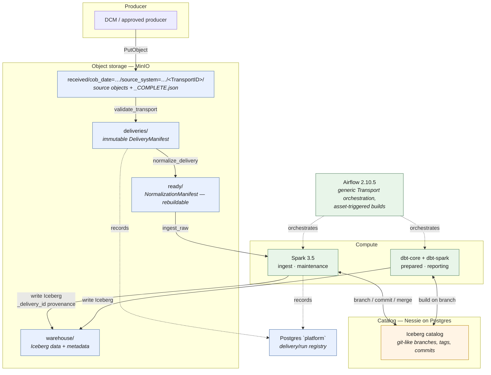
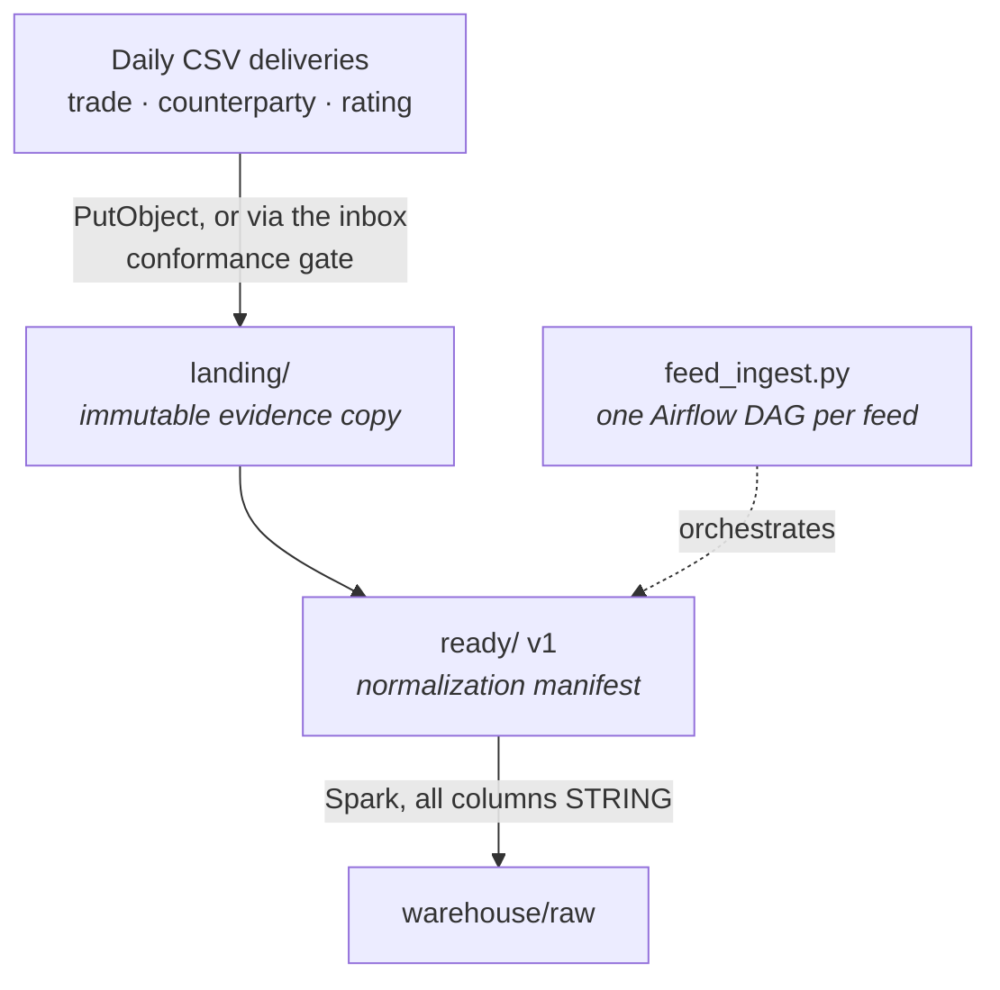
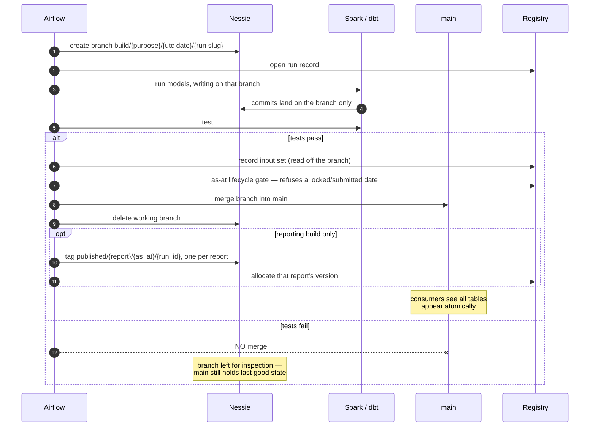
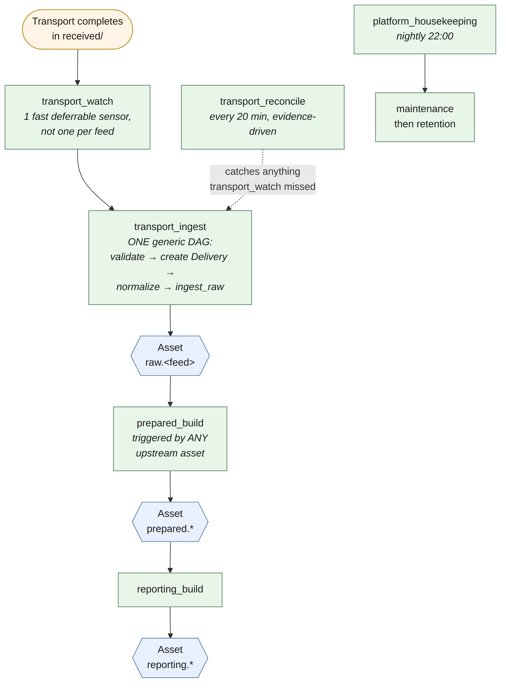
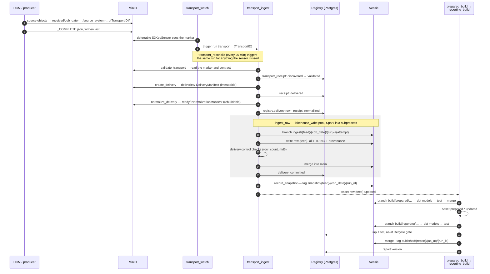
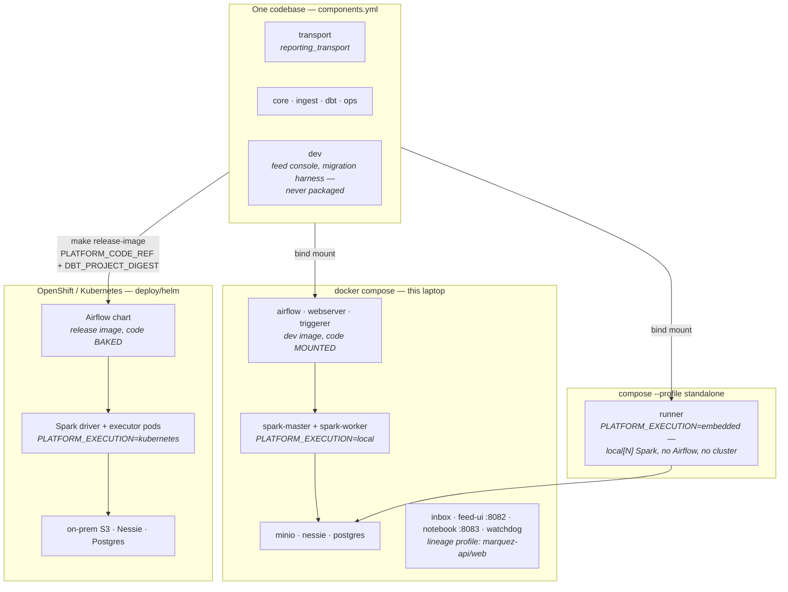
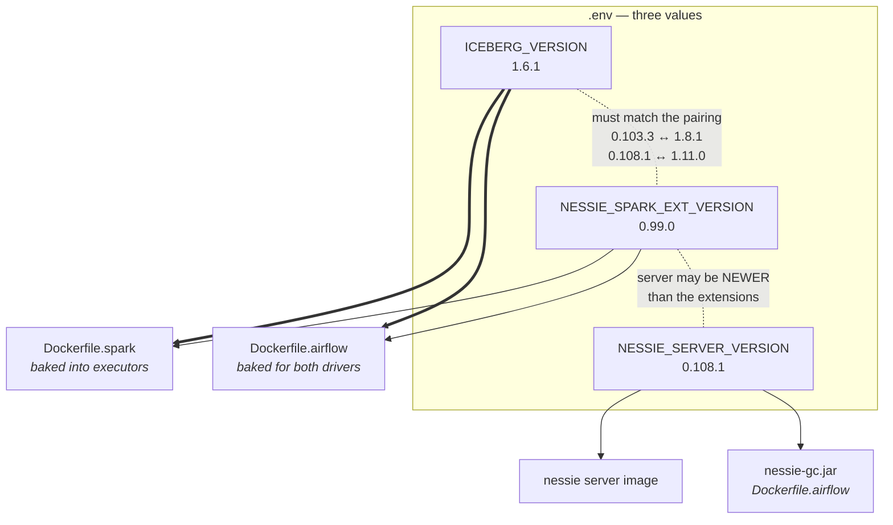

# Reporting Platform — Local Full-Stack Approximation

A laptop-runnable approximation of the target lakehouse: on-prem S3-compatible
object storage, OpenShift compute, Airflow, Iceberg, Nessie, dbt and Spark —
replacing the legacy ETL / RDBMS / scheduler ingest-and-report chain.

**What it does:** DCM (or another approved producer) hands off a **Transport**
into `received/` → the platform turns it into an immutable **Delivery** →
**normalizes** it into a Spark-readable form → ingests it into Iceberg `raw` →
builds a conformed `prepared` layer → builds several reports from `reporting`,
all sharing one lineage graph → maintains the Iceberg tables → enforces
retention equivalent to the legacy "10 working days plus 80 month-ends"
partition-switch job. A **legacy compatibility path** (`inbox` → `landing` →
`raw`) is retained alongside it — see [Legacy compatibility path](#legacy-compatibility-path)
below — and a Phase 8 **dual-run migration** capability can compare the two
for a feed that is cutting over; see [docs/MIGRATION.md](docs/MIGRATION.md).

## Architecture

Every component here has a 1:1 counterpart in the OpenShift target, so the code
that runs locally is the code that runs in the cluster — only configuration
changes. See [docs/OPENSHIFT-MAPPING.md](docs/OPENSHIFT-MAPPING.md).

This is the **current, primary path** — how a Delivery reaches a published
report. The identity model (TransportID → DeliveryID → RunID → ReportVersion)
and the object-store namespaces are defined precisely in
[ARCHITECTURE.md](docs/ARCHITECTURE.md#identity-model) and
[ARCHITECTURE.md](docs/ARCHITECTURE.md#object-store-namespaces).



### Legacy compatibility path

The platform also still runs an older path — `inbox` (legacy sender
conformance) → `landing/` (evidence copy) → `ready/` v1 (normalization
manifest) → `raw`, orchestrated by **one Airflow DAG per feed**
(`airflow/dags/feed_ingest.py`, generated from `feeds.yml`) instead of the
generic Transport DAGs above. It is retained because:

- it is how every feed onboarded before Phase 6 still runs, and existing
  local workflows/tests exercise it;
- Phase 8's dual-run migration compares the Transport path's output against
  it for a feed that is cutting over (`migration.mode: dual_run` on the
  feed — see [docs/MIGRATION.md](docs/MIGRATION.md));
- it is a staged strangler migration, not a permanent second architecture —
  new feeds should be onboarded onto the Transport path
  (see [docs/ADDING-A-FEED.md](docs/ADDING-A-FEED.md)), not this one.



### Layer model

Each layer has one job, and this part is identical whichever path fed `raw` —
Transport or the legacy `landing` path. The rule that shapes everything: **a
load must never fail because a value was unparseable** — it must land, and
then fail a *test*.

```mermaid
flowchart LR
    A["<b>received / landing</b><br/>source objects as sent<br/><i>never rewritten</i>"]
    B["<b>raw</b><br/>Iceberg, 1:1<br/><i>every column STRING</i>"]
    C["<b>prepared</b><br/>typed, conformed<br/>deduplicated"]
    D["<b>reporting</b><br/>marts sharing<br/>one lineage graph"]
    E["<b>serving</b><br/>RDBMS export<br/><i>not implemented</i>"]

    A -->|"Spark ingest<br/>+ lineage columns"| B
    B -->|"dbt: cast, trim,<br/>null-normalise, test"| C
    C -->|"dbt: ref() the<br/>shared spine"| D
    D -.->|"gated on the<br/>same asset"| E

    classDef done fill:#e8f5e9,stroke:#4a7c59,color:#1a1a1a
    classDef todo fill:#f5f5f5,stroke:#999,color:#666,stroke-dasharray:5
    class A,B,C,D done
    class E todo
```



Casting happens in `prepared`, not at load, so a bad value fails a test instead
of aborting a 3am load. Every `raw` row carries `_cob_date`, `_ingest_ts`,
`_source_file`, `_file_version`, `_row_number` and `_batch_id`, added by both
paths. **A Transport-path row also carries `_delivery_id`, `_received_at`,
`_schema_version` and `_source_system`**, and joins to `registry.delivery` on
`_delivery_id`. Those four are added to a table and never backfilled, so
older rows read NULL.  `_delivery_id` is the
Delivery's identity; `_source_file` is only the physical object Spark read,
and a historical row that predates the Transport path falls back to it. See
[ARCHITECTURE.md#raw-provenance](docs/ARCHITECTURE.md#identity-model) for the
full distinction.

### Write-audit-publish

This is the safety net the whole design leans on. Every ingest and every dbt
build runs on a Nessie **branch**; publication is a merge, and a merge only
happens if the tests passed. `main` never holds a half-built or failed state.



All of this is `reporting_platform/transform/wap.py`. The build DAGs only call
it, and `python -m reporting_platform.transform` runs the same functions
without Airflow. An **ingest** follows the same branch → merge pattern. It
cuts a different tag, `snapshot/{feed}/{cob_date}/{run_id}`, on the commit its
own merge made. An ingest is not a publication. Only a reporting build cuts
`published/…`, and a **report** is a dbt *exposure*, not a model.

Three things this buys that the legacy RDBMS never did cheaply: **atomic multi-table
publication** (a nine-table refresh is one merge, so consumers never see a
half-built mart), **rollback** (reset `main` to the prior commit — the data
files are still there), and **reproducibility** (re-run a report as at a commit
hash, so "what did we publish on the 5th?" is answerable).

### Orchestration

Requirement: *each Delivery must be processed as soon as it is received.* So
there is no nightly batch, and — for the Transport path — **no per-feed DAG
either**: one generic Airflow DAG serves hundreds of Feed definitions, and a
Feed's specific behaviour is configuration/domain logic (`feeds.yml`), not a
bespoke DAG. Events optimise latency; reconciliation preserves correctness.



The scaling model is deliberately **hundreds of Feed definitions → generic
Transport orchestration → one DAG run per Transport/Delivery**, not hundreds
of Feed definitions → hundreds of ingestion DAG definitions. Full design in
[docs/AIRFLOW-ORCHESTRATION.md](docs/AIRFLOW-ORCHESTRATION.md).

#### One Transport, end to end

The diagram above shows the wiring. This one shows a single run over time:
what each step writes, and where it writes it. Every arrow into object
storage, Nessie or the registry is something you can go and look at after
the run.



A failure at any step stops the run at that step and leaves `main` as it
was. Validation, delivery and normalization failures are recorded as
`validation_result` evidence and `receipt: failed`. A failure the same input
would reproduce is a **refusal**, and a refusal is not retried. The
per-stage failure modes are in [docs/PIPELINE.md](docs/PIPELINE.md), and
"where is this feed right now" is answered by the COB Status view in
[docs/OPERATIONAL-CONTROL-PLANE.md](docs/OPERATIONAL-CONTROL-PLANE.md).

**Legacy compatibility path:** `feed_ingest.py` still generates one
`ingest_<feed>` DAG per entry in `feeds.yml`, feeding the same asset-triggered
`prepared_build`/`reporting_build` chain. This is the orchestration model for
the legacy `landing/` path only — see
[Legacy compatibility path](#legacy-compatibility-path) above.

#### Inside a build: one task per dbt model

`prepared_build` and `reporting_build` are not two `dbt run` / `dbt test`
shell-outs any more. [Astronomer Cosmos](https://astronomer.github.io/astronomer-cosmos/)
reads the dbt project and **renders one Airflow task per model**, wired in the
models' own `ref()` order, with a test task closing the layer:

```
open_branch ─► dbt.ref_counterparty_run ┐
            ├─► dbt.ref_rating_run      ├─► dbt.dbt_test ─┬─► publish
            ├─► dbt.fo_trade_run       │                 └─► keep_failed_branch
            └─► dbt.ref_collateral_run  ┘
```

The shape of the build is unchanged — branch, build, test, merge only if clean
— but a broken model is now a red task **carrying that model's name**, and a
clear-and-retry restarts from the model that failed rather than from the top of
the layer.

The graph is derived from the dbt project on every DAG parse, so **a new
`.sql` file under `models/prepared/` becomes a new task by itself**, with no
DAG edit — the same property `feeds.yml` already had for ingest DAGs. Verified
live: a model added to the project appeared as a task within one parse
interval.

Four settings in `dbt_builds.py` are load-bearing rather than stylistic:
`InvocationMode.SUBPROCESS`, the `lakehouse_write` pool on every rendered
task, `LoadMode.DBT_LS` and `TestBehavior.AFTER_ALL`. The module docstring
explains what each one prevents and what went wrong without it.

A late feed does not block the feeds that did arrive — the reporting layer
carries forward the last good version of that dimension and a freshness test
flags it. That is a deliberate behavioural change from the legacy scheduler's gated model
and needs report-owner sign-off.

## Where it runs

The same packages run in three configurations. Only environment variables
change between them. `PLATFORM_EXECUTION` decides where a Spark driver runs,
and every endpoint comes from `common/settings.py`, which falls back to the
compose hosts only when `REPORTING_ENV=local`.



| Configuration | Orchestrator | Spark driver runs | Use it for |
|---|---|---|---|
| `docker compose up` | Airflow 2.10.5, LocalExecutor | a subprocess of the Airflow task, against the standalone cluster | the full platform on a laptop. [docs/QUICKSTART.md](docs/QUICKSTART.md) |
| `--profile standalone run runner` | none: four CLI steps | in the runner process (`local[N]`) | land → ingest → prepared → reporting with only S3, Nessie and Postgres, including against deployed stores. [docs/STANDALONE-PIPELINE.md](docs/STANDALONE-PIPELINE.md) |
| Helm chart, `values-<env>.yaml` | the Airflow estate | a pod, with executor pods (dbt keeps its driver in the task) | dev / UAT / prod. [docs/OPENSHIFT-MAPPING.md](docs/OPENSHIFT-MAPPING.md), [docs/PACKAGING.md](docs/PACKAGING.md) |

A change travels ticket → feature branch → CI → dev → UAT → prod. dbt changes
and DAG changes carry different risk, and prod is gated on a CAB digest. The
sequence diagrams for that are in [docs/DEV-PROCESS.md](docs/DEV-PROCESS.md).
CI has three tiers:

| Tier | Workflow | What it proves | Cost |
|---|---|---|---|
| config | `.github/workflows/config.yml` | `config check` + `python -m tests.run` on a bare runner | ~10 s |
| parse | `.github/workflows/parse.yml` | the image's pins install; `dbt parse`; every DAG file imports and produces its DAGs | ~2–3 min |
| build | `.github/workflows/build.yml` (`scripts/ci_build_tier.sh`) | images build; a throwaway stack ingests a clean seed, builds on a branch, **merges to that stack's `main`**, then `lineage --columns --require-derivable` | full stack |

`.github/workflows/components.yml` builds one wheel per component and
imports each in a clean venv (`python -m scripts.build_components --check`).

## Component versions

Everything is pinned. Several of these pins are load-bearing — they were
arrived at by something breaking, and the "why" column says which. Check
the notes in this table before moving one.

| Component | Version | Pinned in | Why this version |
|---|---|---|---|
| **Airflow** | **2.10.5** (python3.11) | `Dockerfile.airflow` | **Not 3.x, deliberately.** Under Airflow 3.0.2 no DAG run here could ever complete: tasks ran, logged, returned values and pushed xcom, and the scheduler never recorded them. Airflow 2's LocalExecutor writes the result straight to the metadata DB. |
| **Spark** | **3.5.3** (Scala 2.12, JDK 11) | `Dockerfile.spark` | Must match the Iceberg and Nessie Spark runtimes below, which are published per Spark minor. `pyspark` in the Airflow image is pinned to the same 3.5.3. |
| **Nessie server** | **0.108.1** (`NESSIE_SERVER_VERSION`) | `.env` | Sets the server image **and** the `nessie-gc` jar, which must equal each other. Serves REST API v2 and an Iceberg REST catalog. It is allowed to be **newer** than the Spark extensions below, and here it is. |
| **Nessie Spark extensions** | **0.99.0** (`NESSIE_SPARK_EXT_VERSION`) | `.env` | **Tracks Iceberg, not the server** — 0.103.3 ↔ Iceberg 1.8.1, 0.108.1 ↔ 1.11.0. Newer-than-your-Iceberg is the failing direction, which is why this trails the server. |
| **Apache Iceberg** | **1.6.1** (`ICEBERG_VERSION`) | `.env` | `iceberg-spark-runtime-3.5_2.12` and `iceberg-aws-bundle`. Must be **identical** in the Spark image and the Airflow image, which bakes the jars for *both* drivers (`spark_session()` and `dbt/profiles.yml`, via `PLATFORM_DRIVER_JARS`) — because every submitting process runs a pip `pyspark` with no jars of its own. |
| **Marquez** | **0.51.1** (`MARQUEZ_VERSION`) | `.env` | The OpenLineage consumer, off by default behind the `lineage` compose profile. **Both images are built here on UBI** from Marquez's own source (`Dockerfile.marquez-api`, `Dockerfile.marquez-web`) — upstream ships Ubuntu and Alpine. This is the *release tag the builders fetch*, so changing it triggers a gradle + npm build with egress, not a pull. |
| **Postgres** | **16** | `docker-compose.yml` | Backs separate databases: the Airflow metadata DB, the Nessie version store (plus `nessie_gc`'s working state), the `platform` database holding the delivery/run **registry**, an idle `serving` database, and Marquez's when the `lineage` profile is up. Nessie is JDBC-backed rather than in-memory on purpose, so the local stack exercises the same version-store path as the cluster. |
| **MinIO** | `RELEASE.2024-09-22T00-33-43Z` (`mc` `RELEASE.2024-09-16T17-43-14Z`) | `Dockerfile.minio` | Stand-in for the on-prem S3-compatible store. **Built here from source**, both `minio` and `mc`, through `GOPROXY`: no registry serves MinIO's images anonymously any more, and CI failed at `minio Pulling`. Each release is pinned as a tag *and* a Go module version. The first `docker compose up` builds it (~1.5 min). |
| **dbt-core** | **1.8.7** | `Dockerfile.airflow` | Held back deliberately. It is what every DAG runs on and what has been validated; a bump needs a planned re-verification of both layers, not an opportunistic one. |
| **dbt-spark** | **1.8.0** (`[PyHive]`) | `Dockerfile.airflow` | The only dbt adapter installed — see below. |
| **astronomer-cosmos** | **1.15.1** | `Dockerfile.airflow` | Renders the dbt project into Airflow tasks. Installed `--no-deps`, and that is **not** an optimisation: installing it under Airflow's constraint file downgrades `typing_extensions` 4.16 -> 4.12, and dbt's `mashumaro` needs `evaluate_forward_ref` from 4.13+, so **every dbt invocation dies at import** — in dbt, not in cosmos, and not until something runs dbt. The image build now runs `dbt --version` as a smoke check so that can never ship silently again. |
| **DuckDB** | **1.5.5** | `Dockerfile.airflow` | For `scripts/duckdb_console.py` only. 1.1.3's iceberg extension has no catalog `ATTACH` at all and fails with `Binder Error: Unrecognized storage type "ICEBERG"`. |
| **Hadoop AWS / AWS SDK** | 3.3.4 / 1.12.262 | `Dockerfile.airflow` (`HADOOP_AWS_VERSION`, `AWS_SDK_BUNDLE_VERSION`) | S3A filesystem for reading landing CSVs. Deliberately **not** baked into `Dockerfile.spark`: the Airflow image bakes it for the driver, and `spark.jars` ships it to the executors, so there is one place the version is set. |

**There is no `dbt-duckdb`, on purpose.** Spark is the only build engine —
a build has to land on a Nessie branch and only the Spark path can address one
— so the DuckDB adapter had nothing left to do, and its presence made
`dbt --version` report `duckdb: 1.9.6 - Not compatible!` at anyone debugging.
DuckDB itself stays as a **read-only query tool** for analysts and developers
(`scripts/duckdb_console.py`). The reasoning is in
[docs/ARCHITECTURE.md](docs/ARCHITECTURE.md#engine-strategy-spark-runs-the-pipeline-duckdb-serves-people).

Version rules worth stating separately, because breaking any of them is quiet
rather than loud:

- **There are THREE jar versions in `.env`, not one, and the split is the
  finding.** Diverging them gives you a `NoSuchMethodError` on the first
  write — never anything that says "version". `NESSIE_SERVER_VERSION` pairs
  the server image with the `nessie-gc` jar; `NESSIE_SPARK_EXT_VERSION` pairs
  the extensions with **Iceberg**; `ICEBERG_VERSION` must be identical in the
  Spark image and both drivers. The server may be newer than the extensions,
  and today it is. Full reasoning:
  [DECISIONS.md#jar-versions](docs/DECISIONS.md#jar-versions).
- **Iceberg and Spark minors are coupled.** `iceberg-spark-runtime-3.5_2.12`
  exists because Spark is 3.5 and Scala is 2.12; changing either means
  changing the artefact name, not just the version.
- **`.env.example` holds a known-good set.** To see what is actually baked into
  a running image rather than what is configured:

  ```bash
  docker compose exec spark-worker env | grep VERSION
  ```



**Read the diagram this way:** a thick arrow is *must be identical*. The two
dotted lines are the pairings — Iceberg and the Spark extensions must be a
matching release pair, and the server is allowed to run ahead of the
extensions. Everything a *driver* resolves is shipped to the executors, which
is why the same Iceberg version has to be baked into both images: every
submitting process runs a pip `pyspark` with no jars of its own.


## Documentation

Read in this order: **QUICKSTART** to get it running, **ARCHITECTURE** for why
it is shaped this way, then **PIPELINE** for one Delivery end to end, then
whichever procedure you need. `DECISIONS.md` is the reference the other
documents and the code both point into — you go to it when something
surprises you, not front to back.

**Start here**

| Document | Read it for |
|---|---|
| **[docs/QUICKSTART.md](docs/QUICKSTART.md)** | **clone → running stack → data published to `reporting`**, Transport path first, legacy path as an alternative |
| **[docs/ARCHITECTURE.md](docs/ARCHITECTURE.md)** | the canonical architecture doc — layer model, Transport/Delivery/Normalization lifecycle, identity model, object-store namespaces, orchestration, write-audit-publish, the registry, validation, legacy compatibility path |
| **[docs/PIPELINE.md](docs/PIPELINE.md)** | one Delivery end to end — Transport → Delivery → Normalization → raw → prepared → reporting, with the failure mode at every stage, plus the legacy pipeline |

**Domain contracts — authoritative for their own detail; README/ARCHITECTURE only summarise**

| Document | Read it for |
|---|---|
| [docs/TRANSPORT-CONTRACT.md](docs/TRANSPORT-CONTRACT.md) | Contract v2: what a producer hands off under `received/cob_date=…/source_system=…/<TransportID>/`, the `reporting_transport` reference publisher/CLI, and the local wrapper that calls it |
| [docs/TRANSPORT-SOURCES.md](docs/TRANSPORT-SOURCES.md) | where the publisher reads from: local paths by default, or Kerberos SMB shares |
| [docs/DELIVERY-CONTRACT.md](docs/DELIVERY-CONTRACT.md) | how a Transport becomes an immutable DeliveryManifest |
| [docs/NORMALIZATION-CONTRACT.md](docs/NORMALIZATION-CONTRACT.md) | how a Delivery becomes a rebuildable NormalizationManifest v2 |
| [docs/RAW-INGESTION-CONTRACT.md](docs/RAW-INGESTION-CONTRACT.md) | Spark ingestion into Iceberg `raw`, and the exact provenance columns |

**Platform behaviour**

| Document | Read it for |
|---|---|
| [docs/AIRFLOW-ORCHESTRATION.md](docs/AIRFLOW-ORCHESTRATION.md) | `transport_watch` / `transport_ingest` / `transport_reconcile`, asset-triggered builds, and the legacy `feed_ingest.py` path |
| [docs/VALIDATION.md](docs/VALIDATION.md) | the three validation layers (delivery/raw controls, Spark ingestion, dbt tests) and `validation_result` evidence |
| [docs/REGISTRY.md](docs/REGISTRY.md) | what was delivered, what was published, out of which inputs, under which code — and the as-at lifecycle that gates publication |
| [docs/LINEAGE.md](docs/LINEAGE.md) | OpenLineage export and Marquez — opt-in, and why it is not an authority on what a run published |
| [docs/STANDALONE-PIPELINE.md](docs/STANDALONE-PIPELINE.md) | the whole pipeline with no Airflow and no Spark cluster: the `runner` service, `PLATFORM_EXECUTION=embedded`, and pointing it at deployed stores |

**Making a change**

| Document | Read it for |
|---|---|
| [docs/ADDING-A-FEED.md](docs/ADDING-A-FEED.md) | onboarding a Feed — the shared config/dbt files, and why the Transport path needs no per-Feed ingestion DAG |
| [docs/ADDING-A-COLUMN.md](docs/ADDING-A-COLUMN.md) | adding a column to an existing feed — the commonest change of all, and the raw table is the part not in the git diff |
| [docs/ADDING-A-MODEL.md](docs/ADDING-A-MODEL.md) | the two files a new dbt model touches, and why Cosmos means there is no DAG to edit |
| [docs/FEED-UI.md](docs/FEED-UI.md) | the feed console on :8082 — legacy/`landing`-path onboarding only |
| [docs/DEV-PROCESS.md](docs/DEV-PROCESS.md) | ticket-to-prod path, why dbt and DAG changes carry different risk, the CAB digest gate |

**Operations**

| Document | Read it for |
|---|---|
| [docs/MONITORING.md](docs/MONITORING.md) | the six checks, what each one can and cannot see, and what a red one means |
| [docs/OPERATIONAL-CONTROL-PLANE.md](docs/OPERATIONAL-CONTROL-PLANE.md) | COB Feed Status: for one COB date, which feeds were expected, arrived, are processing, completed, failed or are missing. It answers what a per-feed DAG list used to |
| [docs/RETENTION.md](docs/RETENTION.md) | the two-stage delete model, why tags are data retention, policy config, and which namespaces have no policy yet |
| [docs/MAINTENANCE.md](docs/MAINTENANCE.md) | the five Iceberg procedures, ordering, metric-driven triggering |
| [docs/OPENSHIFT-MAPPING.md](docs/OPENSHIFT-MAPPING.md) | what changes on promotion, and the three things that genuinely differ |
| [docs/PACKAGING.md](docs/PACKAGING.md) | the components in `components.yml`, one wheel each, the release image and the Helm chart in `deploy/helm/` |

**Migration / compatibility**

| Document | Read it for |
|---|---|
| [docs/MIGRATION.md](docs/MIGRATION.md) | Phase 8 dual-run migration — correlation, comparison strategies, evidence, acceptance, cutover |
| [docs/DELIVERY-SHAPES.md](docs/DELIVERY-SHAPES.md) | zips, control files and legacy filenames — the current Transport shapes and the legacy inbox conformance gate |
| [docs/DELIVERY-WALKTHROUGHS.md](docs/DELIVERY-WALKTHROUGHS.md) | four worked examples of the legacy inbox/landing conformance path |
| [docs/INGESTION-BASELINE.md](docs/INGESTION-BASELINE.md) | Phase 0 baseline captured before the Transport path existed — migration/compatibility evidence, not current architecture |
| [docs/FEED-ONBOARDING-REMEDIATION.md](docs/FEED-ONBOARDING-REMEDIATION.md) | a point-in-time review (2026-09-17) of the feed console's sample-driven onboarding, and its remediation plan. Not living architecture |

**Reference**

| Document | Read it for |
|---|---|
| **[docs/DECISIONS.md](docs/DECISIONS.md)** | **why the code is shaped the way it is — an anchored decision log, almost all of it learned by running the stack and reading what it actually said**, with superseded entries marked as such rather than deleted |
| [docs/REQUIREMENTS.md](docs/REQUIREMENTS.md) | what every `REQ-nnn` cited in the code and tests actually requires, where it is implemented and what proves it |
| [docs/todo/](docs/todo/README.md) | known defects and gaps, one file each, with how each was verified |

**Also**

| Document | Read it for |
|---|---|
| [notebooks/explore.py](notebooks/explore.py) | marimo notebook on :8083 — query landing files and every Iceberg layer through one read-only DuckDB session |
| [tests/README.md](tests/README.md) | the config-level tests — `make test`, no stack needed, and why there is no pytest |
| [spike/duckdb-wap/README.md](spike/duckdb-wap/README.md) | a closed spike: can DuckDB do write-audit-publish on a Nessie branch? Findings and the upstream bug it ran into. Kept because the answer is a constraint, not a preference. |

## Layout

```
docker-compose.yml        MinIO, Nessie, Postgres, Spark, Airflow, the inbox
                          watcher, feed console, notebook and watchdog;
                          `runner` behind the standalone profile, Marquez
                          behind the lineage profile
Dockerfile.*              airflow (dev + release targets), spark, minio (built
                          from source), marquez-api/-web (built on UBI)
.env                      jar versions, host ports, Marquez version -- see
                          Component versions
conf/spark-defaults.conf  only what is the same in every environment
components.yml            which module belongs to which shipped component;
                          enforced by tests/test_components.py
deploy/helm/              the chart, with values-{dev,uat,prod,local-k8s}.yaml
reporting_platform/       the platform library (NOT named `platform` -- that
                          shadows a Python stdlib module)
  config/
    feeds/                the feed registry: _defaults.yml -> conventions/ ->
                          one <feed>.yml per feed. `python -m
                          reporting_platform.config check` validates it
    retention.yml         retention policy + classes, per environment
    maintenance.yml       maintenance thresholds
  common/                 settings.py (endpoints), context.py (config loading
                          and resolution), spark.py, nessie.py, spark_task.py
                          (the ONLY Spark launcher), COB-date calendar rules
  ingest/                 transport.py/delivery.py/normalization.py +
                          transport_steps.py (Transport path),
                          conform.py/inbox.py/normalize.py (legacy inbox
                          conformance gate, Ready v1), ingest_feed.py (Spark
                          raw write, shared by both), steps.py (snapshot tag,
                          drift report), control.py, migrate_raw.py
  transform/              wap.py -- write-audit-publish: open branch, publish
                          (evidence -> inputs -> lifecycle gate -> merge ->
                          tags -> versions), fail and keep the branch
  pipeline/               the standalone runner's CLI: glue over the ingest
                          and transform entry points, not a third copy
  registry/               Postgres `platform`: what was delivered, what was
                          published, out of which inputs, and the as-at
                          lifecycle -- docs/REGISTRY.md. validation.py records
                          validation_result evidence; transports.py the
                          Transport receipt
  migration/              Phase 8 dual-run migration: correlation, comparison
                          strategies, evidence, acceptance -- docs/MIGRATION.md
  monitoring/             checks that run outside what they watch --
                          completeness, lateness, evidence, reproducibility,
                          watchdog -- plus feed_status.py (COB Feed Status)
  lineage/                OpenLineage export + column classification. Off by
                          default -- docs/LINEAGE.md
  retention/              branch/tag/row/snapshot/orphan expiry, in order,
                          plus the landing, ready and quarantine sweeps
  maintenance/            metric-driven compaction, manifests, deletes
  ui/                     the feed console on :8082 -- onboarding form,
                          scaffold, sample data, job runner, Arrivals,
                          COB Status
airflow/dags/
  transport_watch.py      fast path -- one deferrable sensor on received/,
                          not one per feed
  transport_ingest.py     ONE generic DAG: validate_transport ->
                          create_delivery -> normalize_delivery -> ingest_raw
                          -> report_drift -> record_snapshot
  transport_reconcile.py  evidence-driven recovery for anything transport_watch
                          missed, every 20 minutes
  _transport_trigger.py   the one way both of the above trigger a run
  migration_reconcile.py  Phase 8: compares new-path output against the legacy
                          estate for feeds in migration.mode: dual_run
  feed_ingest.py          LEGACY: one ingest_<feed> DAG per feed
  dbt_builds.py           asset-triggered prepared and reporting builds;
                          the dbt tasks inside them are rendered by Cosmos
  platform_housekeeping.py  nightly maintenance, then retention, then the
                          reproducibility check
dbt/
  models/                 raw sources, prepared, reporting, exposures (the
                          reports)
  macros/                 engine.sql (engine-specific SQL, known_as_of,
                          dedupe_rank, provenance), scd2.sql, merge.sql,
                          naming.sql (schema routing -- removing it moves
                          every table reference)
docs/                     see Documentation, above; docs/todo/ is the backlog
reporting_transport/      the reference S3 Transport producer -- contract.py
                          (versioned wire contract, pure Python, no boto3),
                          storage.py (StorageConfig, standard boto3 credential
                          chain), publisher.py (publish_transport(), the one
                          publication algorithm), cli.py/__main__.py
                          (`python -m reporting_transport publish`). No
                          dependency on `reporting_platform` -- a real DCM
                          environment installs and invokes just this package.
                          docs/TRANSPORT-CONTRACT.md
scripts/
  generate_feeds.py       sample feed generator (`--clean` for a seed that
                          passes its tests)
  simulate_dcm_transport.py  thin local wrapper over
                          reporting_transport.publisher, for MinIO
  land_feeds.py           legacy landing helper
  bulk_ingest.py          ingest everything pending, in subprocess batches
  _spark_task.py          shim over common/spark_task.py
  _open_build_branch.py   open a throwaway Nessie build branch for a manual
                          write-audit-publish test
  spark-sql               spark-sql with the catalog configured (a bare
                          spark-sql in spark-master no longer knows it)
  duckdb_console.py       read-only query tool against published `main`
  check_dag_imports.py    Airflow's own DagBag over every DAG file (CI parse tier)
  build_components.py     one wheel per component; --check imports each
  ci_build_tier.sh        exactly what CI's build tier runs
  release_image.sh, k8s_smoke.sh   release image; local-k8s smoke test
tests/                    config-level tests; no stack, no pytest
spike/                    closed spikes, kept for their findings
```

---

# Legacy compatibility walkthrough

**This walkthrough exercises the legacy `landing` → `ready` v1 → `raw` path**
(`land_feeds`, `bulk_ingest`, `ingest_<feed>` DAGs), not the Transport path
described above. It is kept because it is still the most detailed, step-by-step
explanation of write-audit-publish, the registry, retention and maintenance —
all of which are identical regardless of which path fed `raw` — and because the
legacy path is still how most feeds in this local stack run today.

For the current Transport path's equivalent walkthrough, see
[docs/QUICKSTART.md](docs/QUICKSTART.md#transport-path-the-current-primary-path)
and the live-verified command sequence in
[docs/AIRFLOW-ORCHESTRATION.md](docs/AIRFLOW-ORCHESTRATION.md#verifying-the-fast-path-locally).

*In a hurry? [docs/QUICKSTART.md](docs/QUICKSTART.md) is the same journey in
nine commands, with the URLs and credentials collected in one table. This
walkthrough is the version that explains why.*

`make up` will start everything, but working through it by hand once is worth
the twenty minutes — most of the design decisions only become obvious when you
watch a stage happen. Each step says what to look at and why.

## 0. Prerequisites

Docker with ~8 GB available, and Python 3.11+ on the host for the seed
generator. Everything else runs inside containers.

```bash
cp .env.example .env
python3 scripts/doctor.py     # or: make doctor
```

`doctor` checks the things that fail environmentally rather than in the
platform's own code — `.env` exists, `AIRFLOW_UID` is right for your OS,
Docker has enough memory, the ports the stack publishes are free (or already
held by this same stack) — and each failure names its own fix. Worth running
before `docker compose up` the first time, and again any time it refuses to
come up for a reason that isn't obviously the platform's.

**`make` is optional and is not present on a stock Windows box.** The
`Makefile` and the "Automated route" below are a convenience wrapper; every
step of this walkthrough is a plain `docker compose` command that works
without it. Where a section names a `make` target it also gives the raw
equivalent. On Windows use Git Bash for anything with single-quoted JSON in it
— PowerShell mangles the quoting — or run the equivalent from the PowerShell
examples.

## 1. Generate sample upstream data

```bash
python3 scripts/generate_feeds.py --months 30 --end 2026-08-19 --out seed
```

Pass `--end` explicitly. It defaults to `date.today()`, and every filename and
date below is derived from it — leave it off and the specific files this
walkthrough names will not be the ones you get. `make seed` pins the same date.

30 months matters. You cannot meaningfully test "10 business days plus 80
month-ends" against three days of data, and retention bugs that only appear at
month boundaries are exactly the ones that reach production.

The generator deliberately injects the awkward cases — read its docstring. It
includes a re-delivered date, an absent counterparty feed, an orphan
counterparty reference, an unparseable notional, and a new upstream column
appearing partway through. Each one exercises a specific design decision.

```bash
ls seed/fo_trade | tail -5        # note TRADE_20260813_v2.csv
head -1 seed/ref_counterparty/CPTY_20260810.csv   # note lei_code appeared
ls seed/ref_counterparty/CPTY_20260817.csv        # absent: the late-feed case
```

## 2. Start storage and catalog only

```bash
docker compose up -d minio minio-init postgres nessie
```

Wait for Nessie, then look at an empty catalog:

```bash
curl -s http://localhost:19120/api/v2/config | python3 -m json.tool
curl -s http://localhost:19120/api/v2/trees | python3 -m json.tool
```

One branch, `main`, at the empty hash. Everything that follows is commits
against this — the catalog is version-controlled in exactly the way the SQL
Server schema never was.

MinIO console: http://localhost:19001 (`minioadmin` / `minioadmin123`).

## 3. Start compute

```bash
docker compose up -d --build spark-master spark-worker airflow
docker compose logs -f airflow | grep -m1 "Airflow is ready"
```

Airflow: http://localhost:8081 (`admin` / `admin`). Spark: http://localhost:8080.

`airflow-init` has already created `lakehouse_write`, the pool that
serialises lakehouse writes. It is not optional:
`remove_orphan_files` running concurrently with a write corrupts the table.
Confirm it exists with
`docker compose exec -T airflow airflow pools list -o plain`.

**One pool, not two.** Ingest, dbt builds and nightly maintenance all contend
for this single slot. An earlier version created a second `iceberg_maintenance`
pool, which looked deliberate but enforced nothing: a task belongs to exactly
one pool, so two one-slot pools run happily in parallel with each other and the
corruption window stayed open.

## 4. Land one file, by hand

Resist the urge to load everything. Land a single day:

```bash
docker compose exec airflow python -m scripts.land_feeds \
  --source /opt/platform/seed --feed ref_counterparty --limit 1
```

Look at it in MinIO under `lakehouse/landing/ref_counterparty/`. This object is
immutable and is never rewritten. It is the evidence copy — the thing that lets
you answer "what did upstream actually send us" without asking upstream.

## 5. Ingest it, by hand

```bash
docker compose exec airflow python -m reporting_platform.ingest.ingest_feed \
  --feed ref_counterparty \
  --object landing/ref_counterparty/CPTY_20240229.csv
```

Watch what the output tells you, then check the catalog:

```bash
curl -s http://localhost:19120/api/v2/trees | python3 -m json.tool
```

The ingest branch was created, written to, merged into `main`, and deleted. If
you want to see it mid-flight, run the same command with `--dry-run` — the
branch is created and left behind.

Now query the raw table and look at what landed:

```bash
docker compose exec spark-master /opt/platform/scripts/spark-sql -e \
  "SELECT * FROM lakehouse.raw.ref_counterparty LIMIT 5"
```

Note that **every source column is a string**. That is deliberate. Casting
happens in dbt, in `prepared`, where a bad value fails a *test* rather than
aborting a *load*. Note also the `_` metadata columns: `_cob_date`,
`_file_version`, `_source_file`, `_batch_id`. Those are the lineage back to the
exact delivery.

## 6. See re-delivery handled

Land and ingest both versions of the same trade date:

```bash
docker compose exec airflow python -m scripts.land_feeds \
  --source /opt/platform/seed --feed fo_trade

docker compose exec airflow python -m reporting_platform.ingest.ingest_feed \
  --feed fo_trade --object landing/fo_trade/TRADE_20260813.csv
docker compose exec airflow python -m reporting_platform.ingest.ingest_feed \
  --feed fo_trade --object landing/fo_trade/TRADE_20260813_v2.csv

docker compose exec spark-master /opt/platform/scripts/spark-sql -e \
  "SELECT _cob_date, _file_version, count(*)
   FROM lakehouse.raw.fo_trade WHERE _cob_date = DATE '2026-08-13'
   GROUP BY 1,2 ORDER BY 2"
```

Both versions are present. Nothing was overwritten. The `prepared` layer reads
only the newest delivery for each COB date (see `dedupe_rank` in
`dbt/macros/engine.sql`). For a `full_snapshot` feed that delivery restates
the whole date, so a key the `_v2` file omits is absent from `prepared`.
**Nothing sweeps the older version.** It stays in `raw` for as long as its
COB date is in the table keep-set, and in `landing/` for the feed's retention
class. That is deliberate: "what did they send us first?" is usually the
question being asked. The legacy `stg` truncate-and-load could not answer it.

## 7. Load the rest

```bash
docker compose exec airflow python -m scripts.land_feeds --source /opt/platform/seed
```

Then either trigger the ingest DAGs from the Airflow UI, or loop:

```bash
for f in ref_counterparty ref_rating fo_trade; do
  docker compose exec -T airflow python - <<PY
from reporting_platform.common.context import feed
from reporting_platform.ingest.arrival import find_pending
from reporting_platform.ingest.ingest_feed import ingest
fd = feed("$f")
for key in find_pending(fd):
    print(ingest(fd.name, key)["cob_date"], key)
PY
done
```

Watch for the schema-drift warning when it reaches the first file containing
`lei_code`. The load did not fail; the column landed in `_extra_columns` and you
got a warning. That is the intended behaviour — a new upstream column should
never stop the pipeline at 3am, it should produce a ticket.

## 8. Build the prepared layer

Build on a branch, not on `main`. That is the whole write-audit-publish point,
and it is what makes the next paragraph true rather than hypothetical — a
failed build must leave `main` untouched. `_open_build_branch.py` opens a
throwaway branch off `main` and prints its name:

```bash
docker compose exec airflow dbt deps --project-dir /opt/platform/dbt --profiles-dir /opt/platform/dbt

branch=$(docker compose exec -T airflow python -m scripts._open_build_branch)
docker compose exec -T airflow dbt build --project-dir /opt/platform/dbt --profiles-dir /opt/platform/dbt \
  --select path:models/prepared --vars "{nessie_ref: $branch}"
```

In PowerShell the capture is `$branch = (docker compose exec -T airflow python
-m scripts._open_build_branch).Trim()`.

**The tests will fail, and that is the point of the exercise.** The default
seed injects a trade referencing `CP99999`, which is absent from the
counterparty feed, and an unparseable notional. (`generate_feeds.py --clean`
makes a seed without them, for when you need a build that publishes.) You
should see:

- `relationships` failing on `fo_trade.counterparty_id`
- `not_null` failing on `fo_trade.notional`

In the legacy chain the first would have been a legacy ETL lookup failure that
aborted the load, and the second a conversion error. Here the data landed, the
test failed, and the build stayed on its branch — `main` still holds the last
good state. Nobody saw a wrong number. Leaving that branch unmerged *is* the
correct outcome; `airflow/dags/dbt_builds.py` is the same logic under the
scheduler, where the merge is conditional on the test task succeeding.

To proceed through the walkthrough, either fix the seed data or re-run with
`--exclude-resource-type test` — keeping `--vars "{nessie_ref: $branch}"` so
you are still on the branch.

## 9. Build the reporting layer

Same branch, so `reporting` can see the `prepared` models built in step 8 —
they exist on that branch, not on `main`:

```bash
docker compose exec -T airflow dbt build --project-dir /opt/platform/dbt --profiles-dir /opt/platform/dbt \
  --select path:models/reporting --vars "{nessie_ref: $branch}"
```

Then look at what shared lineage bought you:

```bash
docker compose exec airflow dbt ls --project-dir /opt/platform/dbt --profiles-dir /opt/platform/dbt \
  --select +exposure_change
```

`exposure_by_country` and `exposure_change` both `ref()`
`counterparty_exposure` rather than re-deriving exposure from `prepared`.
Change the exposure definition once and every report moves together. That is
the specific thing the legacy reporting estate cannot do today, and the
reason the metadata-catalog gap in the PoC is worth closing with dbt's manifest
rather than a separate register.

`dbt docs generate` writes the catalog and lineage graph to
`/opt/platform/run/dbt/target` (`make lineage` runs it). No host port is
published for `dbt docs serve`: 8082 is the feed console and 8083 the
notebook. For a browsable cross-system lineage graph use Marquez instead
([docs/LINEAGE.md](docs/LINEAGE.md)).

## 10. Publish, then look at the day-over-day report

Steps 8 and 9 built on a branch, so nothing is on `main` yet — that is the
audit stage doing its job. Publishing is the merge:

```bash
docker compose exec -T airflow python -c \
  "from reporting_platform.common.context import Nessie; Nessie().merge('$branch', into='main')"
```

Only merge a build whose tests you are content with. If you left the two
injected failures in place, this is exactly the merge the DAG would have
refused — do it here only because the walkthrough needs data on `main` to
continue, and understand that is the discipline being deliberately bypassed.
Alternatively skip the merge and query at the branch instead, by appending
`@<branch>` to the table name as in step 13.

```bash
docker compose exec spark-master /opt/platform/scripts/spark-sql -e \
  "SELECT cob_date, change_category, count(*), round(sum(mtm_change),0)
   FROM lakehouse.reporting.exposure_change
   GROUP BY 1,2 ORDER BY 1 DESC, 2 LIMIT 20"
```

Note `prior_month_end_mtm` is populated — that only works because retention
keeps 80 month-end dates alongside the 10 recent business days. Shorten
retention to a rolling window and this column silently becomes null. There is a
`not_null` test with `severity: warn` on it for exactly that reason.

## 11. Collect maintenance metrics

Before doing any maintenance, look at the state:

```bash
docker compose exec airflow python -m reporting_platform.maintenance.maintain \
  --all-managed --dry-run
```

Read `manifest_count`, `max_files_per_partition` and `avg_file_size_mb`.

**The degradation here is manifest sprawl, not small data files** — which is
worth understanding, because it is not the one people expect. Each COB
date is its own partition (`days(_cob_date)`), and each was ingested as a
single file, so you get roughly *one data file per partition*: already optimal,
with nothing for compaction to combine. But every one of those 55 ingests
committed its own manifest, and manifest-level partition pruning degrades as
that list grows.

Measured on the seed data: 55 data files across 54 partitions, and **55
manifests**.

Now act on it:

```bash
docker compose exec airflow python -m reporting_platform.maintenance.maintain \
  --all-managed
```

Re-run the `--dry-run` and compare. `manifest_count` collapses from 55 to **1**.
`total_files` does *not* move, and `rewritten_data_files_count` is 0 — that is
compaction correctly declining to do pointless work, not a failure. Small data
files would show up if a partition accumulated several deliveries; the `_v2`
redelivery date is the only one here with 2 files.

The general lesson: read the metric that actually moved. A maintenance job
reporting "compacted" while rewriting zero bytes has still done nothing, and
the number proving this run was worth making is `rewritten_manifests_count`.

## 12. Retention, dry run first

**Always dry-run retention before letting it delete anything.**

`--all-managed` is every table the platform maintains, taken from
`context.managed_tables()` — the same list `platform_housekeeping` uses, so
the manual command and the nightly job cannot disagree. `--table fqn:layer` is
still there for one-off work.

```bash
docker compose exec airflow python -m reporting_platform.retention.retention \
  --all-managed \
  --dry-run
```

Check `retained_dates` and `oldest_retained` against what you expect: 10 recent
COB dates plus every month-end in the generated history. Confirm the count
before running for real.

```bash
docker compose exec airflow python -m reporting_platform.retention.retention \
  --all-managed
```

Then verify the storage actually dropped, in MinIO. If dates were expired but
bytes did not move, something is still pinning the files — almost always a
Nessie tag. That is the failure mode `docs/RETENTION.md` warns about and the
`storage_report` task in the housekeeping DAG exists to catch.

**Expect bytes not to move yet, and expect that to be correct.** Nessie GC
defers its deletes (`defer_deletes: true`), so a run identifies files and
removes nothing until `nessie-gc deferred-deletes` is run by hand.
 `storage_report` says so explicitly rather than failing
for why asserting on the bytes alone could never work here.

Storage health is also watched from *outside* Airflow, because a task inside
the housekeeping DAG cannot report that DAG being down:

```bash
docker compose logs --tail 20 watchdog
docker compose exec -T watchdog python -m reporting_platform.monitoring.watchdog
```

## 13. Time travel

```bash
curl -s http://localhost:19120/api/v2/trees | python3 -m json.tool | grep published
```

A reporting build that merges tags `main` once per report, as
`published/<report>/<as_at>/<run_id>`. A report is a dbt exposure, such as
`counterparty_exposure_report`. Each ingest also leaves a
`snapshot/<feed>/<cob_date>/<run_id>` tag. Query as at a tag:

```bash
docker compose exec spark-master /opt/platform/scripts/spark-sql -e \
  "SELECT count(*) FROM lakehouse.reporting.\`counterparty_exposure@published/counterparty_exposure_report/2026-08-13/<run_id>\`"
```

Only a build that ran through `reporting_build` (section 14) or
`python -m reporting_platform.transform` cuts these tags. The hand merge in
section 10 does not. `registry versions` lists what was published.

This is the answer to "what exactly did we publish on the 5th" — a question
that currently requires restoring a the legacy RDBMS backup.

---

## 14. Through the scheduler — the asset cascade

Everything up to here ran from the command line. That proves the **tasks**; it
says nothing about the **wiring**, and the wiring is what the topology diagram
above is actually claiming. This section is how you see it.

### First: unpause the DAGs

**Airflow pauses every DAG at creation.** Nothing in this repo overrides that,
so on a fresh clone every DAG sits paused and no asset cascade can fire,
however much data you land. This is the single easiest way to conclude the
platform does not work.

Unpause them by asking Airflow what exists rather than by naming them:

```bash
docker compose exec -T airflow airflow dags list -o plain | awk 'NR>1 {print $1}' |
  xargs -n1 docker compose exec -T airflow airflow dags unpause
docker compose exec -T airflow airflow dags list -o plain
```

That loop used to be a hard-coded list of DAG ids, and **it had already gone
stale**: adding a feed made one more ingest DAG than the list named — so anyone
following this page left that feed paused and had no reason to suspect it. The set of DAGs is
derived from `feeds.yml`, so any list written down beside it is a copy waiting
to drift.

The last column is `is_paused`; every row should read `False`. In the UI
(http://localhost:8081, `admin` / `admin`) it is the toggle on the left of each
row.

The `ingest_*` DAGs are `schedule=None` — they run only when triggered or when
a file arrives — so unpausing them starts nothing on a timer.
`platform_housekeeping` is nightly at 22:00.

You do **not** need to create the write pool by hand any more. `airflow-init`
runs `airflow pools set lakehouse_write ${LAKEHOUSE_WRITE_SLOTS:-1}` on every `docker compose up`, along
with `dbt deps`. Both were manual steps whose omission broke the platform
*silently*: no pool meant every task sat `queued` forever with nothing
anywhere saying why, and no `dbt_packages` now means `prepared_build` and
`reporting_build` do not even **import**, because Cosmos renders them by
running `dbt ls`. Confirm it landed:

```bash
docker compose exec -T airflow airflow pools list -o plain
```

**One pool, deliberately** — ingest, dbt model tasks and maintenance all take
the same slot. Two one-slot pools would not exclude each other, which is
exactly the bug that once let `remove_orphan_files` run alongside a write.
`make pools` re-runs it by hand if you ever need to.

### Then: land one file and watch the chain

The point is that **you trigger one thing and three run.** Hold a trade file
back from section 7, land it, and trigger only the ingest:

```bash
docker compose exec -T airflow airflow dags trigger ingest_fo_trade -r demo1
```

`ingest_fo_trade` writes `raw.fo_trade` and updates its **asset**. `prepared_build`
is scheduled on *any* raw asset, so it starts on its own; it updates the
prepared asset, and `reporting_build` starts on its own in turn. Watch:

```bash
docker compose exec -T airflow airflow dags list-runs -d prepared_build -o plain
docker compose exec -T airflow airflow dags list-runs -d reporting_build -o plain
```

**The evidence is in the run_id.** A run you started by hand is
`manual__…`; one the scheduler started off an asset is
`dataset_triggered__…`. If you only ever see `manual__`, the cascade is not
firing and the whole per-feed topology is unproven — that distinction is the
entire point of this section.

Each build opens its own Nessie branch, tests on it, and merges to `main` only
if the tests pass. Watch that too:

```bash
curl -s http://localhost:19120/api/v2/trees | python3 -m json.tool
```

A `build/prepared/...` branch that outlives the run is a build whose tests
failed — that is `keep_failed_branch` doing its job, and `main` is untouched.

### Housekeeping: maintenance, retention and reclamation

Nightly in normal operation; trigger it by hand to watch it. **Dry run first
— this is the DAG that deletes things.** The conf JSON needs a shell that
does not mangle quotes (bash, not PowerShell):

```bash
docker compose exec -T airflow airflow dags trigger \
  platform_housekeeping -r hk_dry -c '{"dry_run": true}'
```

Then for real, once you have read what the dry run reported:

```bash
docker compose exec -T airflow airflow dags trigger platform_housekeeping -r hk_real
```

### Three traps that will cost you an afternoon

- **Do not use `airflow dags test`.** It creates a real DAG run, and with
  `max_active_runs=1` that blocks the next one. Killing your local
  `docker compose exec` does *not* kill the process inside the container — it
  carries on and finishes the run later — and deleting the run's rows out of
  the metadata DB corrupts the record rather than removing it. Use
  `dags trigger` with your own `-r` run id.
- **Wait on your own run id, not the first row of `list-runs`.**
- **A run stuck in a non-terminal state wedges everything.** With
  `max_active_runs=1` the scheduler spins on it and starves every other DAG;
  the symptom is DAGs sitting `queued` with `start=None`. Look for the stale
  run first — it has been the cause every time, never the executor.

### Is it healthy?

The watchdog runs as its own container and deliberately depends on no Airflow
service, so it still answers when the scheduler is down:

```bash
docker compose logs --tail 20 watchdog
docker compose exec -T watchdog python -m reporting_platform.monitoring.watchdog
```

Exit code 0 is healthy; non-zero means at least one ALERT.

### Looking at the data without starting Spark

For "what is actually in these tables", a read-only DuckDB session against
published `main` answers in about a second:

```bash
docker compose exec -T airflow python -m scripts.duckdb_console --tables
docker compose exec -T airflow python -m scripts.duckdb_console \
  "select cob_date, count(*) from lakehouse.prepared.fo_trade
   group by 1 order by 1 desc limit 5"
```

It is read-only by design and cannot build anything — see
[docs/ARCHITECTURE.md](docs/ARCHITECTURE.md) for why Spark is the only build
engine.


## Automated route

```bash
make up seed land pools deps build
make maintenance-metrics
make retention-dry
```

`make help` prints this same list from the Makefile itself:

| Target | Does |
|---|---|
| `make env` | Create .env from the template |
| `make doctor` | Check this host is set up right BEFORE `make up` -- .env, uid, memory, ports |
| `make up` | Start the whole local stack |
| `make release-image` | Build the release image (code baked in) and write release.env. `IMAGE=<ref>` |
| `make test` | Config-level tests (no stack needed, ~1s). See tests/README.md |
| `make down` | Stop the stack, keep volumes |
| `make nuke` | **Stop and destroy all data** — `down -v`, every volume gone |
| `make seed` | Generate sample upstream CSVs into seed/ |
| `make land` | Upload seed CSVs into the S3 landing prefix |
| `make pools` | Re-create the write pool (airflow-init already did this) |
| `make deps` | Re-install dbt packages (airflow-init already did this) |
| `make build` | Full dbt build (run + test) -- on main, see note above |
| `make prepared` | Build the prepared layer only -- on main, see note above |
| `make reporting` | Build the reporting layer only -- on main, see note above |
| `make lineage` | Generate and serve the dbt lineage docs |
| `make retention-dry` | Show what retention WOULD expire, changing nothing |
| `make retention` | Enforce retention for real |
| `make maintenance-metrics` | Collect Iceberg health metrics without acting |
| `make maintenance` | Run metric-driven maintenance |
| `make console` | Start the feed console UI on http://localhost:8082 |
| `make refs` | List Nessie branches and tags |

**Needs GNU Make**, which a stock Windows box does not have; without it, run
the walkthrough's `docker compose` commands directly — `make -n <target>`
prints what a target would run, if you have make somewhere else to read it
with.

**This route does not touch Airflow.** It builds on `main` from the command
line, which is convenient for a throwaway stack and is *not* the
write-audit-publish pattern the platform is built around — the Makefile says
so at the `build` target. To exercise the orchestration, and the asset
cascade that the topology diagram is really claiming, do section 14.

---

## What this is not

Being explicit about the gaps, since the point of a proof is to be honest about
what it does and does not prove:

- **Not performance-representative.** One Spark worker on a laptop against
  MinIO tells you nothing about cluster throughput. Sizing figures in
  `OPENSHIFT-MAPPING.md` are starting points, not measurements.
- **The Transport path's `received/` boundary is S3-only, by design** — see
  [docs/OPENSHIFT-MAPPING.md](docs/OPENSHIFT-MAPPING.md) for the DCM/S3
  boundary this replaces DFS/SFTP delivery with. **The legacy path's `landing`
  arrival is still a prefix poll / inbox conformance gate**, which stands in
  for the DFS/SFTP problem that path never solved.
- **Only as proven as its last run.** The original version was never run
  end to end, and it did not work when it first was. Everything since has
  been brought up against a live stack, and the defects that turned up are
  recorded in [docs/DECISIONS.md](docs/DECISIONS.md), almost all of them
  found by running the thing rather than reading it. The standing proof is
  now CI's **build tier** (see [Where it runs](#where-it-runs)). It ingests a
  clean seed with `bulk_ingest`, runs `dbt build` on a branch, and merges to
  that stack's `main` only if the build is clean. **It does not go through
  the Airflow scheduler or `transform/wap.py`'s publish.** The asset cascade,
  the lifecycle gate and the `published/` tags are proven by running them on
  a stack (section 14), not by CI. Nothing in CI deploys in Kubernetes mode
  either. That is the manual local-k8s smoke test (`scripts/k8s_smoke.sh`). Known open defects are in
  [docs/todo/](docs/todo/README.md). `CLAUDE.md` is the orientation for
  picking the work up fresh.
- **No serving-layer export.** The Postgres `serving` database is created but
  nothing writes to it. (The `platform` database is no longer idle — the
  delivery registry writes there; see `docs/DECISIONS.md#the-registry-records-observations-not-verdicts`.) The PoC's DuckDB→pyodbc→the legacy RDBMS export would slot in
  after `reporting_build`, gated on the same asset.
- **No semantic layer.** The design constraint that the BI tool must be
  replaceable means a semantic layer belongs between `reporting` and the tool.
  Lightdash reads dbt metadata directly, which is why it is a candidate — but
  that is a decision this repo deliberately leaves open.
- **No masking.** Non-prod currently carries production data. The place to add
  it is a `prepared`-layer variant selected by `REPORTING_ENV`, before anything
  reads from it.
