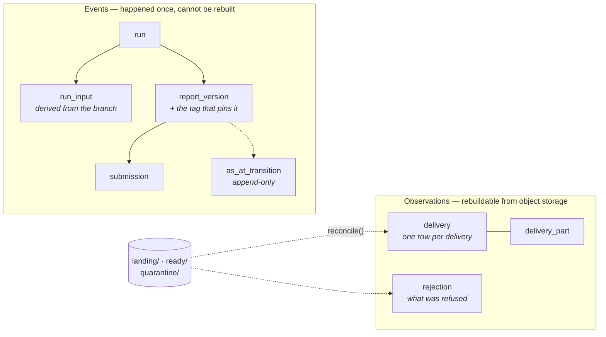
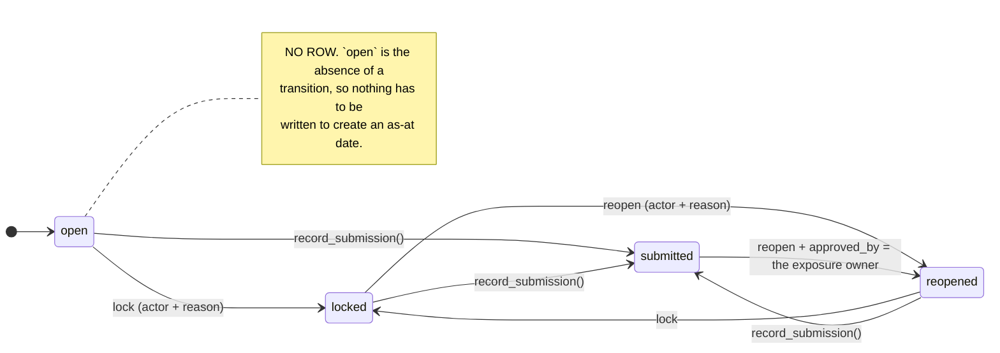
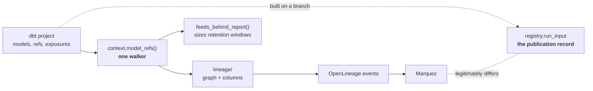

# Reporting Platform — Local Approximation: Architecture

## Purpose

This repo is a **local, laptop-runnable approximation** of the target Reporting Platform
stack. It is deliberately shaped so that every component has a 1:1 counterpart
in the on-prem OpenShift target (see `OPENSHIFT-MAPPING.md`), and so that the
*code you write locally is the code that runs in the cluster* — only
configuration changes.

> For the *sequence* rather than the shape — one delivered file from the
> inbox through to a reporting table, with the failure mode at each stage —
> see [PIPELINE.md](PIPELINE.md).

It replaces the legacy pattern:

```
Upstream CSV  →  the legacy ETL tool package  →  the legacy RDBMS stg tables
              →  stored procedures  →  reporting schema
              →  the legacy report server / the BI tool
              →  nightly partition-switch archive job
```

with:

```
Upstream CSV  →  landing (object storage, immutable)
              →  raw     (Iceberg, 1:1, typed)
              →  prepared (Iceberg, dbt, conformed)
              →  reporting (Iceberg, dbt, shared-lineage marts)
              →  serving  (optional RDBMS export / BI direct-read)
```

with Nessie providing commit-level version control over the whole lakehouse,
and an explicit maintenance + retention subsystem replacing the implicit
behaviours the legacy RDBMS gave us for free.

---

## Layer model

| Layer | Format | Catalog | Written by | Grain |
|---|---|---|---|---|
| `landing` | CSV as received, uncompressed | none (object keys) | landing task | one object per feed arrival |
| `raw` | Iceberg | Nessie `lakehouse.raw` | ingest task (Spark) | 1:1 with source rows, all columns as-received + ingest metadata |
| `prepared` | Iceberg | Nessie `lakehouse.prepared` | dbt | conformed, typed, deduplicated, one row per business key per COB date |
| `reporting` | Iceberg | Nessie `lakehouse.reporting` | dbt | report-shaped marts, shared lineage |
| `serving` | Postgres / an enterprise RDBMS | n/a | export task | latest COB date only, BI-tool-specific |

### Why `landing` is separate from `raw`

The legacy `stg` schema conflated "what arrived" with "what we parsed". Keeping
the byte-exact original in object storage means:

- reprocessing is possible without asking upstream to resend;
- schema drift is detectable by diffing arrivals rather than by a load failure;
- the retention policy for the immutable evidence copy can differ from the
  retention policy for the queryable copy (it does — see `RETENTION.md`).

### Why `raw` is 1:1 and untyped-ish

`raw` is a mechanical projection of the CSV. Every column lands as `string`
except the ingest metadata. All parsing, casting, trimming and null-normalising
happens in `prepared`, in dbt, where it is testable and version-controlled.
A load must never fail because a value was unparseable — it must land, and then
fail a *test*.

Ingest metadata columns added to every `raw` table:

| Column | Type | Meaning |
|---|---|---|
| `_cob_date` | date | the date the data describes (from filename or feed config) |
| `_ingest_ts` | timestamp | when we ingested it |
| `_source_file` | string | full object key in `landing` |
| `_file_version` | int | 1, 2, 3… for re-deliveries of the same COB date |
| `_row_number` | bigint | position in the source file, for diagnosis |
| `_batch_id` | string | ingest run identifier, = Nessie branch name suffix |

### Namespace naming

The three Iceberg layers are namespaces in the Nessie catalog: `lakehouse.raw`,
`lakehouse.prepared`, `lakehouse.reporting`. Note two things that are easy to get wrong,
both of which were live defects at one point:

- **dbt does not produce these names by default.** Its default
  `generate_schema_name` concatenates the profile's schema with the per-layer
  `+schema:`, which yielded `lakehouse_prepared` and `lakehouse_reporting` — sitting
  inconsistently beside the `raw` that `ingest_feed.py` creates literally.
  `dbt/macros/naming.sql` overrides it to use the layer name verbatim.
- **The catalog is not addressable as a third name part from dbt.** dbt-spark
  supports only a two-level `schema.table`, so `lakehouse` comes from
  `spark.sql.defaultCatalog` in `profiles.yml` rather than from a `database:`
  on the source.

**No layer prefix on any table name.** The namespace already says which layer
a table is in, so `prepared.prep_trade` and `reporting.rpt_exposure_change`
were saying it twice. Full names are `lakehouse.raw.fo_trade`,
`lakehouse.prepared.fo_trade`, `lakehouse.reporting.counterparty_exposure`.

A feed's landed and conformed tables therefore share a name and differ only by
namespace — `raw.fo_trade` and `prepared.fo_trade`. That is legal because dbt keeps
models and sources in separate namespaces: a model named `trade` and a source
`raw.fo_trade` coexist without collision. Verified against a live parse before the
rename, not assumed.

The consequence to remember is in `common/context.py`: no `alias` is
configured on any model, so **the dbt model name IS the catalog table name**.
`PREPARED_TABLES` / `REPORTING_TABLES` must be renamed in the same commit as
the model files, or maintenance and retention address tables that do not
exist — silently, because `managed_tables()` never checks that its entries
resolve.

### Why `prepared` and `reporting` are both dbt

Shared lineage is the whole point. Multiple legacy apps consume the same
counterparty and trade datasets. If each app builds its own copy, the estate
recreates the legacy estate's problem in a new stack. `prepared` is the single conformed
representation; `reporting` marts are thin, and every mart declares its
`prepared` inputs via `ref()` so lineage is machine-readable — this is the
metadata catalog gap called out in the PoC review, closed by dbt's manifest.

---

## Per-feed processing, not a nightly batch

Requirement: *each feed must be processed as soon as it is received.*

The DAG topology is therefore:

```
                     (file arrival)
                           │
        ┌──────────────────┼──────────────────┐
        ▼                  ▼                  ▼
  ingest_fo_trade      ingest_ref_counterparty   ingest_ref_rating      ← one DAG per feed,
        │                  │                  │                generated from feeds.yml
        ▼                  ▼                  ▼
   Asset: raw.fo_trade   Asset: raw.ref_counterparty  Asset: raw.ref_rating
        └──────────────────┼──────────────────┘
                           ▼
                  prepared_build (dbt)          ← triggered by ANY upstream asset
                           │
                  Asset: prepared.*
                           ▼
                  reporting_build (dbt)         ← triggered by prepared assets
                           │
                  Asset: reporting.*
                           ▼
                     serving_export
```

Airflow **assets** (datasets in Airflow 2) do the coupling. No feed waits for
any other feed to arrive. `prepared_build` is scheduled on the asset condition
and runs as soon as anything upstream changes; dbt's own `state:modified+` and
model selection keep the rebuild proportionate.

A feed that is late does not block the ones that arrived; the reporting layer
simply carries forward the last good version of that dimension and the
freshness test flags it. This is a deliberate behavioural change from the
legacy scheduler's gated model and needs to be signed off by the report owners.

**Two different failures hide behind "late", and only one of them is caught by
freshness.** `dbt source freshness` measures the age of the newest
`_ingest_ts`, so it detects a feed that has *stopped arriving*. It cannot
detect a hole in the middle of a history that later resumed, because a newer
delivery resets the clock — the seed's deliberately absent counterparty date
raises no freshness warning at all. That second shape is the more dangerous
one: a late feed is visibly missing and the report is visibly incomplete,
whereas a gap is a report that runs, returns numbers, and is quietly wrong for
one date forever.

`reporting_platform/monitoring/completeness.py` covers the gap case. It infers the
business calendar from the platform's own data — a COB date is one on
which at least one feed delivered — so no holiday calendar is needed and a
holiday can never be reported as a gap. Its blind spot is a day on which every
feed missed; that is the orchestrator's and the watchdog's territory.

---

## Nessie: write-audit-publish

Every ingest and every dbt build runs on a **branch**, not on `main`.

```
main ────────────●────────────────────●──────────►
                 ▲                    ▲
                 │ merge (if tests    │ merge
                 │        pass)       │
  ingest/trade/2026-08-11/r7 ──●      │
                                      │
  build/prepared/2026-08-11/r7 ───●───●
```

Branch naming: `<purpose>/<scope>/<cob_date>/<run_id>`.

This gives us three things the legacy RDBMS never did cheaply:

1. **Atomic multi-table publication.** A reporting refresh that touches nine
   tables becomes one Nessie merge. Consumers never see a half-built mart.
2. **Rollback.** A bad publication is reverted by resetting `main` to the prior
   commit; the data files are still there.
3. **Reproducibility.** A report can be re-run "as at" a Nessie commit hash, so
   a regulator question about a figure published on a given date is answerable.

Tags are cut on `main` after each successful publication:
`published/<cob_date>/<run_id>`. Retention of *tags* is what determines
how far back you can time-travel, and is a separate policy from row retention.

---

## How the dbt builds become Airflow tasks

The two build DAGs do not run dbt as one opaque command. **Astronomer Cosmos**
reads the dbt project at DAG-parse time and renders it into Airflow tasks —
one per model, in the models' own `ref()` order — with `open_branch` in front
and `publish` behind:

```
open_branch ─┬─► dbt.ref_counterparty_run ┐
             ├─► dbt.ref_rating_run       │
             ├─► dbt.fo_trade_run        ├─► dbt.dbt_test ─┬─► publish
             └─► dbt.ref_collateral_run   ┘                 └─► keep_failed_branch
```

Write-audit-publish is unchanged by this — the branch is still opened once,
the whole layer still lands on it, the tests still run before the merge, and a
failure still leaves `main` untouched with the branch retained. What changes is
**resolution**: a failing model is a red task with that model's name on it, and
a retry starts from that model rather than from the top of the layer.

**The graph is derived, not declared.** A new `.sql` under `models/prepared/`
becomes a task on the next DAG parse with no edit to `dbt_builds.py`, which is
the same property `feeds.yml` already gave the ingest DAGs. Between them, the
two things a developer adds to this platform — a feed and a model — both
appear in Airflow by themselves.

### The four decisions that make it work here

Each of these was chosen against a specific failure, and the reasoning is
repeated in the `dbt_builds.py` docstring next to the code it governs.

| Decision | What it prevents |
|---|---|
| `InvocationMode.SUBPROCESS` | Cosmos defaults to running dbt **in the calling process**. Our target is `method: session`, so dbt builds a SparkSession — an in-process JVM with non-daemon threads would stop the task heartbeating and the scheduler would zombie-reap it ~300s after the work had already succeeded. Same constraint that puts every other Spark call behind `scripts/_spark_task.py`. |
| `pool="lakehouse_write"` on every rendered task | One dbt invocation is one Spark application, capped at 2 cores against a 6-core worker. Per-model tasks would otherwise start several at once, and standalone mode hands out free cores and holds them until the session stops — so the losers wait forever rather than failing. The single slot serialises them exactly as the old monolithic `dbt run` did by holding it for its whole duration. |
| `LoadMode.DBT_LS` | `LoadMode.CUSTOM` (Cosmos's own parser) is faster and needs no dbt, but on this project it emits **every test twice** — once bare, once `test.dbt.`-prefixed — which collides as Airflow task ids, and it misses model-level tests entirely, including the `unique_combination_of_columns` blocks that are the only proof `dedupe_rank` works. `dbt ls` finds all 51 tests, and does not open a Spark session. |
| `TestBehavior.AFTER_ALL` | The `AFTER_EACH` default renders one task per *test* — 51 JVM starts for a layer that has four models. `BUILD` is wrong for a different reason: under eager indirect selection a `relationships` test is pulled in with the model it is declared on, but its other parent may not be built yet (`collateral` → `counterparty` is a dependency of the *test*, not the model), and under cautious selection that test is silently dropped instead. Testing the whole layer once, after it is whole, has neither problem. |

`dbt ls` costs about 5s per parse; Cosmos caches the result against a hash of
the project files, so it is paid again only when a model actually changes.

---

## Slowly-changing dimensions in `prepared`

`prepared.ref_counterparty` and `prepared.ref_rating` store **one row per version**,
not one per COB date. `trade` and `collateral` stay daily snapshots.

The split is measured, not stylistic. Against 40 retained COB dates:

Measured, built:

| table | snapshot rows | as SCD2 | saved |
|---|---|---|---|
| `counterparty` | 2,400 | **70** | 97% |
| `rating` | 5,580 | **1,402** | 75% |
| **reference total** | **7,980** | **1,472** | **82%** |
| `trade` | 16,000 | 14,443 | 10% — *not converted* |
| `collateral` | 650 | 219 | *not converted, see below* |

`trade` is why this is per-table rather than a layer-wide rule: a persisting
book whose marks genuinely move, so versioning it costs complexity and saves a
tenth. Reference data restates an unchanged value every morning; transaction
data does not.

`collateral` is **not** converted, and that is a semantic call rather than a
measurement one. Its 66% is an artefact of the sample generator holding values
still; a real collateral feed revalues `market_value` and `haircut_pct` daily,
which makes it a position feed like `trade`. Convert it if your upstream
actually restates unchanged positions — measure first.

### Grain is per business key, not per table

`rating` versions per **(counterparty_id, agency)**: Moody's downgrading must
not close the S&P version, where a per-table grain would interleave two independent histories into one chain, and the
`mutually_exclusive_ranges` test is partitioned on the same key so it catches
exactly that.

### How consumers read it

`{{ as_of('c', 'a.cob_date') }}` — a `between effective_from and effective_to`
predicate. `effective_to` is `DATE '9999-12-31'` on the open version rather than
NULL, so no consumer needs an `or effective_to is null` branch, which is silently
wrong when forgotten.

No snapshot-shaped VIEW is offered over it. Iceberg views do work in this
catalog (verified: created, queried, survives a session, `SHOW VIEWS` lists
it) — but they are **invisible to `scripts/duckdb_console.py`**, which reads
the Iceberg REST endpoint. A view exists to keep consumers unchanged, and it
would have dropped the one consumer that cannot be changed by editing a model.

### Three consequences worth knowing

**A late feed is now carried forward, not nulled.** A version's range spans a
missing delivery, so a point-in-time join finds the counterparty on a day its
file never arrived. This is what this document and README have always
promised; the snapshot implementation did the opposite and emitted NULLs.
`counterparty_exposure.reference_carried_forward` keeps the gap visible — more
usefully than a NULL, which could not say how stale the value was.

The same effect on `rating` is larger and more clearly a fix: rating is a
**weekly** feed, so under the snapshot 420 of 2,400 exposure rows (17.5%) had
no rating at all on the days it did not deliver. Point-in-time joining carries
the last known rating forward and that count is now **zero**. It is not
flagged as "carried forward", because for a weekly feed that is the design
rather than a gap — `rating_as_of` says how old the rating is instead.

**Retention stops being a partition drop.** There is no `cob_date`
column, so `retention.py` uses a row-level delete for these tables. See
RETENTION.md.

**Restatement provenance moves to `raw`.** A version row names the delivery
that first carried the value, and closed versions are never rewritten — their
`source_file` and `dbt_invocation_id` are frozen at the build that created
them (verified). Which files restated an unchanged value is still recorded,
once, in `raw`, which this change does not touch.

---

## Where Spark actually runs

**Every Spark job on this platform is a client of the `spark-master` /
`spark-worker` cluster. Nothing runs `local[*]`.** The process that calls
`spark_session()` — an Airflow task's `scripts/_spark_task.py` child, a
`dbt build`, a manual `python -m ...` in the Airflow container — is the
**driver**; all task work happens in executors on `spark-worker`.

```mermaid
flowchart LR
  T["Airflow task<br/><i>2.10 LocalExecutor</i>"]
  SP["scripts/_spark_task.py<br/><b>child process</b>"]
  DR["the DRIVER<br/><i>lives here</i>"]
  M["spark-master"]
  E1["executor<br/>2 cores / 2g"]
  E2["executor"]
  T -->|"subprocess"| SP
  SP --> DR
  DR -->|"SPARK_MASTER"| M
  M --> E1
  M --> E2
  DR -. "ships spark.jars.packages<br/>(incl. hadoop-aws, which the<br/>Spark image does NOT bake)" .-> E1
  DR -. .-> E2
```

**Why the subprocess is not optional:** the driver runs in-process, so the JVM
and its py4j gateway keep non-daemon threads alive after the task callable
returns. Heartbeats stop, and ~300s later the scheduler reaps the task as a
zombie and marks it failed — with a task log that shows the work completing.
This holds on a cluster too, because the *driver* is what lives in that
process.

This is set in exactly two places, and they must not diverge:

| Path | Where the master is set |
|---|---|
| Python (ingest, retention, maintenance, completeness, arrival checks) | `spark_session()` in `reporting_platform/common/spark.py`, from `SPARK_MASTER` |
| dbt builds | `spark.master` in `dbt/profiles.yml` (`spark_local`), from the same `SPARK_MASTER` |

Three consequences worth knowing before changing any of it:

- **There is no local fallback, on purpose.** `spark_session()` raises if
  `SPARK_MASTER` names a `local` master. A misconfiguration that quietly ran
  the whole pipeline inside the Airflow container would *complete
  successfully* with the cluster sitting idle — the failure mode that is worth
  a guard is the one that isn't red anywhere.
- **The driver ships the jars.** `Dockerfile.spark` bakes the Iceberg and
  Nessie runtimes into the executors, but `spark.jars.packages` jars are
  served from the driver to every executor, so what the executors load is what
  the driver resolved. That is why the package list in `common/spark.py` and
  `profiles.yml` must stay at `Dockerfile.spark`'s versions, and why
  `hadoop-aws` — which the Spark image does *not* bake — reaches the executors
  at all.
- **Each application caps itself at 2 cores / 2g.** A standalone application
  takes every free core by default and holds it until the session stops, so an
  uncapped job would leave the next one waiting forever on *"Initial job has
  not accepted any resources"* rather than failing. `SPARK_WORKER_CORES` /
  `SPARK_WORKER_MEMORY` in `docker-compose.yml` are sized for three concurrent
  applications: the single `lakehouse_write` slot plus the read-only jobs that
  sit outside that pool (arrival checks, completeness, maintenance metrics).

The driver still runs in-process, which is why `scripts/_spark_task.py`
still exists: the JVM and its py4j gateway keep the calling process alive
after the task callable returns, cluster mode or not.

One live constraint: the Airflow image is Python 3.11 and the Spark image is
Python 3.8. That mismatch is invisible today because nothing here uses a
Python UDF or an RDD operation — everything is SQL and DataFrame work, which
executes entirely in the JVM, so no Python worker is ever launched on an
executor. **Introduce a Python UDF and Spark will fail the job** with a
driver/worker version mismatch; fixing it means giving `Dockerfile.spark` a
matching interpreter.

---

## Engine strategy: Spark runs the pipeline, DuckDB serves people

**Spark is the only build engine, and that is a constraint rather than a
preference.** Two independent things force it:

- **Every build must land on a Nessie branch.** Write-audit-publish is the
  safety model this whole document is built around, and a branch is something
  the engine has to be able to *address*. Only the Spark path can: dbt-spark
  takes `spark.sql.catalog.lakehouse.ref` directly, which is how `nessie_ref`
  threads from the DAG into the build.
- **Iceberg maintenance is Spark-only.** `rewrite_data_files`,
  `rewrite_manifests`, `expire_snapshots`, `remove_orphan_files` and
  `rewrite_position_delete_files` are Iceberg *stored procedures* invoked via
  `CALL`, and only the Spark runtime implements them.

This was tested rather than assumed. Session 5 got DuckDB
building Iceberg tables into Nessie for the first time — `duckdb 1.5.5` +
`dbt-duckdb 1.9.6` against the Iceberg REST catalog Nessie serves at
`/iceberg`, with `dbt build` completing and Spark reading the result — and
then removed the target anyway, because a *completing build* turned out to
prove less than it looked:

| | |
|---|---|
| Cannot address a Nessie branch | the ref rides in the Iceberg REST prefix, which DuckDB takes from `/v1/config` and cannot override — so no write-audit-publish |
| Silently drops `partition_by` | produces unpartitioned tables, and `cob_date` partitioning is what makes retention's expiry a metadata delete rather than a full rewrite |
| Cannot `INSERT`/`UPDATE` a partitioned table | so it cannot write to the tables the platform already has, without an explicit override |

Any one of those is disqualifying.

**DuckDB's role is reading published `main`** — analyst queries, a developer
checking what actually landed, the kind of question that should not need a
SparkSession. `scripts/duckdb_console.py` is that entry point: a read-only
attach, one command, sub-second answers against the same Iceberg tables
through the same catalog.

```
docker compose exec -T airflow python -m scripts.duckdb_console --tables
docker compose exec -T airflow python -m scripts.duckdb_console \
    "select cob_date, count(*) from lakehouse.prepared.fo_trade group by 1"
```

It is a script rather than a dbt target deliberately. The engine macros are
Spark-only now, so a DuckDB target could not compile the models anyway, and a
target that builds some models and not others is a trap. The read-only attach
is verified, not assumed — `CREATE` fails with *"Cannot execute statement of
type CREATE on database ... attached in read-only mode"*.

### What happened to the portability layer

This section used to promise that models were engine-portable: ANSI SQL only,
divergences fixed in `dbt/macros/engine.sql`, "the project ships tests that
must pass on both engines". **That promise is withdrawn**, because nothing
verified it and an untested guarantee in this codebase has a poor record. The
DuckDB branches are gone from the macros.

`engine.sql` remains, and its real value was never the second engine: it is
that engine-specific constructs live in **one place**. Bug #8 was a bare
`CAST(x AS VARCHAR)` that Spark rejects outright, and all three
reporting models having copy-pasted their own inline version, so fixing the
macro never reached them. Centralisation is what prevents that, with one
engine or five.

`profiles.yml` carries `spark_local` and `spark_ocp`, both pointed at the same
Nessie catalog and the same S3 warehouse; `DBT_TARGET` selects between them at
deployment time. `airflow/dags/dbt_builds.py` **refuses** a target that is not
a Spark one — because the failure it prevents is silent, not loud: a
non-Spark engine ignores the `nessie_ref` var, writes to the default branch,
and the DAG goes green.

---

## The registry: what is recorded, and what stays derived

A lakehouse can answer "what does the data say". It cannot, on its own, answer
"did they send it", "which deliveries is this number built from", or "under
whose authority was this published". Those are questions about **events**, and
they live in a Postgres database called `platform`, under the schema
`registry`.



**The dividing line is the whole design.** The left half is an *index over
bytes that still exist*, so it is rebuildable by the same code that writes it —
`deliveries.reconcile()` walks object storage and registers everything missing,
and that path is the authority, not a repair tool. The right half records
things that happened once: a run either executed or it did not, and no amount
of reading storage will tell you afterwards.

Three consequences follow, and each of them is a rule that fails quietly if you
work against it:

- **The delivery half records no verdicts.** There is no `ingested`, no
  `superseded`, no `status`. Whether a delivery reached raw stays derived from
  `_source_file` in the raw table; whether it supersedes another stays
  `dedupe_rank`'s answer. This is the single difference from the legacy `stg`
  load-control tables this platform replaces — those held a status that could
  disagree with the data, and eventually did.
- **`run_input` carries no foreign key to `delivery`.** A run is an event and a
  delivery is an observation; a run may legitimately name an input whose
  delivery row was rebuilt, renumbered, or not yet reconciled. The input set is
  *derived* — read out of the prepared models on the branch, before the merge,
  using the same `delivery_ref()` the rows themselves carry.
- **A run has a mutable status. A delivery may not.** For the same reason.

Postgres rather than Iceberg because `sequence_no` — the order in which the
platform saw deliveries — needs a serialising authority. `MAX(…)+1` over a
table several writers append to is a read-then-write, correct today only
because the `lakehouse_write` pool has one slot, which is precisely what any
concurrency work would change.

The CLI is `python -m reporting_platform.registry`; [`REGISTRY.md`](REGISTRY.md)
is the operator's guide to it, and
[`DECISIONS.md#the-registry-records-observations-not-verdicts`](DECISIONS.md#the-registry-records-observations-not-verdicts)
carries the reasoning.

---

## The as-at date has a lifecycle

Publishing is not only a technical question. A `(report, as-at date)` pair
moves through states that say whether it may still be republished, and on whose
say-so.



| State | Means | What a publish onto it does |
|---|---|---|
| `open` | nobody has locked it — the ordinary state | proceeds |
| `locked` | closed to routine republication | **refused if the input set for that date has moved**; allowed if it has not, so an unrelated rebuild is not an incident |
| `submitted` | a version was sent somewhere | as `locked`, plus a stronger reopening requirement |
| `reopened` | somebody deliberately reopened it | proceeds, and takes the next version number |

Four things about this are load-bearing:

**`open` is the absence of a row.** `registry.as_at_transition` is append-only
and records *departures from the default*. Nothing has to be written to bring
an as-at date into existence, which is why a date nobody has ever thought about
behaves correctly.

**The gate runs BEFORE the merge, and that is not where it looks like it should
go.** The publish task merges the audited branch into `main` and only *then*
cuts tags and allocates versions. A check sitting with the versioning would
fire after `main` had already moved. `check_publishable()` is called between
reading the input set — where the as-at date first becomes known — and the
merge. A refusal fails the task with `main` untouched and the branch retained
for inspection.

**Authority is recorded and checked against the project's own declaration, not
enforced.** There is no identity provider here; nothing can verify that whoever
typed `--actor jane` is Jane, and a module claiming otherwise would be theatre.
What it *can* do is refuse any transition that does not name an actor and a
reason — so the record is never "somebody unlocked this at some point" — and
require, when reopening a **submitted** date, an `approved_by` matching the
report's owner. That last one is a real check, because the owner comes from the
dbt exposure and cannot be supplied by the person doing the reopening.

**Nothing branches on what kind of report it is.** A daily internal dashboard
and a quarterly regulatory return travel the same path; the difference between
them is the `restatement:` policy declared on the exposure, not a branch in the
lifecycle code. `tests/test_lifecycle.py` greps for that, because a comment
claiming it would not survive the first convenient special case.

The report, its owner and its restatement policy are all **derived from the dbt
exposure** by `context.reports()` — the lifecycle adds no second registry of
reports that could disagree with the first.

---

## Lineage is an export, not an authority

OpenLineage emission and Marquez are **off by default**, behind
`OPENLINEAGE_DISABLED` and the `lineage` compose profile. When on, Airflow
emits a lineage event per task and Marquez consumes it.



Two things this diagram is drawn to make obvious:

**There is one graph walker, not two.** `context.model_refs()` derives the
lineage graph *and* is what `feeds_behind_report()` uses to size per-feed
retention windows. A second derivation that drifted from the first is exactly
the failure this codebase keeps warning about, so `tests/test_lineage.py`
asserts the two agree.

**Marquez is not the record of what a run published.** `registry.run_input` is,
and the two legitimately differ: an SCD2 dimension may contribute 10 of 40
deliveries to a published figure while OpenLineage correctly reports all 40 as
read. **Do not reconcile them** — they answer different questions.

Three operational facts that are easy to lose an afternoon to:

- **Env is read at process start**, so enabling lineage needs the Airflow
  containers **recreated**, not restarted.
- **The custom extractor registers under `AIRFLOW__OPENLINEAGE__EXTRACTORS`** —
  *not* `__CUSTOM_EXTRACTORS`, which is read by nothing and warns about
  nothing. Without it Airflow emits jobs and no datasets at all.
- **A skipped task shows as `RUNNING` in Marquez forever.** Airflow 2.10's
  listener spec has no skipped hook, and skipping is the ingest DAGs' idle
  state. Airflow is the authority on what is running.

The package may never refuse: nothing in it raises, because an export must not
gain the power to stop the pipeline. `unresolved` columns are a defect that does
not fail a build — the seam is CI, where `lineage --columns` exits 1 on any.
[`LINEAGE.md`](LINEAGE.md) has the detail.

---

## Component inventory

| Component | Local | Purpose |
|---|---|---|
| Object storage | MinIO | stand-in for the on-prem S3-compatible store |
| Catalog | Nessie (Postgres-backed) | Iceberg catalog + git-like versioning |
| Orchestration | Airflow **2.10.5**, LocalExecutor | DAGs, assets, sensors |
| Compute | Spark 3.5 standalone | ingest, maintenance, **and every dbt build** |
| Transformation | dbt-core + dbt-spark | prepared + reporting |
| Query (people) | DuckDB, read-only on `main` | `scripts/duckdb_console.py` — analyst and dev queries |
| Serving | Postgres | stand-in for an enterprise RDBMS export target |
| **Registry** | **Postgres `platform`** | **what arrived, what was published, out of which inputs, under whose authority — see above** |
| Metadata | dbt manifest + Nessie commit log | model graph, catalog, and the change ref on each merge commit |
| Lineage (optional) | OpenLineage → Marquez, both built here on UBI | export only, off by default behind the `lineage` profile |
| Monitoring | six checks, one of them in its own container | gaps, lateness, evidence, reproducibility, the watchdog, the orphan sweep's refusal |

Airflow is **2.10.5 deliberately, not 3.x**. Under Airflow 3 no DAG run here
could ever complete — tasks ran, logged, returned values and pushed xcom, and
the scheduler never recorded them. Airflow 2's
LocalExecutor writes the result straight to the metadata DB. Read
`Dockerfile.airflow`'s header before changing it.

Nessie is deliberately Postgres-backed rather than in-memory so that the local
stack exercises the same version-store code path as the cluster, and so
restarting the stack does not silently reset the catalog.
