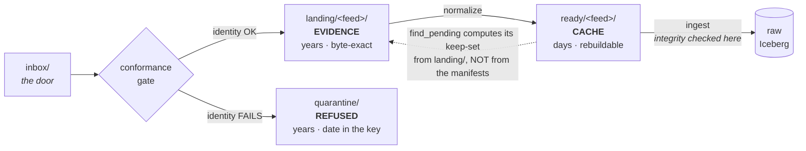
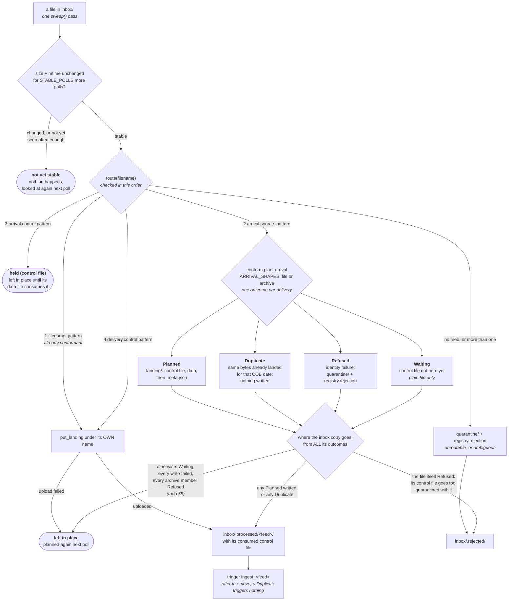

# Delivery shapes

**Scope: this document predates the Transport/Delivery split and describes
the legacy inbox/landing conformance-gate shapes** — zips, control files,
sibling control discovery, landing-based date parsing, and Ready v1. It is
the legacy compatibility path, not the current Transport path's shapes. For
the Transport path's shapes (plain data+control object sets under
`received/<TransportID>/`, multiple source objects, business-date/version
evidence), see [TRANSPORT-CONTRACT.md](TRANSPORT-CONTRACT.md),
[DELIVERY-CONTRACT.md](DELIVERY-CONTRACT.md) and
[NORMALIZATION-CONTRACT.md](NORMALIZATION-CONTRACT.md) — those are current
and authoritative for the Transport path. Do not treat the legacy
filename-conformance requirements below as mandatory for a Transport-path
Feed.

**Status: all five steps built**, including console support for creating an
archive or control-gated feed through the form -- a gap step 5 surfaced but
did not originally fix; it is closed now
([DECISIONS.md#console-delivery-support](DECISIONS.md#console-delivery-support)).
Sections in the future tense describe work that does not exist yet. When a
step lands, its section moves to the present tense and the reasoning moves
to [DECISIONS.md](DECISIONS.md) — step 1 at
[#feed-conventions](DECISIONS.md#feed-conventions), step 2 at
[#ready-is-a-derived-index](DECISIONS.md#ready-is-a-derived-index), step 4 at
[#control-file-gate](DECISIONS.md#control-file-gate), the sniffer at
[#the-sniffer](DECISIONS.md#the-sniffer). Step 3's reasoning has not moved
yet — its section below is still the write-up.

Today a feed is [five files and no DAG edit](ADDING-A-FEED.md). That is cheap
enough — until the delivery is a zip with the date on the container and no date
on the CSVs inside it, or a file that must not be read until its control file
lands. This is about making those cost the same five files.

The short version: **`landing/` is doing two jobs, and splitting them is what
makes every awkward delivery shape cheap.**

---

## What already works, so nobody builds it twice

**Pipe-delimited, tab-delimited, unusual quoting, non-UTF-8 encodings and
multiline records share one parser contract.** `delimiter`, `quote_char`,
`header`, `file_encoding` and validated `csv_options` are recorded in a v2
manifest and translated to explicit Spark reader options. Python preview and
counting use the same contract, including escape behavior and universal newline
handling. `control_encoding` defaults to the data encoding but can be set
independently. Decoding is strict: unsupported codecs, bad bytes and malformed
records fail before publication. A pipe feed still needs only `delimiter: "|"`.

**`.csv.gz` needs no unpacking.** Hadoop's input formats decompress gzip and
bzip2 transparently, so a single gzipped CSV already reads through the same
path. **A zip is not a compression codec, it is an archive**, and Spark has no
reader for one. That distinction is why archives need a new stage and `.gz`
does not.

**Re-delivery versioning needs nothing.** `_file_version` is computed from the
raw table (`next_file_version`, `ingest_feed.py`), not from the filename —
the `(?:_v(?P<version>\d+))?` group is parsed and then **discarded** by
`ingest()`. Its only job is to make the pattern match a corrected file at all.
An archive re-delivered under its original name versions correctly with no new
mechanism.

## The assumption everything else breaks against

**One landed object is one file, is one delivery, and its NAME carries the
COB date.**

`Feed.parse_filename` (`common/context.py`) does `re.fullmatch` on a
filename and returns `(cob_date, version)`. It has **14 call sites across
7 modules**, and they are not all the ones you would guess:

| Module | What it decides |
|---|---|
| `ingest/arrival.py` (3) | what is pending, and which dates landing believes exist |
| `ingest/ingest_feed.py` (1) | the COB date of the write |
| `ingest/inbox.py` (1) | which feed claims a dropped file |
| `retention/landing.py` (2) | **what may be deleted from the evidence prefix** |
| `ui/feeddata.py` (4) | seed listing, landed listing, delivery, upload validation |
| `ui/sampledata.py` (3) | that a generated filename is one the platform can route |
| `scripts/land_feeds.py` (1) | which seed files to upload |

A zip breaks that three ways at once: the date is on the container and not the
member; one object yields *many* units of work; and there is no URI Spark can
read. A control file breaks it differently — the object that arrives is not the
object to ingest, and "ready" stops meaning "stopped growing"
([DECISIONS.md#inbox-is-polled](DECISIONS.md#inbox-is-polled)).

More regex does not fix this. One concept has to become three: **what arrived**,
**when it is ready**, and **what COB date it is for**.

---

## The shape: three prefixes, three jobs, three lifetimes

`landing/` currently serves as both the immutable evidence copy **and** the work
queue. Those have opposite requirements, and the tension is already visible in
the code: `sweep_landing` will not delete an object whose name it cannot parse
(`retention/landing.py`) because it is evidence, which means anything the
platform does not recognise accumulates in the work queue forever.

Split them.

| Prefix | Job | Lifetime | Deletion rule |
|---|---|---|---|
| `landing/<feed>/` | **evidence** — exactly what the upstream sent, byte for byte | `keep_years`, in years ([RETENTION.md](RETENTION.md#landing-everything-for-its-retention-class)) | never on a guess; unparseable means keep |
| `ready/<feed>/` | **work queue** — a manifest per delivery, plus any derived parts | days | freely, once ingested; rebuildable from landing |

`landing/` keeps its current semantics and its current retention sweep
untouched. `ready/` is new, is a **cache**, and everything in it can be
reconstructed by re-running normalization against `landing/`. That property is
what makes it safe to delete from, and it is the property to protect: the
moment something in `ready/` is not reconstructable, it has quietly become a
third copy of the data.

A **normalize** stage sits between them, and `ready_prefix` joins
`landing_prefix` in `config/feeds/_defaults.yml`.

There is a third prefix, and it has the *same* lifetime as the evidence copy
for the same reason — a refused delivery is evidence of what the upstream sent:



**The dotted arrow is the coupling that must not be undone.** `find_pending`
derives what is outstanding from `landing/`, because `ready/` is a days-long
cache and `landing/` is the only prefix holding every date. So the `ready:`
window bounds the **derived parts, not the manifests** — a manifest whose
landing object still exists is kept at any age. Bound the manifests instead and
the sweep and the reconcile undo each other nightly: 157 deleted, 157 remade,
both logging success.
([`DECISIONS.md#the-ready-window-bounds-the-parts-not-the-manifests`](DECISIONS.md#the-ready-window-bounds-the-parts-not-the-manifests))

An **identity** failure is quarantined; an **integrity** failure lands and
fails at ingest. That asymmetry is deliberate: landing is the evidence copy,
and a bad delivery is exactly what it exists to prove.

### What the gate does with one file

The diagram above shows two ways out of the gate. The code has more, and the two
it leaves out are the two that confuse someone watching a file sit in
`inbox/`: **the file is not stable yet**, or **it is `Waiting`** for its
control file. Neither is an error, and neither moves the file. Every name
below is taken from `ingest/inbox.py` (`sweep`, `route`, `_promote`) and
`ingest/conform.py` (`ARRIVAL_SHAPES` and its four outcome classes):



Four things the picture encodes that the prose elsewhere does not:

- **Stability comes before routing.** A file is not even routed until its size
  and mtime have held still for `STABLE_POLLS` further polls. Until then
  `sweep` records the observation and returns no result for the file.
- **One inbox file can have many outcomes.** An `arrival.archive` container
  yields one outcome per member, so the inbox copy's destination is decided
  from all of them together, in the order shown: `.rejected/` only if the file
  *itself* was refused, `.processed/` if anything at all landed or was already
  there, otherwise it stays put.
- **`Waiting` exists only for a plain file.** A member whose control file is
  missing from its container is `Refused`, because a container arrives
  complete and waiting for it could never end.
- **A `Duplicate` is not a rejection.** Nothing is written and nothing is
  triggered, but the inbox copy still moves to `.processed/`, because the
  delivery it names is already landed.

## The manifest

Normalization writes one JSON manifest per delivery into `ready/<feed>/`:

```json
{ "feed": "treasury_margin_call",
  "cob_date": "2026-08-01",
  "delivery_id": "20260801T063112-a1b2c3",
  "received_at": "2026-08-01T06:31:12Z",
  "source_object": "landing/treasury_margin_call/marginCalls_20260801.zip",
  "parts": [{"object_key": "ready/treasury_margin_call/.../part1.csv",
             "bytes": 41203, "member": "part1.csv"}],
  "format": {"parser_contract": 2, "delimiter": "|", "quote_char": "\"",
             "header": true, "encoding": "utf-8", "escape_char": "\"",
             "multiline": true},
  "declared_row_count": 4211,
  "normalizer": "archive/v1" }
```

Three decisions in that object carry most of the design.

**For a plain CSV, normalize writes a manifest and does NOT copy the bytes.**
`parts[].object_key` points straight back into `landing/`. So the common case
costs one small JSON object rather than a second copy of every delivery, and
there is still exactly one code path downstream: `ingest()` reads
`manifest.parts` and neither knows nor cares whether that points into
`landing/` or `ready/`. A normalizer copies bytes only when it actually
transforms them.

**`format` is recorded, and ingest reads it from the manifest rather than live
from `feeds.yml`.** That makes an ingest reproducible — you can say what
delimiter was actually used for a delivery six months ago, which is the same
question `landing/` exists to answer about the bytes. Correcting a wrong
delimiter becomes "fix `feeds.yml`, re-normalize", which is cheap precisely
because `ready/` is a cache.

**Ingestion status is NOT in the manifest, and must never be.**
`already_ingested` derives its ledger from `_source_file` in the raw table
specifically so that it *cannot* drift from reality; its docstring
(`arrival.py`) names the legacy `stg` load-control tables as the failure
being avoided. A manifest carrying `"ingested": true` is that table, rebuilt
under a new name.

The line to hold: **the manifest records observations about an event that
happened** — what arrived, what the control file declared, what encoding was
detected — facts not recomputable once the container is gone. It never records
**derived state**, which stays derived.

## The metadata sibling

The manifest above describes a delivery for the *platform*. The metadata
sibling describes it for *whoever asks what the upstream actually sent* — and
it exists only for a delivery that came through the inbox gate, because that is
the only path on which the landed object's name is **not** the name the sender
used.

`landing/<feed>/<delivery>.meta.json`, written by `ingest/conform.py`, beside
the delivery it describes. An approved sender writing straight to `landing/`
gets none: nothing was renamed, so there is nothing to record.

### A legacy sender with a control file

The upstream sends `marginCalls.csv` and `marginCalls.ctl` into the inbox. The
data file's name carries no date at all; the control file declares it. The
gate renames both and writes a third object:

```
landing/treasury_margin_call/
  marginCalls_20260801.csv            <- the delivery, byte-identical
  marginCalls_20260801.ctl            <- the control file, byte-identical, PROMOTED
  marginCalls_20260801.csv.meta.json  <- this
```

```json
{
  "bytes": 41203,
  "cob_date": "2026-08-01",
  "declared": {
    "cob_date": "2026-08-01"
  },
  "feed": "treasury_margin_call",
  "landing_control_filename": "marginCalls_20260801.ctl",
  "landing_filename": "marginCalls_20260801.csv",
  "md5": "9d2f1c7a4b6e803f5a1d9c2b7e4f6a81",
  "metadata_version": 1,
  "promoted_at": "2026-08-01T06:31:14.882913+00:00",
  "promoted_by": "inbox",
  "received_at": "2026-08-01T06:31:12+00:00",
  "row_count": 4211,
  "source_control_filename": "marginCalls.ctl",
  "source_filename": "marginCalls.csv",
  "source_system": "TREASURY"
}
```

Keys are sorted and the JSON is indented — `metadata_bytes()` writes it with
`sort_keys=True`, so two deliveries diff cleanly against each other.

`declared` holds **only what the control file said about identity**: `cob_date`,
and `version` when the sender states which restatement this is. A row count or
checksum in the same file is *not* here — those belong to `delivery.control`
and are checked at ingest, so that the trusted path is never the less-verified
one. A key absent from `arrival.control` is absent from `declared`, because
"the sender did not say" and "the sender said zero" are different facts.

### An archive member

The upstream sends one zip. The gate unpacks it and lands each member as an
ordinary delivery for its own COB date; **the container itself never reaches
`landing/`**. So each member's sidecar carries three extra keys, and they are
the only record the container ever existed:

```json
{
  "bytes": 128440,
  "cob_date": "2026-09-03",
  "declared": {},
  "feed": "custody_position",
  "landing_filename": "custodyPositions_20260903.csv",
  "md5": "3f8b1e05c9a27d64b0e5f1a83c7d2049",
  "metadata_version": 1,
  "promoted_at": "2026-09-03T05:12:41.004117+00:00",
  "promoted_by": "inbox",
  "received_at": "2026-09-03T05:12:40+00:00",
  "row_count": 9817,
  "source_container": "custodyPositions_20260903.zip",
  "source_container_bytes": 44120,
  "source_container_md5": "c14a7f39b8d25e60af31c8d94b7e0526",
  "source_filename": "positions_20260903.csv",
  "source_system": "CUSTODY"
}
```

`declared` is empty: an archive feed is gated on `member_pattern`, not on a
control file, and combining `control:` with `kind: archive` is refused at load.
There is no `landing_control_filename` or `source_control_filename` key at all
— absent, not null.

### Every key

| Key | Plain / control-gated | Archive member | Is |
|---|---|---|---|
| `metadata_version` | ✓ | ✓ | `1`. The format's own version, so a reader can tell what it is looking at |
| `feed` / `source_system` | ✓ | ✓ | from `feeds.yml` |
| `cob_date` | ✓ | ✓ | the date the delivery is FOR — from the control file, the source filename, or `member_pattern` |
| `landing_filename` | ✓ | ✓ | the name the platform gave it |
| `landing_control_filename` | ✓ | — | the promoted control file's name, derived from `delivery.control.pattern` with the landing stem |
| `source_filename` | ✓ | ✓ | **the name the upstream used** — for a member, its name inside the zip |
| `source_control_filename` | ✓ | — | the control file's name as sent |
| `source_container` | — | ✓ | the zip's filename |
| `source_container_md5` / `_bytes` | — | ✓ | the zip's checksum and size |
| `received_at` | ✓ | ✓ | when the inbox saw it |
| `promoted_at` / `promoted_by` | ✓ | ✓ | when the gate moved it, and that it was the gate |
| `bytes` / `md5` / `row_count` | ✓ | ✓ | **measured at the door** — see below |
| `declared` | ✓ | `{}` | what the control file said about IDENTITY, and nothing else |

### The measurements are recorded, never compared

`bytes`, `md5` and `row_count` come from `observe()`, and the function is
deliberately not called `verify`. An earlier draft compared them against the
control file's declarations and rejected a mismatch at the door. That put a
second implementation of the row-count check on one of the two arrival paths,
and left an approved sender writing straight to landing with **weaker**
checking than a legacy one — the trusted path being the less-verified one,
which is backwards. The comparison happens once, at ingest, for everybody.

They are measured anyway because they are **provenance**. If the ingest later
disputes the row count, these say whether the file *changed after arrival* or
*arrived wrong* — a distinction nothing else in the platform can draw.

`row_count` is parsed with the feed's own dialect rather than by counting
newlines: a quoted field containing a newline is one row and two lines, and a
naive count would report a correct file as short.

### Two rules that look like details and are not

**It embeds no copy of the control file's text.** An earlier version did, and
correctly — the gate *consumed* the control file, which reached landing no
other way. It is promoted now, byte-identical, under
`landing_control_filename`, so a copy here would be a second version of the
same bytes with nothing keeping the two in step.

**The `.meta.json` suffix is load-bearing.** `retention/landing.py` dates an
object from its own name and refuses to delete anything it cannot date. A
metadata object carries its delivery's name inside its own, so it dates by
stripping the suffix — no lookup, no extra S3 call — and an orphaned one still
expires instead of accumulating in the evidence prefix forever.

### What reads it

| Reader | Uses |
|---|---|
| `registry/deliveries.py::_sidecar()` | the **first** of three md5 sources, before the object's ETag and before reading the bytes (REQ-104) |
| `ingest/arrival.py::landed_md5_lookup()` | tells a corrected re-delivery from an unchanged **resend** — the latter is a no-op, not a `_v2` |
| `retention/landing.py` | dates the sidecar by its own name, as above |

All three tolerate it being absent or unreadable rather than raising. Bad
provenance is not a reason to refuse to record that a delivery exists — the
same reasoning that makes the registry write best-effort at normalize time.

---

---

## 1. `conventions:` — the lever that reduces work — **BUILT**

`feeds.yml` had exactly two tiers: global `defaults:` and per-feed. The
variation being described is neither — it is **per source system**. Treasury
sends zips with a control file; the reference system sends pipe files. That
knowledge had nowhere to live, so it got retyped into every feed block and
drifted between them.

```yaml
conventions:
  treasury_zip:
    delimiter: "|"
    schema_drift: fail
    delivery:
      kind: archive
      cob_date_from: container

feeds:
  - name: treasury_margin_call
    convention: treasury_zip
    business_key: [margin_call_id]
    columns: [...]
```

Merge order is `defaults -> convention -> feed`, resolved in
`context.effective_defaults()` — the **only** implementation of that ordering,
because the feed console needs the same answer to decide which keys to leave
out of a block it writes. Three things are errors at load rather than silent
fallbacks: a feed naming an undefined convention, an unknown key inside a
convention, and a convention setting `name` or `convention`. The reasoning for
each is in [DECISIONS.md#feed-conventions](DECISIONS.md#feed-conventions).

The three `REF_SRC` feeds use it today, which is the point of converting them
rather than shipping an empty section: this file's history is full of settings
that were read by no code for months.

The payoff is not YAML brevity. It is that **the awkward source system is
onboarded once, with real thought and a real test**, and feeds 2..40 from it
are six lines that cannot get the awkward part wrong.

## 2. `ready/`, the manifest, and a pass-through normalizer — **BUILT**

The whole stage, before a single interesting normalizer. The reasoning now
lives at
[DECISIONS.md#ready-is-a-derived-index](DECISIONS.md#ready-is-a-derived-index);
what follows is what was built.

A **normalize** task sits between `resolve_arrival` and `ingest` in
`airflow/dags/feed_ingest.py`. It is plain Python — `zipfile`, boto3, `json`,
no Spark — so it is an ordinary Airflow task; if it ever grows a Spark call it
goes through `scripts/_spark_task.py` like everything else
([DECISIONS.md#spark-in-a-subprocess](DECISIONS.md#spark-in-a-subprocess)).

With `kind: file` — the default, and what every existing feed gets — the
normalizer resolves the COB date from the filename exactly as
`parse_filename` did, writes a manifest whose single part references the
landing object, and copies nothing. **Observable behaviour is unchanged**, and
that was the entire success criterion.

Verified on the live stack: a 120-row delivery landed, `pending` returned
`ready/fo_trade/TRADE_20260903.csv.json`, ingesting that manifest wrote 120
rows with `_source_file = landing/fo_trade/TRADE_20260903.csv`, and the next
`pending` came back empty. A full `ingest_fo_trade` DAG run went green with
`normalize` taking 0.12s. Re-delivery still versions from the table
(`_file_version: 2`), and `--object landing/...` still works.

Downstream of the manifest boundary, nothing changes: same reader, same branch
per delivery, same `_source_file` ledger, same merge. `ingest()` already
accepts an explicit `cob_date` that takes precedence over the parsed one
(`ingest_feed.py`), so the manifest date flows in through a parameter that
exists today.

### What this does and does not do to `parse_filename`

It does not delete it, and the count is worth stating honestly: about **4 of
the 14** call sites go away — the ingest hot path and two in `find_pending`.
`inbox` still routes by pattern at arrival (`inbox.py`), landing retention
still needs it to decide what is ours (`retention/landing.py`), and the
console, sample-data and seed-landing uses are about local files *before*
landing and legitimately keep it.

**The win is not the call-site count.** It is that the COB date is derived
**once**, at normalize, and read thereafter — instead of seven modules
independently re-running the same regex with the standing ability to disagree.

### Does normalize want its own image?

Not for this step, and the reason the current one-image rule gives is worth
correcting while it is being relied on.
[DECISIONS.md#feed-ui-same-image](DECISIONS.md#feed-ui-same-image) says a
slimmer image "would have to duplicate the platform package and could then be
built against a different version of it". Locally that is not what happens:
`feed-ui`, `inbox` and `watchdog` all **bind-mount** `./reporting_platform`,
so the source is already shared and cannot skew. What a second image would
actually duplicate is the **dependency pinning**. The argument holds in the
cluster, where the package is baked in, and not on the laptop.

Normalize needs `boto3`, `pyyaml` and stdlib `zipfile` — all already
installed — so splitting now costs a build and buys nothing.

The trigger to split is **step 3 and 4**, where format handling wants
`openpyxl`, `chardet` and friends. Those have no business sitting in an image
that also carries Spark, dbt and Cosmos, and the OpenShift shape makes the
cost concrete: normalize becomes a KubernetesPodOperator, one pod per
delivery, pulling 2.7GB to unzip a file. When that happens, put the pins in
one shared requirements file so the two images cannot drift — the manifest is
a contract between normalize and ingest, and skew across it is precisely the
silent failure this whole design is trying to remove.

### `ready/` retention

A new `ready:` block in `retention.yml`, in days. It has none of the coupling
the `landing:` block carries — that one must be `>=` the raw window because
`find_pending` computes its keep-set from landing, and the config comment says
so. `ready/` is rebuildable, so it has no correctness floor either — what stops
a delivery being swept between normalization and a late ingest is the rule
below, at any age, not this number. Seven days.

One rule, and it uses the derived ledger rather than a status flag: **never
sweep a manifest whose parts are not in `already_ingested`.** A manifest swept
before ingest is not data loss — landing still has the container — but nothing
would re-normalize it automatically, so it is a silent drop, which is worse
than a loud one.

## 3. The archive normalizer — **BUILT**, for `concat`/`container` only

The reasoning now lives at
[DECISIONS.md#archive-normalizer](DECISIONS.md#archive-normalizer); what
follows is what was built.

```yaml
delivery:
  kind: archive               # file | archive
  member_pattern: '.*\.csv'   # which members belong to this feed
  cob_date_from: container   # container | member | path -- only container is built
  parts: concat               # concat | separate -- only concat is built
  control:                    # optional, and it gates the CONTAINER -- see §4
    pattern: '{stem}\.ctl'
    row_count: 'ROWS=(?P<rows>\d+)'   # the TOTAL across the members
    md5: 'MD5=(?P<md5>[0-9a-fA-F]{32})'   # the CONTAINER's own checksum
```

**This is the shape for statically named members with a date on the
container.** For the other arrangement — members that each carry their own
date, or their own control file — the container is a transport wrapper and is
unpacked at the door instead (`arrival.archive`, §"Unpacking at the gate" and
[DECISIONS.md#unpacking-happens-at-the-gate](DECISIONS.md#unpacking-happens-at-the-gate)).
Which of the two a feed wants is decided by **where the COB date is**, and the
loader refuses the combinations that cannot answer that.

The normalizer reads the container from `landing/`, explodes matching members
into `ready/<feed>/<stem>/`, and writes one manifest whose `parts` list them.
This is the first normalizer that actually copies bytes; the derived copies
live in `ready/`, where short retention and rebuildability apply, never under
`landing/`. `cob_date_from: member`/`path` and `parts: separate` are
recognised keys that raise a "NOT BUILT" error naming the gap rather than
being silently accepted (`context.NOT_BUILT`).

**Verified on the live stack**, not only against `tests/fakes3.py`: a
throwaway feed drove a real zip through MinIO, `pending` and `ingest` end to
end, merged rows to `main` with `_source_file` on each MEMBER's key, and
`pending` empty afterward. See
[DECISIONS.md#archive-normalizer](DECISIONS.md#archive-normalizer) for what
was checked and the numbers.

## 4. Control files — **BUILT**

The reasoning now lives at
[DECISIONS.md#control-file-gate](DECISIONS.md#control-file-gate); what
follows is what was built.

```yaml
delivery:
  control:
    pattern: '{stem}\.ctl'          # a REGEX template, {stem} substituted in
    row_count: 'ROWS=(?P<rows>\d+)' # optional; a pure gate needs no row_count
```

**How the file is read is `format:`, and the default reading is the one
above.** Each field is a regex over the file's whole text with one named
group. A control file that is a small table -- a header row and one row of
values, in whatever delimiter the sender chose -- is `kind: delimited`
instead, and every field then names a COLUMN:

```yaml
delivery:
  control:
    pattern: '{stem}\.ctl'
    format:
      kind: delimited
      delimiter: '|'          # required; never inherited from the data file
      # header: false         # and then `columns: [...]`, for a file with none
    row_count: RECORD_COUNT
    md5: CHECKSUM
```

Both control blocks take a `format:` and it must be the SAME one -- they read
the same promoted bytes -- which is checked at load. `ingest/control.py` is
the only place a control file is parsed, for either block and either format.
See [DECISIONS.md#control-file-formats](DECISIONS.md#control-file-formats)
for the refusals and what each one prevents.

**On top of either kind.** `control:` with `kind: archive` gates the
container: the control file sits beside the zip in `landing/`, `row_count` is
the total across the members (what ingest counts once the parts are unioned)
and `md5` is the **container's own**, because that is the object the sender
hashed — the members are this platform's extraction and no checksum the
sender could write would describe them. Which object a declared checksum
covers is recorded per delivery in the manifest's `checksum_objects`, so
ingest verifies both kinds through one code path.
`normalize()` will not emit a manifest until a sibling in the same landing
folder matches `pattern`, and reads `declared_row_count` out of it where
`row_count` is set. A missing control file raises `NotReady`, a new
exception distinct from every other normalization failure, and `reconcile()`
counts it separately in `awaiting_control` rather than `failed`.

The declared row count is an equality check next to `expected_min_rows`
(`ingest_feed.py`), not a replacement for it — the floor still catches a
truncated file on a feed with no control file at all.

**A late control file does not fail the run.** `feed_ingest.py`'s
`normalize_task` catches `NotReady` and skips rather than propagating it into
`DEFAULT_ARGS`' two retries at `RETRY_DELAY`, which would otherwise turn "not
here yet" into a hard failure in well under a minute. The safety-net poll
path already built for every other feed — `find_pending`, reached from
`resolve_arrival`'s no-conf fallback, or `scripts.bulk_ingest` — is what
picks the delivery up once the control file actually lands, however long
that takes. There is no timeout: `arrival_timeout_hours` was a config field
nothing read — a first pass at this section claimed otherwise before that was
checked against the code — and it has since been deleted rather than left to
be mistaken for a mechanism. See
[DECISIONS.md#no-arrival-timeout](DECISIONS.md#no-arrival-timeout).

`inbox.route()` needed a second check for this to work locally at all: a
control file matches no feed's `filename_pattern` and would otherwise be
rejected to `.rejected/` and never reach `landing/`, permanently starving
the delivery it belongs to.

**Verified on the live stack**, against a real Airflow scheduler in
particular: a data file landed with no control file, and the exact conf
`inbox` sends produced a DAG run that ended in state `success` with
`normalize` (and everything downstream) `skipped` -- not a hard failure
burning retries. The control file then landed and the safety-net poll
picked the delivery up with no new trigger; a second delivery with a control
file declaring the wrong count aborted cleanly with `main` untouched. See
[DECISIONS.md#control-file-gate](DECISIONS.md#control-file-gate) for what
was checked.

## 5. Onboard from a real file — **BUILT**, except console support for `delivery:`

The reasoning now lives at
[DECISIONS.md#the-sniffer](DECISIONS.md#the-sniffer); what follows is what
was built and what was not.

The console already derives the filename pattern from one example
(`derive_pattern`, `ui/registry.py`) and columns from an uploaded CSV
(`columns_from_csv`, `ui/feeddata.py`). `reporting_platform/ingest/sniff.py`
is a **sniffer**: propose mode, not a normalizer that writes anything. Given a
real delivered file it proposes delimiter, quote, header, encoding and
per-column types by calling DuckDB's own `sniff_csv()` -- a real, tested CSV
sniffer already a dependency here via `scripts/duckdb_console.py` and
`notebooks/explore.py` -- rather than hand-rolled frequency analysis, plus a
uniqueness scan on top for business-key candidates. Headers become
identifiers through the existing `platform_names`.

**Infer types from values, not from column names.** `infer_type`
(`ui/scaffold.py`) guesses from the name, and the repo already documents
what that produces: a column typed `decimal` whose generated sample data is a
string, `safe_cast` nulls the column, the build goes green, 75 rows and 0
non-null
([DECISIONS.md#resolve-types-is-authoritative](DECISIONS.md#resolve-types-is-authoritative)).
With a real file in hand the guess can simply be right.

Archives are handled too (`sniff_archive`): extracts a matching member to a
local temp file and sniffs it, and proposes `member_pattern` grouped by
extension when there is no existing feed to have declared one already. Only
`cob_date_from: container` is ever proposed -- `member`/`path` are
real, described above, and NOT BUILT, and proposing either would suggest a
value guaranteed to fail at load; `container_has_date` says plainly when
the container's own name has nothing to source it from. A container whose members
carry their own control files (`POS_A.dat` beside `POS_A.ctl`) is proposed as
the `arrival.archive` shape instead -- the control pattern and format for both
control blocks, and candidate fields as evidence, never filled in; see
[DECISIONS.md#the-sniffer](DECISIONS.md#the-sniffer).

**The console side is built**: `feed-ui`'s "Unclaimed deliveries" panel
lists whatever `inbox` moved to `.rejected/` (`GET /api/unclaimed`,
re-running `route()` so a file feeds.yml has since started claiming is
flagged rather than sniffed), sniffs one on click
(`POST /api/unclaimed/{filename}/sniff`) and pre-fills the "new feed" form
from it. The form's own upload control now calls the same sniffer
(`POST /api/sniff`) instead of only reading the header row. Business key
CANDIDATES are shown as a note, never auto-selected.

**`feedForm`/`FeedSpec` now has a `delivery:` field** -- the console can
create AND edit an archive or control-gated feed through the form, not
only sniff one and describe what a human would have to add by hand. See
[DECISIONS.md#console-delivery-support](DECISIONS.md#console-delivery-support).
An archive sniff pre-fills the new fields directly (`kind: archive`, the
member-pattern candidate) instead of only describing them in a note.
Validation reuses `context.resolve_delivery_config` -- the exact function
feeds.yml load calls -- so a typo or an unbuilt combination fails in the
form with the same message it would raise at the next Airflow parse.

Also not built: date-source detection for member/path sourcing (nothing to
detect towards, since neither is built either) and landing's own
unrecognised-object count folded into the same unclaimed-deliveries queue
-- only `inbox`'s `.rejected/` backlog is surfaced, a concrete existing
mechanism rather than a general "any unclaimed object anywhere in the
bucket" scanner, which remains an open design question.

Verified against real data on the live stack, backend and console API
alike: a landed `fo_trade` delivery in MinIO sniffed correctly via
`s3://lakehouse/...`, and end to end through the running `feed-ui`
container -- `.rejected/` files (plain and zipped) listed via
`/api/unclaimed` and sniffed correctly via both new routes, path traversal
in the filename rejected. **Not verified: an actual in-browser
click-through** -- no browser was available in the session that built this
(see [DECISIONS.md#the-sniffer](DECISIONS.md#the-sniffer)); the JS was
syntax-checked and traced by hand instead, which is how a real bug
(`delivery_expected`, then named `completeness`, silently defaulting to
unchecked for any sniffed draft) was
caught before it shipped.

Creating and editing an archive/control-gated feed through `delivery:` was
verified against the real HTTP layer (`TestClient` against the actual
`app.py`, config pointed at a container-writable copy of feeds.yml rather
than the checked-out one -- see
[DECISIONS.md#console-delivery-support](DECISIONS.md#console-delivery-support)
for why): create, the same NOT-BUILT rejection a hand-edit would get, and
edit-to-add / edit-to-remove the block, all correct.

---

## Order, and what each step is worth

| # | Step | Why here |
|---|---|---|
| 1 | `conventions:` tier | **Built.** No new runtime concept. Makes 2-5 cheap to express. Useful even if nothing else is built. |
| 2 | `ready/` + manifest + normalize stage, pass-through only | **Built.** The architecture. Behaviour-preserving, verified against the live stack before anything new depends on it. |
| 3 | Archive normalizer | **Built and live-verified.** The zip case. First normalizer that copies bytes. |
| 4 | Control-file normalizer | **Built and live-verified**, against a real Airflow scheduler. Readiness in one place, and the exact-count assertion. |
| 5 | Sniffer + unclaimed queue | **Built and verified against the running console**, not yet in-browser. A normalizer in propose mode. Turns onboarding from a form into a reviewable diff. |

Steps 3-5 are each *one normalizer* because step 2 built the stage. That is the
whole reason step 2 exists as its own change rather than arriving underneath
the zip work.

## Three things that will bite

**`find_pending` has to straddle both prefixes.** Candidates come from `ready/`
manifests, but the retention keep-set must still be computed from the dates
observed in **`landing/`** (`retention_keep_dates`, `arrival.py`) — landing
is the only place holding every date after raw has expired them, which is
exactly what the `landing:` block in `retention.yml` warns about in its own
comment. Compute the keep-set from `ready/` and it silently narrows to the
cache window, and live COB dates start looking expired. The tempting fix —
give manifests an eight-year lifetime so the keep-set can come from them — is
the control-table-drift trap again, wearing a different hat.

**The sample-data generator has to grow an archive mode.**
`ui/sampledata.py` builds a filename and then checks it against
`parse_filename` (`sampledata.py`), which is the guard that catches a
pattern nobody can route. An archive feed with no generator has nothing to run
against locally, and per [ADDING-A-FEED.md](ADDING-A-FEED.md) that is the step
whose omission leaves a feed that looks complete and has never executed.

**`kind: file` must stay the untouched default through every step.** Four feeds
in `feeds.yml`, every seed, every DAG and every test depend on today's
behaviour. The value of step 2 is entirely that it changes nothing observable.
