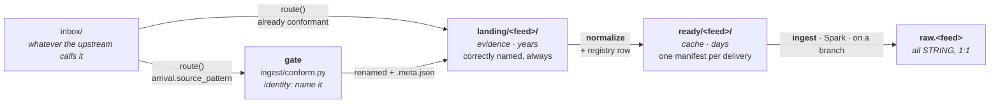
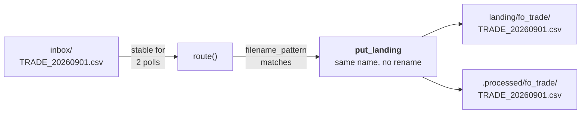
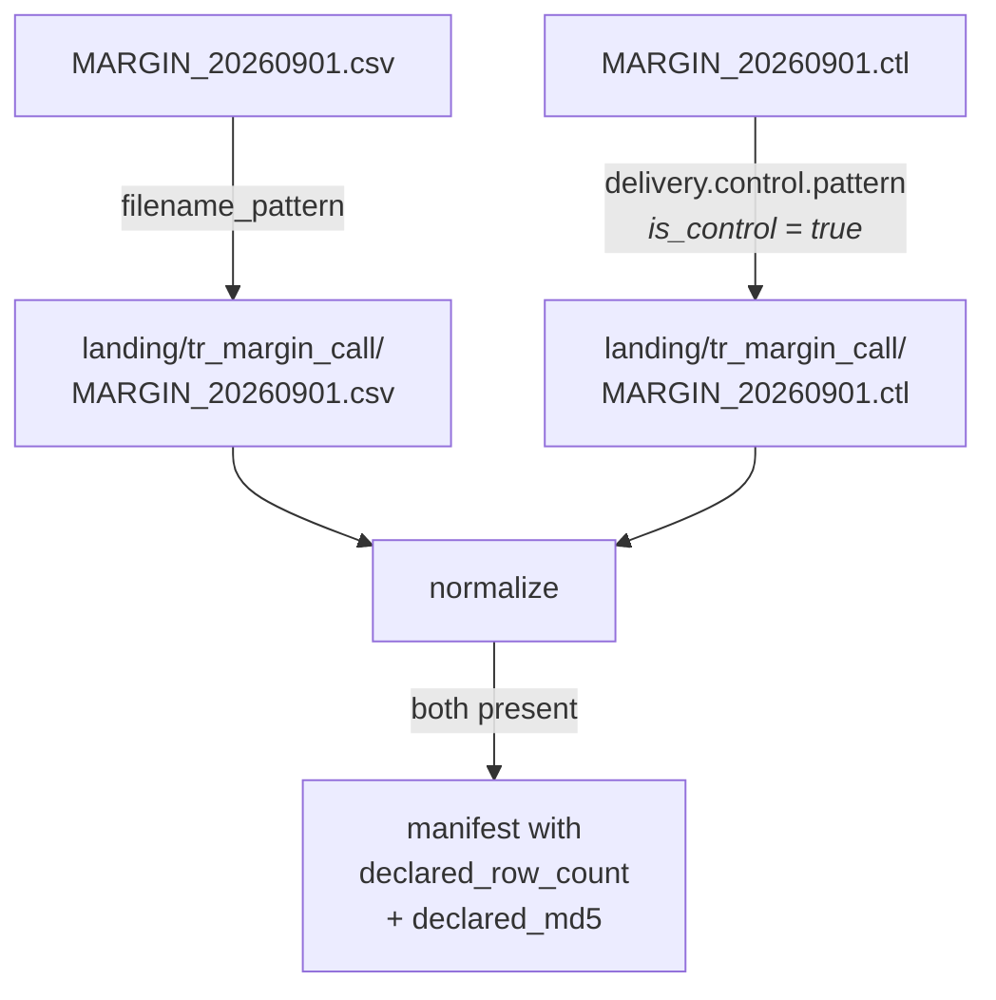
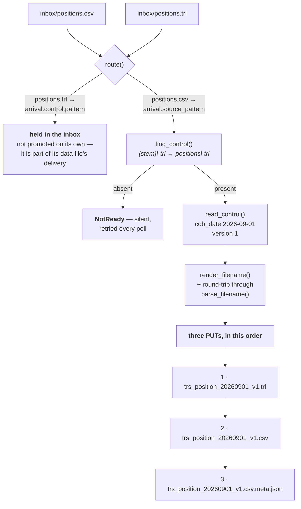
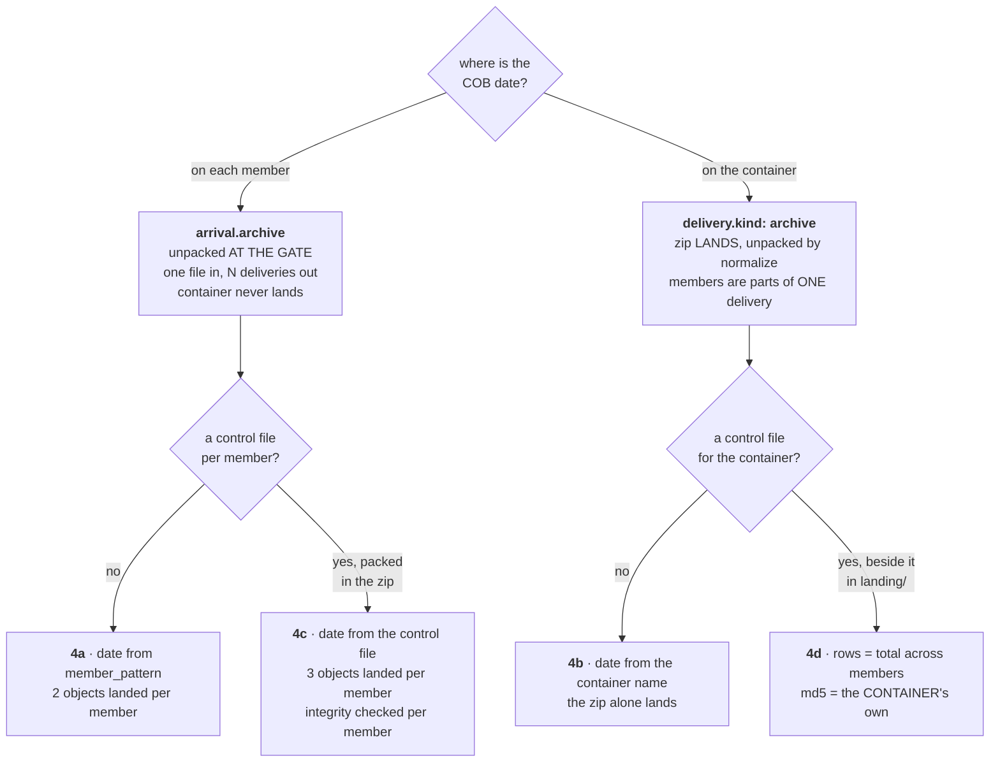

# Four deliveries, end to end

**Legacy compatibility path.** These four worked examples trace the legacy
`inbox` → `landing` → `ready` v1 conformance gate. The current Transport
path's shapes are worked through in
[TRANSPORT-CONTRACT.md](TRANSPORT-CONTRACT.md) and
[DELIVERY-CONTRACT.md](DELIVERY-CONTRACT.md); its live-verified command
sequence is in
[AIRFLOW-ORCHESTRATION.md](AIRFLOW-ORCHESTRATION.md#verifying-the-fast-path-locally).

One file per shape, traced from the moment it appears in `inbox/` to the rows
it becomes in `raw.<feed>` — **every filename, every rename, every object
written, and the full content of every metadata and manifest object**.

[PIPELINE.md](PIPELINE.md) is the same path described once, generically.
[DELIVERY-SHAPES.md](DELIVERY-SHAPES.md) is why the shapes exist and what
each config key means. This file is the worked examples, for when the question
is *"what exactly will land, and what will it be called?"*

**How this was produced.** Feeds were resolved from a throwaway
`REPORTING_CONFIG_DIR`, the deliveries were dropped into a real inbox
directory, and `inbox.sweep()` / `normalize.reconcile()` / `find_pending()`
were run against a scratch MinIO bucket on the live stack. Every JSON body,
object key, landed name and error message below is **copied from that run**,
not composed. The raw-table schema and row provenance are queried from the
live catalogue. The two things *not* executed are marked where they appear:
the Airflow trigger (the demo feeds have no DAG in the container) and the
Spark ingest itself, whose behaviour is quoted from `ingest/ingest_feed.py` —
except for the checksum comparison in §4d, which is run here because it is
the one thing about that shape a reader would reasonably doubt.

Shapes **4c** and **4d** were built after the first four were written up, and
this document is what specified them: §4c described a configuration that
loaded and then deadlocked in silence, which is the shape of bug this repo
treats as worse than a crash.

---

## The shapes

| | What the upstream sends | Dated by | Gate | Lands as |
|---|---|---|---|---|
| **1** | `TRADE_20260901.csv` | its own filename | none — already conformant | the same name |
| **2** | `MARGIN_20260901.csv` + `MARGIN_20260901.ctl` | its own filename | none; the control file gates it **in landing** | both names unchanged |
| **3** | `positions.csv` + `positions.trl` | the control file | **inbox conformance gate** | `trs_position_20260901_v1.csv` + `.trl` + `.csv.meta.json` |
| **4a** | `weekly_20260901.zip` | each member's own name | **gate unpacks it** | one ordinary delivery per member; the zip never lands |
| **4b** | `custodyHoldings_20260901.zip` | the container's name | none; `normalize` unpacks it | the zip itself, members extracted into `ready/` |
| **4c** | `weekly_20260901.zip` of `POSITIONS_A.csv` + `POSITIONS_A.ctl` | each member's own control file, **inside the zip** | **gate unpacks and renames both** | three objects per member |
| **4d** | `custodyHoldings_20260901.zip` + `.trl` | the container's name | none; the control file gates it **in landing** | the zip and its control file |

Case 4 is split because the platform has **two** archive mechanisms at
different stages, and which one a feed wants depends on *where the COB date
is*: on each member (4a, 4c — unpacked at the door) or on the container (4b,
4d — landed whole and exploded by `normalize`). A control file can be added to
either, which is what 4c and 4d are.

---

## The stages, once



Four names matter throughout, and keeping them apart is most of
understanding this:

| Name | Is |
|---|---|
| `filename_pattern` | what **landing** accepts. The contract. |
| `arrival.source_pattern` | what the **upstream** sends, for a feed that needs renaming |
| `arrival.control` | how to find the control file **at the door**, and what it says about **identity** (COB date, version) |
| `delivery.control` | how to find it **in landing**, and what it says about **integrity** (row count, md5), checked at ingest |

---

## Case 1 — a conformant CSV, no control file

The ordinary case, and every feed shipped in `reporting_platform/config/feeds/`
today.

### The feed

```yaml
# reporting_platform/config/feeds/fo_trade.yml
name: fo_trade
description: Daily trade extract, correctly named by the upstream.
source_system: FO_SRC
filename_pattern: 'TRADE_(?P<cob_date>\d{8})(?:_v(?P<version>\d+))?\.csv'
business_key: [trade_id]
expected_min_rows: 1
columns: [trade_id, counterparty_id, notional, currency]
```

No `arrival:` block, so `needs_conforming` is `False` and the resolved
`delivery:` is just `{"kind": "file"}`.

### What arrives

```
inbox/TRADE_20260901.csv
```
```csv
trade_id,counterparty_id,notional,currency
T1,C1,1000000,USD
T2,C2,250000,GBP
```

### The inbox



`route()` tries `filename_pattern` **first**, before any arrival pattern, so a
correctly named file needs no control file and no renaming even for a feed that
*has* an `arrival:` block. The sweep's own output:

```json
{"feed": "fo_trade", "file": "TRADE_20260901.csv", "is_control": false,
 "key": "landing/fo_trade/TRADE_20260901.csv",
 "moved_to": ".processed/fo_trade/TRADE_20260901.csv", "status": "landed"}
```

The file is **moved before the DAG is triggered**: if the trigger fails the
file is already out of the inbox and recorded as landed, so the next pass
cannot re-upload it as a new version.

This whole stage is optional. An approved sender does a `PutObject` straight
into `landing/fo_trade/` and no code of ours runs at all — `reconcile()` picks
it up, which is the production arrival path.

### `landing/` afterwards

```
landing/fo_trade/TRADE_20260901.csv       78 bytes
```

**One object. No `.meta.json`** — nothing was renamed, so there is nothing to
record that the landed name does not already say.

### `ready/` — the manifest

`ready/fo_trade/TRADE_20260901.csv.json`, verbatim:

```json
{
  "checksum_objects": [
    "landing/fo_trade/TRADE_20260901.csv"
  ],
  "cob_date": "2026-09-01",
  "control_object": null,
  "declared_md5": null,
  "declared_row_count": null,
  "delivery_id": "TRADE_20260901.csv",
  "feed": "fo_trade",
  "format": {
    "delimiter": ",",
    "encoding": "utf-8",
    "header": true,
    "quote_char": "\""
  },
  "manifest_version": 1,
  "normalizer": "file/v1",
  "parts": [
    {
      "bytes": 78,
      "object_key": "landing/fo_trade/TRADE_20260901.csv"
    }
  ],
  "received_at": "2026-09-13T08:41:00+00:00",
  "source_object": "landing/fo_trade/TRADE_20260901.csv"
}
```

**Nothing is copied.** The single part points straight back into `landing/`, so
the common case costs one small JSON object. `checksum_objects` names what a
declared md5 would cover — here the same object again, and it earns its place
in §4d, where the delivery and the object the sender hashed are not the same
thing. `received_at` is the landing
object's `LastModified`, not the time normalize ran — which is what makes
re-normalizing an unchanged delivery rewrite byte-identical content, and
`ready/` a cache rather than a third copy.

`find_pending(fo_trade)` → `['ready/fo_trade/TRADE_20260901.csv.json']`.

### The registry row

Writing the manifest is also the moment the delivery is registered
(`registry.delivery`, one row, **no verdicts**):

```json
{
  "bytes": 78,
  "cob_date": "2026-09-01",
  "control_object": null,
  "declared_md5": null,
  "declared_row_count": null,
  "delivery_id": "TRADE_20260901.csv",
  "feed": "fo_trade",
  "md5": "cdc4dcd7aab868b267068536d7141473",
  "normalizer": "file/v1",
  "origin": "direct",
  "origin_uri": "s3://lakehouse/landing/fo_trade/TRADE_20260901.csv",
  "parts": [{"bytes": 78, "object_key": "landing/fo_trade/TRADE_20260901.csv", "part_no": 0}],
  "schema_version": "d63379062267",
  "source_container": null,
  "source_filename": null,
  "source_object": "landing/fo_trade/TRADE_20260901.csv",
  "source_system": "FO_SRC"
}
```

`origin: "direct"` because there is no `.meta.json` stamped `promoted_by`, and
`origin_uri` is then the landing object itself — the earliest thing that
exists. (Only the bucket name in `origin_uri` is edited: the verification run
used a scratch bucket, the platform's is `lakehouse`.)

The registry is an **index, not a ledger**: no `ingested`, no `status`, no
`superseded`. Whether this delivery reached raw stays derived from
`_source_file`, and the whole table is rebuildable from `landing/` and `ready/`
by `registry reconcile` — which is the property that keeps it an index.

### `raw.fo_trade`

`ingest` opens a Nessie branch, reads the parts **with the manifest's own
format**, appends, and merges to `main` only if the checks pass. The live table
today, for a delivery that took exactly this path:

| `_source_file` | `_delivery_id` | `_file_version` | `_received_at` | rows |
|---|---|---|---|---|
| `landing/fo_trade/TRADE_20260819.csv` | `TRADE_20260819.csv` | 1 | 2026-09-09 22:47:41+00 | 400 |

Every declared column is `STRING`; the platform's own columns are
`_extra_columns MAP<STRING,STRING>`, `_cob_date DATE`, `_ingest_ts`,
`_source_file`, `_file_version INT`, `_row_number BIGINT`, `_batch_id`,
`_delivery_id`, `_received_at`, `_schema_version`, `_source_system`.

### A second delivery for the same COB date

The upstream sends `TRADE_20260901_v2.csv`. It matches `filename_pattern`
(whose `(?:_v(?P<version>\d+))?` group exists for exactly this), so it lands
beside the first — **nothing is overwritten**, landing is the evidence copy —
and gets its own manifest and its own raw rows.

`_file_version` is **not** read from the filename: `next_file_version()` takes
`MAX(_file_version) + 1` for that COB date from the raw table itself, so the
second delivery is version 2 whether or not its name says so. `prepared` then
keeps the newest DELIVERY for the COB date, whole (`dedupe_rank`, which is what
`supersession: full_snapshot` means): a key version 2 omits is gone from
`prepared`, and from every report built on it, on the next incremental run.
See
[DECISIONS.md#a-snapshot-re-delivery-restates-the-whole-date](DECISIONS.md#a-snapshot-re-delivery-restates-the-whole-date).

---

## Case 2 — a conformant name, gated on its own control file

The upstream names files correctly **and** sends a control file stating what it
produced. Nothing needs renaming, so there is no `arrival:` block — only
`delivery.control`, which is read on the **landing** side.

### The feed

```yaml
name: tr_margin_call
description: Margin calls, correctly named, gated on a pipe-delimited control file.
source_system: TREASURY
filename_pattern: 'MARGIN_(?P<cob_date>\d{8})(?:_v(?P<version>\d+))?\.csv'
business_key: [call_id]
expected_min_rows: 1
delivery:
  kind: file
  control:
    pattern: '{stem}\.ctl'
    format:
      kind: delimited
      delimiter: "|"
    row_count: RECORD_COUNT
    md5: CHECKSUM
columns: [call_id, counterparty_id, amount, currency]
```

`format.kind: delimited` changes **what the field keys mean**: `RECORD_COUNT`
and `CHECKSUM` are **column names**, not regexes. `delimiter` is required and
is deliberately *not* inherited from the feed's own `,` — a pipe file read as
commas is not an error, it is one column named by the whole header line.

### What arrives

```
inbox/MARGIN_20260901.csv
inbox/MARGIN_20260901.ctl
```
```csv
call_id,counterparty_id,amount,currency
M1,C1,45000,USD
M2,C3,12500,EUR
```
```
RECORD_COUNT|CHECKSUM|PRODUCED_AT
2|03714256815f77d96123f1bb56850ba3|2026-09-01T06:12:00Z
```

Exactly one data row. `PRODUCED_AT` is simply not read — extra columns are
fine; a second *row* is refused, because which row belongs to this delivery is
not guessable.

### The inbox: two files, two routes, neither renamed



```json
{"feed": "tr_margin_call", "file": "MARGIN_20260901.csv", "is_control": false,
 "key": "landing/tr_margin_call/MARGIN_20260901.csv", "status": "landed"}
{"feed": "tr_margin_call", "file": "MARGIN_20260901.ctl", "is_control": true,
 "key": "landing/tr_margin_call/MARGIN_20260901.ctl", "status": "landed"}
```

A control file **matches no data pattern** — it names no COB date, it says
something about a delivery that does — so `route()` checks the control patterns
only after both data patterns have declined it. Without that it would be
rejected as unroutable and the delivery would wait forever on a file that can
never arrive. A control file is triggered **with no `object_key`**: it names no
delivery of its own, so the run falls back to `find_pending`, which picks up
whichever delivery it just unblocked.

### The control file has not arrived yet

Verified, with the data file landed alone:

```
reconcile: {"created": [], "landed": 2, "failed": [],
            "awaiting_control": [
              {"object": "landing/tr_margin_call/MARGIN_20260902.csv",
               "waiting_for": "tr_margin_call: MARGIN_20260902.csv is waiting on a
                control file matching '{stem}\\.ctl' (stem 'MARGIN_20260902') in the
                same landing folder. Not a failure -- a late feed, not a failed one."}]}
pending: []                      # the delivery is landed and not yet ingestible
```

No manifest, no registry row, **not pending** — and logged at INFO, because
this runs on every poll and nothing is wrong. In Airflow the `normalize` task
**skips** rather than fails: `retries: 2` at a ten-second delay would turn "the
control file is not here yet" into a hard failure inside a minute. There is no
arrival timeout by decision; the poll path picks it up. Once the `.ctl` lands:

```
reconcile: {"created": ["ready/tr_margin_call/MARGIN_20260902.csv.json"],
            "awaiting_control": [], "landed": 2}
pending: ['ready/.../MARGIN_20260901.csv.json', 'ready/.../MARGIN_20260902.csv.json']
```

### The manifest

`ready/tr_margin_call/MARGIN_20260901.csv.json`, verbatim — the three keys
case 1 had as `null` are now filled in:

```json
{
  "checksum_objects": [
    "landing/tr_margin_call/MARGIN_20260901.csv"
  ],
  "cob_date": "2026-09-01",
  "control_object": "landing/tr_margin_call/MARGIN_20260901.ctl",
  "declared_md5": "03714256815f77d96123f1bb56850ba3",
  "declared_row_count": 2,
  "delivery_id": "MARGIN_20260901.csv",
  "feed": "tr_margin_call",
  "format": {
    "delimiter": ",",
    "encoding": "utf-8",
    "header": true,
    "quote_char": "\""
  },
  "manifest_version": 1,
  "normalizer": "file/v1",
  "parts": [
    {
      "bytes": 72,
      "object_key": "landing/tr_margin_call/MARGIN_20260901.csv"
    }
  ],
  "received_at": "2026-09-13T08:41:00+00:00",
  "source_object": "landing/tr_margin_call/MARGIN_20260901.csv"
}
```

What the control file declared is recorded **once**, here, as an observation —
not re-read at ingest. `declared_md5` is lower-cased on the way in, and again
at ingest, because hex case is the sender's property and not our reader's.

### At ingest — where the declaration is actually checked

Three checks, in this order, each of which **abandons the branch** so `main` is
untouched (`ingest_feed.py`):

| Check | Compares | Catches |
|---|---|---|
| `expected_min_rows` | rows read ≥ the floor | a truncated delivery. Every feed. |
| `declared_row_count` | rows read **==** the declared count | a short or duplicated extract |
| `declared_md5` | md5 of the parts **as landed** | a file re-encoded or truncated in transit that still has the right *number* of rows |

The md5 is taken through boto3 over the landed object, not through the
dataframe — it is a checksum of the bytes the sender hashed, and hashing a
re-serialisation would never match.

**This is why the integrity keys live on `delivery.control` and not on
`arrival.control`.** They run here, once, for every delivery however it
arrived — so an approved sender gets exactly the same verification as the
legacy feed in case 3, from one implementation. Checking at the door instead
would leave the trusted path the less-verified one.

---

## Case 3 — a static name, dated only by its control file

The shape the inbox gate exists for: `positions.csv` every day, with the date
on a line inside `positions.trl`.

### The feed

```yaml
name: trs_position
description: Positions from a legacy sender that names nothing usefully.
source_system: TRS
filename_pattern: 'trs_position_(?P<cob_date>\d{8})(?:_v(?P<version>\d+))?\.csv'
business_key: [position_id]
expected_min_rows: 1
arrival:                                   # IDENTITY, at the door
  source_pattern: 'positions\.csv'
  control:
    pattern: '{stem}\.trl'
    cob_date: 'ReportingDate\|(?P<cob_date>\d{8})'
    version: 'Revision\|(?P<version>\d+)'
delivery:                                  # INTEGRITY, in landing
  kind: file
  control:
    pattern: '{stem}\.trl'
    row_count: 'ROWS=(?P<rows>\d+)'
    md5: 'MD5=(?P<md5>[0-9a-fA-F]{32})'
columns: [position_id, instrument_id, quantity]
```

**Both blocks are required and they read the same bytes.** `arrival.control`
with no `delivery.control` is refused at load — it would promote a control file
nothing reads, losing the row count and checksum for exactly the feed least
likely to deserve that trust. And because they read one file, a `format:`
declared on each must be **identical**; the loader refuses two readings of one
file.

### What arrives

```
inbox/positions.csv
inbox/positions.trl
```
```csv
position_id,instrument_id,quantity
P1,ISIN1,100
P2,ISIN2,250
P3,ISIN3,75
```
```
ReportingDate|20260901
Revision|1
ROWS=3
MD5=1da693e8ee9557770eef34a1eded654d
```

One file, four lines, **read twice by two blocks for different fields**: the
gate takes `ReportingDate` and `Revision`; `normalize` takes `ROWS` and `MD5`
from the promoted copy. Under the default `format: regex` each field is a regex
over the whole text with one named group, so nothing has to know the file has
lines at all.

### The gate



```json
{"cob_date": "2026-09-01", "feed": "trs_position", "file": "positions.csv",
 "status": "conformed",
 "key": "landing/trs_position/trs_position_20260901_v1.csv",
 "landed_as": "trs_position_20260901_v1.csv",
 "control_landed_as": "trs_position_20260901_v1.trl",
 "moved_to": ".processed/trs_position/positions.csv"}
```

Four things in that output are worth stopping on.

**The two names are different strings, on purpose.** `positions.csv` is what
the upstream sends (`Feed.claims_source`); `trs_position_20260901_v1.csv` is
what landing holds (`Feed.parse_filename`). `ingest/conform.py` is the only
thing that crosses between them.

**The landing name cannot be one landing would reject.** It is *built from*
`filename_pattern` by `render_filename` and then fed back through
`parse_filename`; a name that does not round-trip raises instead of landing.
That makes the silent failure — a renamed file that lands and is never
ingested — structurally impossible rather than something a test must remember.

**`_v1`, because the control file declared `Revision|1`.** A version the sender
states wins outright, and `render_filename` emits the optional group whenever a
version is passed. Drop `version:` from `arrival.control` and the same delivery
lands as `trs_position_20260901.csv`; both parse back to version 1, so this is
a naming choice, not a behaviour change.

**The write order is control file → data file → metadata.** The data file is
what a triggered run acts on, so writing it second-to-last means no run can
find a delivery whose control file has not landed. If the metadata write then
fails, the delivery is complete and ingests with its provenance missing — the
failure to prefer over the reverse.

### `landing/` afterwards

```
landing/trs_position/trs_position_20260901_v1.trl              78 bytes
landing/trs_position/trs_position_20260901_v1.csv              73 bytes
landing/trs_position/trs_position_20260901_v1.csv.meta.json   585 bytes
```

**Three objects, and the control file is promoted, not consumed.** The delivery
*is* the pair, so landing holds the pair — which is what lets `delivery.control`
verify it there exactly as it verifies case 2, and why the stages below cannot
tell the two cases apart. The promoted control file is named from
`delivery.control.pattern` with the **landing** stem, not by keeping its inbox
name, because that is the pattern that has to find it later.

### The `.meta.json`, verbatim

```json
{
  "bytes": 73,
  "cob_date": "2026-09-01",
  "declared": {
    "cob_date": "2026-09-01",
    "version": 1
  },
  "feed": "trs_position",
  "landing_control_filename": "trs_position_20260901_v1.trl",
  "landing_filename": "trs_position_20260901_v1.csv",
  "md5": "1da693e8ee9557770eef34a1eded654d",
  "metadata_version": 1,
  "promoted_at": "2026-09-13T08:41:00.300258+00:00",
  "promoted_by": "inbox",
  "received_at": "2026-09-13T08:41:00.231439+00:00",
  "row_count": 3,
  "source_control_filename": "positions.trl",
  "source_filename": "positions.csv",
  "source_system": "TRS"
}
```

This is **the only record of what the upstream actually called its files** —
the landed objects carry the platform's names. `declared` holds identity only;
`ROWS` and `MD5` are in the same control file and deliberately not here.
`bytes`/`md5`/`row_count` are *measured at the door and never compared* — they
are provenance, and if the ingest later disputes the count they are what says
whether the file changed after arrival or arrived wrong. `row_count` is parsed
with the feed's own dialect, so a quoted embedded newline is one row.

### The manifest

`ready/trs_position/trs_position_20260901_v1.csv.json` — note that from here
on nothing distinguishes this delivery from case 2's:

```json
{
  "checksum_objects": ["landing/trs_position/trs_position_20260901_v1.csv"],
  "cob_date": "2026-09-01",
  "control_object": "landing/trs_position/trs_position_20260901_v1.trl",
  "declared_md5": "1da693e8ee9557770eef34a1eded654d",
  "declared_row_count": 3,
  "delivery_id": "trs_position_20260901_v1.csv",
  "feed": "trs_position",
  "format": {"delimiter": ",", "encoding": "utf-8", "header": true, "quote_char": "\""},
  "manifest_version": 1,
  "normalizer": "file/v1",
  "parts": [
    {"bytes": 73, "object_key": "landing/trs_position/trs_position_20260901_v1.csv"}
  ],
  "received_at": "2026-09-13T08:41:00+00:00",
  "source_object": "landing/trs_position/trs_position_20260901_v1.csv"
}
```

And the registry row records where it came from, which no other stage can:

```json
{"origin": "inbox", "origin_uri": "inbox:positions.csv",
 "source_filename": "positions.csv", "source_container": null,
 "delivery_id": "trs_position_20260901_v1.csv",
 "md5": "1da693e8ee9557770eef34a1eded654d",
 "control_object": "landing/trs_position/trs_position_20260901_v1.trl",
 "declared_row_count": 3, "schema_version": "51f52eb9ceff", "bytes": 73}
```

### The same file sent twice — nothing happens

```json
{"status": "duplicate", "feed": "trs_position", "file": "positions.csv",
 "landed_as": "trs_position_20260901_v1.csv",
 "reason": "trs_position: trs_position_20260901_v1.csv already holds these exact
  bytes (md5 1da693e8ee9557770eef34a1eded654d) for 2026-09-01. An unchanged
  resend is not a restatement -- nothing is landed and nothing is ingested."}
```

Sameness is decided on the **bytes**, only against deliveries already landed
for that date. A name being taken is not enough to version past it: a retried
transfer would otherwise become `_v2` and restate a day the upstream never
restated. The inbox copy still moves to `.processed/`, where a colliding name
is timestamped — `positions.20260913T084100.csv` — so the resend stays on disk
as evidence it happened.

### A genuine restatement

Different bytes, and the control file says `Revision|2`:

```json
{"status": "conformed", "cob_date": "2026-09-01",
 "landed_as": "trs_position_20260901_v2.csv",
 "control_landed_as": "trs_position_20260901_v2.trl"}
```

```
landing/trs_position/trs_position_20260901_v1.csv   + .trl + .csv.meta.json
landing/trs_position/trs_position_20260901_v2.csv   + .trl + .csv.meta.json
```

Six objects, two deliveries, one COB date, nothing overwritten. With no
`Revision` line the gate would have tried the unversioned name, found it taken,
compared md5s, and stepped to `_v2` on its own.

### An identity failure

The control file arrives but does not say what it was configured to say — here,
a restatement whose `Revision|` line the sender dropped:

```json
{"status": "rejected", "feed": "trs_position", "file": "positions.csv",
 "reason": "trs_position: control file positions.trl does not match
  `arrival.control.version` 'Revision\\|(?P<version>\\d+)'. The control file
  arrived and does not say what it was configured to say -- a format change
  upstream, not a timing problem, so it will not clear on its own."}
```

The delivery **cannot be named**, so there is no landing key to write it to and
no amount of waiting fixes it: bytes to `quarantine/`, a row in
`registry.rejection`, and `.rejected/` as the console's working copy. **The
control file is quarantined with it** — on its own it is unreadable evidence,
and the commonest identity failure is that the two disagree.

Contrast with an **integrity** failure, which lands and fails at ingest.
Landing is the evidence copy and a truncated file is precisely what it exists
to prove.

---

## Case 4 — a zip

Two mechanisms, at two stages. **Where the COB date is** picks the mechanism;
whether a control file comes with it is then an independent choice, which is
what gives four shapes rather than two.



### 4a · the members carry the date — the gate unpacks it

```yaml
name: cust_position
description: A weekly zip holding one complete file per COB date.
source_system: CUST
filename_pattern: 'cust_position_(?P<cob_date>\d{8})(?:_v(?P<version>\d+))?\.csv'
business_key: [position_id]
expected_min_rows: 1
arrival:
  source_pattern: 'weekly_\d{8}\.zip'
  archive:
    member_pattern: 'POS_(?P<cob_date>\d{8})\.csv'
columns: [position_id, instrument_id, quantity]
```

`member_pattern` **must** capture `(?P<cob_date>...)`: each member is landed as
its own delivery, so each must say which day it is for. The container needs no
date of its own — `source_pattern` here has no `cob_date` group and that is
fine, because it is a transport wrapper, not a delivery. Note that
`filename_pattern` describes the **members after renaming**, never the zip.

`inbox/weekly_20260901.zip` holding:

```
POS_20260831.csv      position_id,instrument_id,quantity / P1,ISIN1,10
POS_20260901.csv      position_id,instrument_id,quantity / P2,ISIN2,20 / P3,ISIN3,30
checksums.txt         not claimed by member_pattern
```

`unpack()` returns `['POS_20260831.csv', 'POS_20260901.csv']` — sorted, so
landing order never depends on how the sender built the archive.
`checksums.txt` is **skipped, not an error**; a zip matching *nothing* is an
error, because an archive that unpacks to nothing is a delivery problem and
landing zero rows would pass `expected_min_rows` only by accident. A member
naming a path (`../POS_20260901.csv`) is refused outright.

```json
{"status": "conformed", "cob_date": "2026-08-31", "feed": "cust_position",
 "file": "weekly_20260901.zip!POS_20260831.csv",
 "landed_as": "cust_position_20260831.csv",
 "moved_to": ".processed/cust_position/weekly_20260901.zip"}
{"status": "conformed", "cob_date": "2026-09-01", "feed": "cust_position",
 "file": "weekly_20260901.zip!POS_20260901.csv",
 "landed_as": "cust_position_20260901.csv",
 "moved_to": ".processed/cust_position/weekly_20260901.zip"}
```

```
landing/cust_position/cust_position_20260831.csv                47 bytes
landing/cust_position/cust_position_20260831.csv.meta.json     570 bytes
landing/cust_position/cust_position_20260901.csv                59 bytes
landing/cust_position/cust_position_20260901.csv.meta.json     570 bytes
```

**The container is never landed.** `landing/` holds only objects Spark can read
directly, and the sidecar is the only record the zip existed:

```json
{
  "bytes": 47,
  "cob_date": "2026-08-31",
  "declared": {},
  "feed": "cust_position",
  "landing_filename": "cust_position_20260831.csv",
  "md5": "508ac482768bb6a093301ae3bc8586ae",
  "metadata_version": 1,
  "promoted_at": "2026-09-13T08:41:00.342582+00:00",
  "promoted_by": "inbox",
  "received_at": "2026-09-13T08:41:00.231439+00:00",
  "row_count": 1,
  "source_container": "weekly_20260901.zip",
  "source_container_bytes": 685,
  "source_container_md5": "b38d31b542bdba664a3ef79033ed0f76",
  "source_filename": "POS_20260831.csv",
  "source_system": "CUST"
}
```

Three keys case 3 does not have (`source_container`, `_bytes`, `_md5`), and two
it does not have here (`landing_control_filename`, `source_control_filename`) —
**absent, not null**. `declared` is `{}`.

From `normalize` onwards each member is an ordinary `file/v1` delivery:
two manifests, two registry rows (`origin: "inbox"`,
`origin_uri: "inbox:POS_20260831.csv"`, `source_container:
"weekly_20260901.zip"`), two COB dates, two raw ingests, two snapshot tags.
`find_pending` returns both.

One bad member does not discard the rest: it is quarantined **with its own
bytes** (not the container's) under `weekly_20260901.zip!POS_xxx.csv`, and the
others land. A container resent whole is caught member by member on md5 and
reported as duplicates — without which every COB date in the zip would restate
itself at once.

### 4b · the container carries the date — `normalize` unpacks it

This is the shape for statically named members: `holdings_part1.csv`,
`holdings_part2.csv` — neither of which says which day it is for — inside a zip
that does.

```yaml
name: cust_holding
description: One zip per COB date whose members are parts of one delivery.
source_system: CUST
filename_pattern: 'custodyHoldings_(?P<cob_date>\d{8})(?:_v(?P<version>\d+))?\.zip'
business_key: [holding_id]
expected_min_rows: 1
delivery:
  kind: archive
  member_pattern: 'holdings_part\d+\.csv'
columns: [holding_id, instrument_id, quantity]
```

Here `filename_pattern` matches **the zip itself**, which is what lets routing,
`matching()` and landing retention know nothing about archives. The resolved
block fills in its defaults:

```json
{"kind": "archive", "cob_date_from": "container", "parts": "concat",
 "member_pattern": "holdings_part\\d+\\.csv"}
```

The inbox treats it as already conformant — one ordinary upload, no gate, no
sidecar:

```json
{"feed": "cust_holding", "file": "custodyHoldings_20260901.zip",
 "is_control": false, "status": "landed",
 "key": "landing/cust_holding/custodyHoldings_20260901.zip"}
```

```
landing/cust_holding/custodyHoldings_20260901.zip   445 bytes
```

**`normalize` is the stage that copies bytes** — the first one that does. The
members are extracted into `ready/`, where short retention and rebuildability
apply, never into `landing/`, which holds the container as delivered:

```
ready/cust_holding/custodyHoldings_20260901.zip.json                  794 bytes
ready/cust_holding/custodyHoldings_20260901/holdings_part1.csv         46 bytes
ready/cust_holding/custodyHoldings_20260901/holdings_part2.csv         46 bytes
```

```json
{
  "checksum_objects": [
    "landing/cust_holding/custodyHoldings_20260901.zip"
  ],
  "cob_date": "2026-09-01",
  "control_object": null,
  "declared_md5": null,
  "declared_row_count": null,
  "delivery_id": "custodyHoldings_20260901.zip",
  "feed": "cust_holding",
  "format": {"delimiter": ",", "encoding": "utf-8", "header": true, "quote_char": "\""},
  "manifest_version": 1,
  "normalizer": "archive/v1",
  "parts": [
    {
      "bytes": 46,
      "member": "holdings_part1.csv",
      "object_key": "ready/cust_holding/custodyHoldings_20260901/holdings_part1.csv"
    },
    {
      "bytes": 46,
      "member": "holdings_part2.csv",
      "object_key": "ready/cust_holding/custodyHoldings_20260901/holdings_part2.csv"
    }
  ],
  "received_at": "2026-09-13T08:41:00+00:00",
  "source_object": "landing/cust_holding/custodyHoldings_20260901.zip"
}
```

`MANIFEST.txt` inside the zip is skipped by `member_pattern`. The extraction
directory is derived from the container's **filename**, not a timestamp or a
uuid, because `already_ingested` matches on `_source_file` — a varying key
would re-ingest every re-normalized delivery forever.

**One delivery, two parts.** At ingest the parts are read in `parts` order and
unioned, each frame tagged with **its own** `object_key`, so in `raw`:

- `_source_file` is `ready/cust_holding/custodyHoldings_20260901/holdings_part1.csv`
  (the part — *not* the landing key, and not the manifest key)
- `_delivery_id` is `custodyHoldings_20260901.zip` (the delivery)
- `_file_version` is one version for the whole delivery, not one per part

The registry row shows the same split: `bytes: 92` is the sum of the **members**
(the container's own 445 is the sidecar's business, and there is no sidecar
here), with one `delivery_part` row per member.

### 4c · per-member control files inside a zip

The fourth shape: members named nothing useful, each packed beside its own
control file. **Built** — this section described a deadlock until it was.

```yaml
name: cust_position
filename_pattern: 'cust_position_(?P<cob_date>\d{8})(?:_v(?P<version>\d+))?\.csv'
arrival:
  source_pattern: 'weekly_\d{8}\.zip'
  control:                                # found INSIDE the container
    pattern: '{stem}\.ctl'
    cob_date: 'DATE=(?P<cob_date>\d{8})'
  archive:
    member_pattern: 'POSITIONS_[A-Z]\.csv'   # NO date in the member name
delivery:
  kind: file
  control:
    pattern: '{stem}\.ctl'
    row_count: 'ROWS=(?P<rows>\d+)'
    md5: 'MD5=(?P<md5>[0-9a-fA-F]{32})'
```

`member_pattern` captures no `cob_date` and that is now legal: exactly one
source must answer, and here it is the control file. Both blocks are required,
as in case 3 — the gate reads identity out of the control file, and
`delivery.control` verifies integrity at ingest, after the pair has landed.

`inbox/weekly_20260901.zip` holding:

```
POSITIONS_A.csv    position_id,instrument_id,quantity / P1,ISIN1,10
POSITIONS_A.ctl    DATE=20260831 / ROWS=1 / MD5=508ac48…
POSITIONS_B.csv    position_id,instrument_id,quantity / P2,ISIN2,20 / P3,ISIN3,30
POSITIONS_B.ctl    DATE=20260901 / ROWS=2 / MD5=459185…
checksums.txt      not claimed by member_pattern
```

```json
{"status": "conformed", "cob_date": "2026-08-31", "feed": "cust_position",
 "file": "weekly_20260901.zip!POSITIONS_A.csv",
 "landed_as": "cust_position_20260831.csv",
 "control_landed_as": "cust_position_20260831.ctl",
 "moved_to": ".processed/cust_position/weekly_20260901.zip"}
{"status": "conformed", "cob_date": "2026-09-01", "feed": "cust_position",
 "file": "weekly_20260901.zip!POSITIONS_B.csv",
 "landed_as": "cust_position_20260901.csv",
 "control_landed_as": "cust_position_20260901.ctl"}
```

**Three objects per member**, exactly as case 3 lands three per delivery — one
inbox file becoming six:

```
landing/cust_position/
  cust_position_20260831.ctl                58 bytes   promoted from POSITIONS_A.ctl
  cust_position_20260831.csv                47 bytes
  cust_position_20260831.csv.meta.json     709 bytes
  cust_position_20260901.ctl                58 bytes
  cust_position_20260901.csv                59 bytes
  cust_position_20260901.csv.meta.json     709 bytes
```

The sidecar carries both of the member's names *and* both of its control
file's, which is the only record of either:

```json
{
  "bytes": 47,
  "cob_date": "2026-08-31",
  "declared": { "cob_date": "2026-08-31" },
  "feed": "cust_position",
  "landing_control_filename": "cust_position_20260831.ctl",
  "landing_filename": "cust_position_20260831.csv",
  "md5": "508ac482768bb6a093301ae3bc8586ae",
  "metadata_version": 1,
  "promoted_at": "2026-09-13T10:38:50.745040+00:00",
  "promoted_by": "inbox",
  "received_at": "2026-09-13T10:38:50.738446+00:00",
  "row_count": 1,
  "source_container": "weekly_20260901.zip",
  "source_container_bytes": 779,
  "source_container_md5": "d082855f25845f11d8a97704ebc6a382",
  "source_control_filename": "POSITIONS_A.ctl",
  "source_filename": "POSITIONS_A.csv",
  "source_system": "CUST"
}
```

From `normalize` onwards each member is an ordinary `file/v1` delivery with
its integrity declared — indistinguishable from case 2:

```json
{
  "checksum_objects": ["landing/cust_position/cust_position_20260831.csv"],
  "cob_date": "2026-08-31",
  "control_object": "landing/cust_position/cust_position_20260831.ctl",
  "declared_md5": "508ac482768bb6a093301ae3bc8586ae",
  "declared_row_count": 1,
  "delivery_id": "cust_position_20260831.csv",
  "normalizer": "file/v1",
  "parts": [{"bytes": 47,
             "object_key": "landing/cust_position/cust_position_20260831.csv"}]
}
```

**A member's control file missing from the container is a refusal, not a
wait** — a container arrives complete, so a file absent from it will never
turn up beside it. That member is quarantined with *its own* bytes and the
others land:

```json
{"status": "rejected", "file": "weekly_20260901.zip!POSITIONS_B.csv",
 "reason": "cust_position: member POSITIONS_B.csv of weekly_20260901.zip has
  no control file matching '{stem}\.ctl' (stem 'POSITIONS_B') inside the
  container. The member's COB date is read out of that file, so without it the
  member cannot be named."}
```

> **What this replaced.** The same configuration used to load cleanly and then
> do nothing: `conform_member` read no control file, so the `.ctl` members were
> dropped at the gate, and every landed member waited in `landing/` for a
> control file that could not arrive — `awaiting_control` at INFO on every
> poll, `pending` empty, indefinitely. Nothing raised and nothing was
> quarantined. See
> [DECISIONS.md#unpacking-happens-at-the-gate](DECISIONS.md#unpacking-happens-at-the-gate).

### 4d · a container gated on its own control file

The other half of the same change: `delivery.control` on `kind: archive`, for
a zip that lands whole (4b) and is described by a control file beside it.

```yaml
delivery:
  kind: archive
  member_pattern: 'holdings_part\d+\.csv'
  control:
    pattern: '{stem}\.trl'
    row_count: 'ROWS=(?P<rows>\d+)'        # the TOTAL across the members
    md5: 'MD5=(?P<md5>[0-9a-fA-F]{32})'     # the CONTAINER's own checksum
```

The zip lands, and **nothing is extracted while it waits** — the gate runs
before the members are written, or every poll of an unfinished wait would
rewrite them:

```
normalize with no control file yet:
  {"awaiting_control": [{"object": "landing/cust_holding/custodyHoldings_20260901.zip",
    "waiting_for": "... waiting on a control file matching '{stem}\.trl'
     (stem 'custodyHoldings_20260901') in the same landing folder."}],
   "created": [], "failed": [], "landed": 1}
  ready/ objects: []
  pending: []
```

Once `custodyHoldings_20260901.trl` lands beside it:

```json
{
  "checksum_objects": ["landing/cust_holding/custodyHoldings_20260901.zip"],
  "cob_date": "2026-09-01",
  "control_object": "landing/cust_holding/custodyHoldings_20260901.trl",
  "declared_md5": "c1d0d8bf4141a92b8f609ce94e693c82",
  "declared_row_count": 2,
  "delivery_id": "custodyHoldings_20260901.zip",
  "normalizer": "archive/v1",
  "parts": [
    {"bytes": 46, "member": "holdings_part1.csv",
     "object_key": "ready/cust_holding/custodyHoldings_20260901/holdings_part1.csv"},
    {"bytes": 46, "member": "holdings_part2.csv",
     "object_key": "ready/cust_holding/custodyHoldings_20260901/holdings_part2.csv"}
  ],
  "source_object": "landing/cust_holding/custodyHoldings_20260901.zip"
}
```

Two numbers, two subjects, and the distinction is the whole of this shape:

| Declared | Is about | Checked against |
|---|---|---|
| `row_count: 2` | the **delivery** | the rows read after the parts are unioned |
| `md5` | the **container** | `checksum_objects`, hashed as landed |

The sender hashed the zip it sent; the members under `ready/` are the
platform's own extraction, and hashing those would fail on a delivery that is
perfectly intact. `checksum_objects` is how the manifest says which of the two
a declared checksum covers, so `ingest_feed` verifies every shape through one
path. Verified end to end:

```
ingest would hash: ['landing/cust_holding/custodyHoldings_20260901.zip']
   and get       : c1d0d8bf4141a92b8f609ce94e693c82
   control declared: c1d0d8bf4141a92b8f609ce94e693c82
   AGREE: True
```

### Still not built

`cob_date_from: member` / `path` and `parts: separate` — each refused at load
with a message naming the gap rather than calling it an unknown key
(`context.NOT_BUILT`).

## Side by side

| | 1 · plain | 2 · name + control | 3 · gate + control | 4a · zip, dated members | 4b · zip, dated container | 4c · zip + member control | 4d · zip + container control |
|---|---|---|---|---|---|---|---|
| `arrival:` | — | — | `source_pattern` + `control` | `source_pattern` + `archive` | — | `source_pattern` + `control` + `archive` | — |
| `delivery:` | `{kind: file}` | `control` | `control` | `{kind: file}` | `kind: archive` + `member_pattern` | `control` | `kind: archive` + `member_pattern` + `control` |
| Each member dated by | — | — | — | its own name | the container | **its own control file** | the container |
| Renamed at the door | no | no | **yes, both files** | **yes, each member** | no | **yes, each member and its control file** | no |
| Objects in `landing/` per delivery | 1 | 2 | **3** | 2 (CSV + sidecar) | 1 (the zip) | **3** | 2 (zip + control) |
| `.meta.json` | — | — | ✓ | ✓ | — | ✓ | — |
| Container landed | — | — | — | **never** | ✓ | **never** | ✓ |
| `normalizer` | `file/v1` | `file/v1` | `file/v1` | `file/v1` | `archive/v1` | `file/v1` | `archive/v1` |
| Bytes copied by normalize | none | none | none | none | **the members** | none | **the members** |
| `parts` | 1, → `landing/` | 1, → `landing/` | 1, → `landing/` | 1, → `landing/` | N, → `ready/` | 1, → `landing/` | N, → `ready/` |
| Deliveries per inbox file | 1 | 1 (+1 control) | 1 | **N** | 1 | **N** | 1 (+1 control) |
| `_delivery_id` | `TRADE_20260901.csv` | `MARGIN_20260901.csv` | `trs_position_20260901_v1.csv` | `cust_position_20260831.csv` | `custodyHoldings_20260901.zip` | `cust_position_20260831.csv` | `custodyHoldings_20260901.zip` |
| `_source_file` | the landing object | the landing object | the landing object | the landing object | **the `ready/` part** | the landing object | **the `ready/` part** |
| `checksum_objects` | the landing object | the landing object | the landing object | the landing object | **the container** | the landing object | **the container** |
| `origin` | `direct` | `direct` | `inbox` | `inbox` | `direct` | `inbox` | `direct` |
| Row count / md5 checked | floor only | ✓ at ingest | ✓ at ingest | floor only | floor only | ✓ at ingest, per member | ✓ at ingest, per delivery |

---

## Where each shape can stop

| Stage | Condition | What happens |
|---|---|---|
| inbox | still being written | held — size and mtime must be unchanged for two polls |
| inbox | no feed claims the name | `quarantine/` + `registry.rejection` + `.rejected/`, classed `unroutable` |
| inbox | two feeds claim it | same, classed `ambiguous` — never guessed |
| inbox | control file not in the inbox yet | **held silently**, retried every poll (`NotReady`) |
| inbox | control file says the wrong thing | **rejected** — identity. Both files quarantined |
| inbox | no COB date derivable | rejected — it cannot be named, so it cannot land |
| inbox | same bytes already landed for that date | `duplicate` — nothing landed, nothing triggered |
| inbox | zip matches no member | rejected; one bad member among good ones is quarantined alone |
| inbox | a member's control file is not in the container | that **member** is refused, not held — a container arrives complete; the others land |
| inbox | upload failed | left in place; the next pass retries |
| normalize | control file not beside it in `landing/` | `awaiting_control`, INFO, not pending; the Airflow task **skips** |
| normalize | object unroutable or unreadable | counted and skipped — one bad file never blocks the rest |
| ingest | below `expected_min_rows` | branch kept, `main` untouched |
| ingest | rows ≠ `declared_row_count` | branch kept, `main` untouched |
| ingest | md5 ≠ `declared_md5` | branch kept, `main` untouched |
| ingest | declared column missing from the table | added on the branch by `ensure_raw_schema`; an undeclared one is never dropped |

Two traps that are configuration, not delivery:

- **Two feeds may share a control suffix; two feeds with the same *stem shape*
  may not.** A control file is attributed by its stem — `MARGIN_20260901.ctl`
  is `tr_margin_call`'s because `MARGIN_20260901.csv` is a name that feed
  claims — so `.ctl` is reusable across source systems. What cannot be
  attributed is a pair whose data names differ only by extension
  (`A_….csv` and `A_….txt`): `A_20260903.ctl` belongs equally to both, and
  that pair is **refused at load**, so it fails `config check` and CI rather
  than silently rejecting every control file those feeds ever send. A `.ctl`
  whose stem matches no feed at all is `unroutable`, and lands in the
  console's unclaimed queue.
- **`expected_by` must be quoted.** YAML 1.1 reads `7:00` as the integer 420,
  and a leading zero hides it until the first unpadded hour.

---

## Reproducing this

```powershell
# drop any of the files above into ./inbox and watch it route
docker compose up -d inbox
docker compose exec -T inbox python -m reporting_platform.ingest.inbox --dry-run

# what routes where, without moving anything
curl -s http://localhost:8082/api/inbox

# what became of every file offered -- a join, written nowhere
curl -s 'http://localhost:8082/api/arrivals?limit=20'

# what normalize produced and what is pending
docker compose exec -T airflow python -m scripts._spark_task pending fo_trade

# the manifest and the registry row for one delivery
docker compose exec -T airflow python -m reporting_platform.registry reconcile
docker compose exec -T airflow python -m reporting_platform.registry coverage

# raw, as published
docker compose exec -T airflow python -m scripts.duckdb_console `
  "SELECT _source_file, _delivery_id, _file_version, count(*) AS n
     FROM lakehouse.raw.fo_trade GROUP BY ALL ORDER BY 1 DESC LIMIT 5"
```

## See also

- [PIPELINE.md](PIPELINE.md) — the same path, generically, stage by stage
- [DELIVERY-SHAPES.md](DELIVERY-SHAPES.md) — every key of `arrival:` and
  `delivery:`, and the metadata sibling in detail
- [ADDING-A-FEED.md](ADDING-A-FEED.md) — the five files a new feed touches
- [DECISIONS.md#the-inbox-is-the-conformance-gate](DECISIONS.md#the-inbox-is-the-conformance-gate),
  [#unpacking-happens-at-the-gate](DECISIONS.md#unpacking-happens-at-the-gate),
  [#ready-is-a-derived-index](DECISIONS.md#ready-is-a-derived-index),
  [#control-file-formats](DECISIONS.md#control-file-formats)
