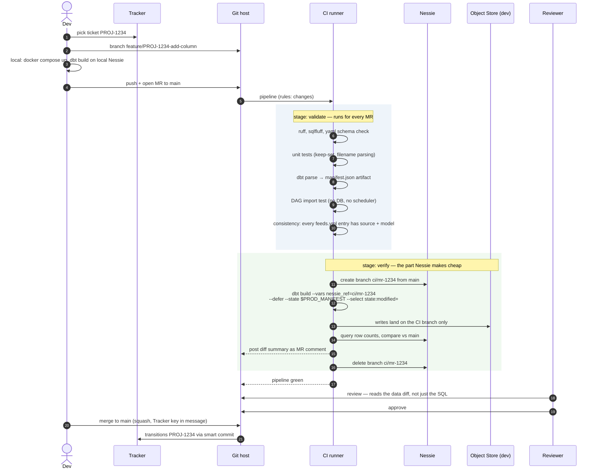
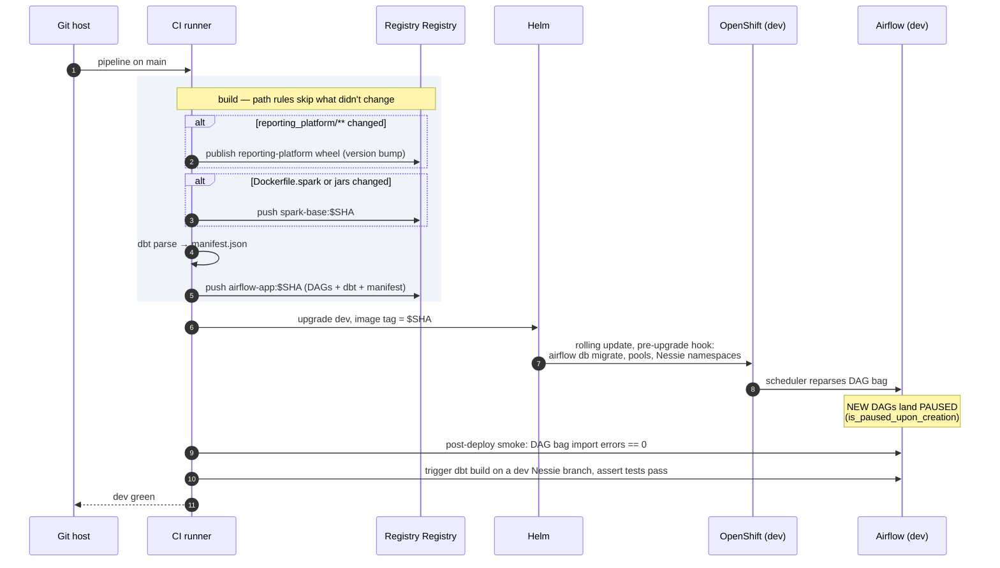
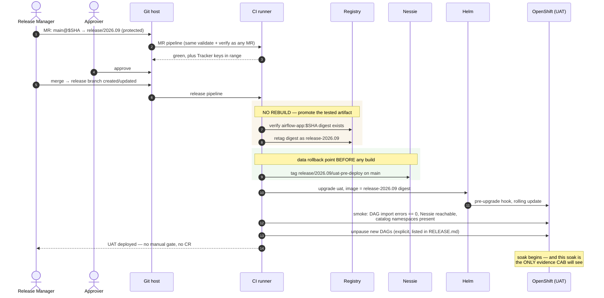
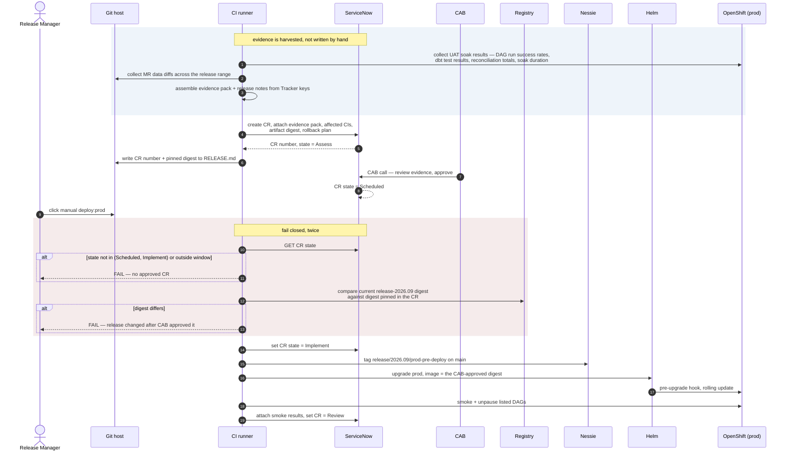
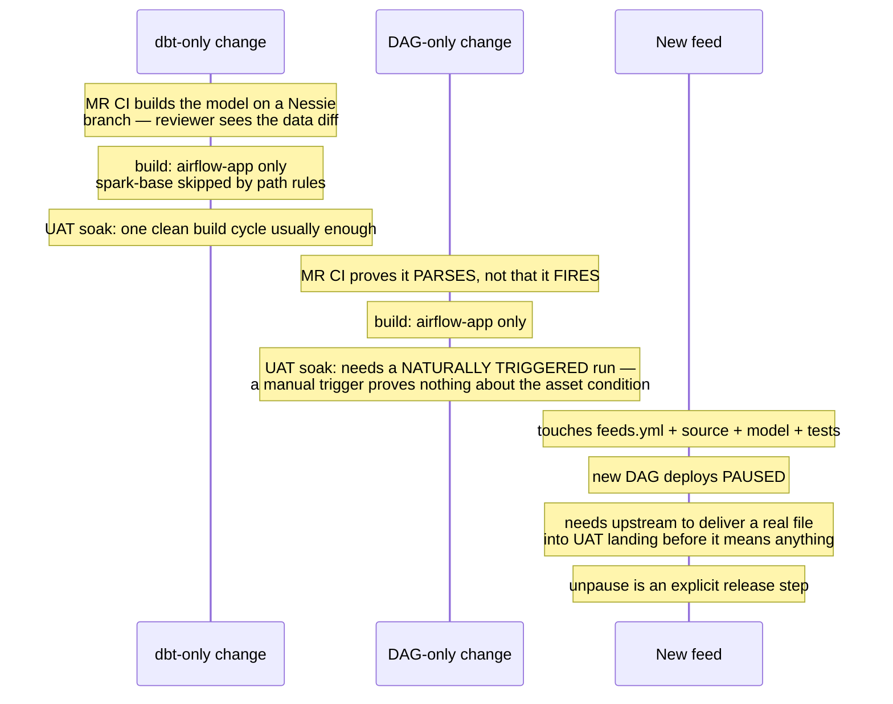

# Development and Deployment Process

Covers the path from a Tracker ticket to production for the two change types
that dominate day-to-day work: **dbt model changes** and **Airflow DAG changes**.

Governance context this is designed around:

- feature branches per Tracker ticket, enforced
- merge review into `main`
- named release branches cut off `main`, protected — changes only via approved MR
- **UAT is gated by that approved MR alone**
- **CAB sign-off, automated through ServiceNow, gates UAT → prod**

---

## 1. Why dbt and Airflow changes are not the same risk

Treating them identically is the mistake to avoid. They fail differently, they
are verifiable to different depths in CI, and — crucially — they roll back
differently.

| | dbt model change | Airflow DAG change |
|---|---|---|
| Primary risk | wrong numbers | job doesn't run, or runs wrong |
| CI can prove | model compiles, tests pass **against real data** on an ephemeral Nessie branch | DAG imports, graph is acyclic, assets resolve, callables unit-test |
| CI cannot prove | performance at prod volume | that the trigger condition actually fires |
| Detection | dbt test, at build time | absence of a run — silent until someone asks where the report is |
| Rollback | revert code **and** reset Nessie ref | `helm rollback` |

**The asymmetry that matters most:** a dbt change is verifiable to a much
greater depth before merge than an Airflow change is, because Nessie lets CI
build the real models over real data at zero blast radius. An Airflow trigger
condition, by contrast, is only truly proven by an arrival happening. That is
what the UAT soak period is for, and why a DAG change should not be cut into a
release the same day it merges.

---

## 2. Feature branch and merge request



Two things worth calling out in that flow.

**`--defer --state $PROD_MANIFEST --select state:modified+`** means CI builds
only the changed models and their descendants; everything upstream resolves to
the existing production tables. A one-model change does not rebuild the estate.
This requires publishing the prod `manifest.json` as a CI package artifact
after each production deploy — do that from day one, because retrofitting it
means a period with no baseline.

**The data diff in the MR comment** is the review artifact that matters. A
reviewer approving a dbt change from SQL alone is guessing. Row counts, null
counts and control-total deltas against `main` turn the review into something
evidential. This is a capability the legacy ETL/stored-procedure estate never had and
is worth building properly rather than as an afterthought.

---

## 3. Merge to main, and the dev deploy



**New DAGs must deploy paused.** With DAGs generated from `feeds.yml`, adding a
feed creates a DAG that would otherwise start polling the landing prefix the
moment it appears — and in an environment holding production data, that means
an unreviewed ingest. `is_paused_upon_creation=True` plus a deliberate unpause
step is the safe default. This is a specific hazard of dynamic DAG generation
and easy to miss.

---

## 4. Release branch → UAT

**Gate: an approved MR into the release branch. No CAB.**

`release/2026.09` is a protected branch. It cannot be pushed to directly — the
initial cut and every subsequent fix arrive as an MR from `main`, and merging
that MR is what deploys UAT. The approval on the MR *is* the control.



Because there is no CAB here, UAT deployment is cheap and can happen often.
That is the right shape: iterate in UAT, gate hard at prod.

It does mean the release branch is **long-lived and mutable** for the duration
of the release. Each fix MR redeploys UAT and produces a new artifact digest —
which matters a great deal once a prod CR exists (see §5).

---

## 5. UAT → Prod: the CAB gate



### The digest check is the control that actually matters

With UAT ungated, fix MRs land on the release branch freely — including after
the CR has been raised. Nothing stops someone merging a fix on Thursday for a
CR that CAB approved on Wednesday, and then prod deploys an artifact no one
reviewed. **The governance is only real if the pipeline compares the digest at
deploy time against the digest recorded in the CR and refuses on mismatch.**

Handle a legitimate late fix explicitly: the pipeline should push the CR back
to `Assess` with a note whenever the release branch moves after CR creation, so
the drift is visible in ServiceNow rather than discovered at the deploy job.
Cheap to build, and it is the difference between an audit trail and a
plausible-looking one.

### Soak duration is now a real gate

UAT is the only place a change is observed before CAB sees it. So the soak
requirement needs a stated minimum — at least one full arrival cycle for every
feed touched, and for a DAG change, at least one cycle where the trigger fired
naturally rather than by manual trigger. Manually triggering a DAG proves the
tasks work; it does not prove the asset condition fires, which is the thing
most likely to be wrong.

Put the minimum in `RELEASE.md` and have the evidence job assert it, otherwise
it becomes whatever the calendar allows.

### Rollback is two commands, in both environments

`helm rollback` restores the **image**. It does not un-write the tables.

```bash
helm rollback platform-airflow -n platform-prod
# and
nessie ref main --assign --to release/2026.09/prod-pre-deploy
```

Miss the second and you have a rolled-back deployment still serving the numbers
you rolled back to avoid. Rehearse it once in dev — 2am is a bad time to
discover the second command.

---

## 6. Where each change type spends its time



## 7. Practical rules

1. **Never rebuild for a release.** Retag the digest that passed CI on `main`.
2. **Pin the digest in the CR, and check it at prod deploy time.** This is the
   only thing preventing an unreviewed artifact reaching prod under an approved
   CR.
3. **Fail closed on the ServiceNow check.** An unreachable governance system is
   not an approval.
4. **The CR number lives in `RELEASE.md`** on the release branch, so the audit
   trail is reconstructable from git alone.
5. **Tag Nessie before every deploy**, UAT and prod, even for DAG-only changes.
6. **New DAGs deploy paused; unpausing is a listed release step.**
7. **A DAG change needs a naturally triggered UAT run before CAB.**

## 8. Open questions worth deciding deliberately

- **Hotfix path.** Straight to the release branch by MR gets to UAT quickly,
  but the merge-back to `main` is what people forget, and the next release then
  silently regresses the fix. A CI check that every release-branch commit has a
  corresponding `main` ancestor closes it — worth building before the first
  hotfix rather than after.
- **Release granularity.** One release bundling dbt and DAG changes means one
  CAB, but a prod rollback reverts both. Given how differently they fail, there
  is a case for separate release trains. Not obviously right — it doubles the
  CAB load, which is the expensive part — but it should be a decision rather
  than a default.
- **How long UAT holds a release.** Longer soak means better evidence for CAB
  but a longer-lived mutable release branch and more digest churn. Somewhere
  around one full week of arrivals is the usual balance point; worth setting
  explicitly since nothing else forces it.
