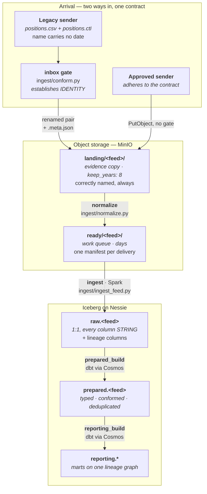
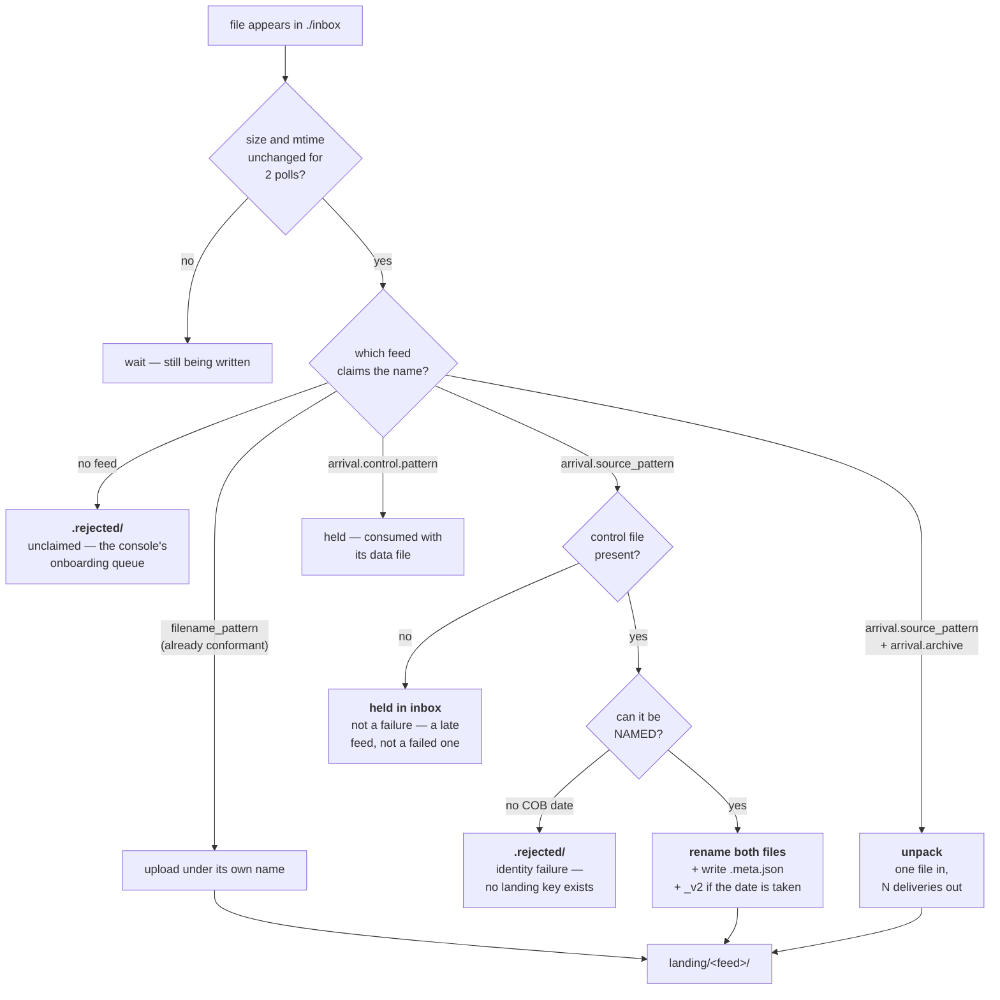
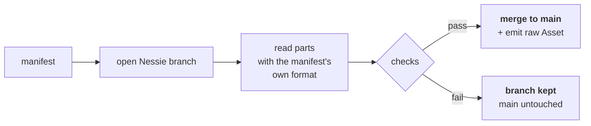
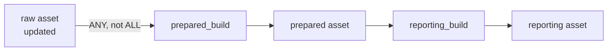

# The feed pipeline, end to end

One delivered file, from the moment it appears to the moment a reporting table
can be queried. Every stage names the code that does it, so this document can
be checked rather than believed.

Read [ARCHITECTURE.md](ARCHITECTURE.md) first for *why* the platform is shaped
this way; this is *what happens*, in order.

---

## The whole path



Everything from `raw` onwards happens **on a Nessie branch and merges to
`main` only if its tests pass** — write-audit-publish. A failed build leaves
its branch for inspection and `main` exactly as it was.

---

## 1. Arrival

`landing/` has a **contract**: every object in it is correctly named and
classified, so `Feed.parse_filename` answers for every delivery and landing
retention can date every object. Two ways to satisfy it.

**An approved sender** writes a conformant name straight into the bucket and
touches none of the code below. This is every feed in `feeds.yml` today.

**A legacy sender** goes through the inbox, which makes the delivery
conformant. A feed opts in with an `arrival:` block.



**The inbox establishes identity, not integrity.** Which source system, which
feed, which COB date, which version — everything needed to name the file.
It does *not* check the row count or the checksum; those are
`delivery.control`'s job and run at ingest, once, for every delivery however it
arrived. See
[DECISIONS.md#the-inbox-is-the-conformance-gate](DECISIONS.md#the-inbox-is-the-conformance-gate).

**The delivery is the data file and its control file together**, so the gate
renames and promotes both. `landing/` therefore holds the same pair whichever
way the delivery arrived, and the stages below cannot tell the difference.

**A zip is a transport wrapper, not a delivery**, so the gate unpacks it and
lands the members as ordinary deliveries — one inbox file in, N deliveries
out. The container is never landed; the metadata records its name, size and
md5 so what arrived stays provable. Every object in `landing/` is therefore
something Spark can read directly.

## 2. `landing/` — the evidence copy

Immutable, kept for `keep_years` (8 in the default profile, 1 in `dev`), swept by
`reporting_platform/retention/landing.py`. Three kinds of object live here, and
retention dates each differently:

| Object | Dated by |
|---|---|
| `TRADE_20260801.csv` | `parse_filename` on its own name |
| `TRADE_20260801.ctl` | the delivery sibling whose stem its `delivery.control.pattern` matches |
| `TRADE_20260801.csv.meta.json` | strip the suffix, then `parse_filename` |

An object it cannot date is **kept and counted**, never deleted on a guess.

## 3. `normalize` — one delivery becomes one manifest

`ingest/normalize.py`. Cheap, idempotent, no Spark. Writes one JSON manifest
per delivery into `ready/<feed>/` recording the three things every downstream
reader was otherwise re-deriving: **which COB date**, **which objects hold
the rows**, and **how to read them**.

| Delivery kind | What normalize does |
|---|---|
| plain CSV (`kind: file`) | manifest only — `parts` points straight back into `landing/`, nothing is copied |
| zip | nothing — unpacked at the gate, so normalize only ever sees plain files |
| gated (`delivery.control`) | waits for the control file; reads `row_count` and `md5` out of it |

`reconcile()` gives every landed object a manifest on demand, which is what
makes `ready/` a **derived index** rather than a queue someone must remember to
fill — a file pushed straight into the bucket is never stranded.

Writing a manifest is also the moment the delivery is recorded in the
**delivery registry** (`reporting_platform/registry/`, Postgres `platform`):
one row saying what arrived, when, how big, what it hashed to, the name the
upstream used and the column contract it was read against. Best-effort — a
failed registry write is logged, never fatal — because
`registry reconcile` rebuilds the whole thing from `landing/` and `ready/` with
the same code. It records **observations only**; whether a delivery was
ingested stays derived from raw's own `_source_file`. See
[DECISIONS.md#the-registry-records-observations-not-verdicts](DECISIONS.md#the-registry-records-observations-not-verdicts).

## 4. `ingest` — raw, on a branch

`ingest/ingest_feed.py`, run through `scripts/_spark_task.py` as a subprocess
so the JVM cannot zombie-reap the Airflow task.



Raw stays **1:1 with the delivery**: same rows, same values, everything
`STRING`. Only identifiers are normalised (`source_columns`). Six lineage
columns are added alongside — `_source_file` per part, then `_cob_date`,
`_ingest_ts`, `_file_version`, `_row_number` and `_batch_id`.

Three checks, all of which abandon the branch rather than publish:

- **`expected_min_rows`** — a floor, catching a truncated delivery. Every feed.
- **`declared_row_count`** — an equality check, for a feed whose control file
  states the count.
- **`declared_md5`** — a checksum, catching a file truncated or re-encoded in
  transit that still has the right *number* of rows.

`_source_file` is the **part's** key, and `already_ingested` derives the
"what have we loaded" ledger from the raw table itself — never a separate
control table, which is the drift the legacy `stg` tables suffered.

## 5. `prepared_build` and `reporting_build` — dbt, on a branch

Both DAGs are **rendered by Astronomer Cosmos**, one Airflow task per dbt
model, derived from the dbt project on every parse. Adding a model needs no DAG
edit.



Triggering is **asset-based, not cron**. `prepared_build` fires when *any* raw
asset updates, so no feed waits for another; `any_of()` is load-bearing,
because a bare list of assets would mean ALL.

Each build follows the same shape: `open_branch` → a task group holding one
`*_run` task per model plus a single `dbt_test` (`TestBehavior.AFTER_ALL`) →
`publish`, which merges to `main` and emits the layer's asset. A failure routes
to `keep_failed_branch` instead, so the branch survives for inspection.

| Layer | What it does |
|---|---|
| `prepared` | cast, trim, null-normalise, deduplicate on the business key; the layer where types first exist |
| `reporting` | marts, `ref()`-ing the shared prepared spine so they cannot disagree with each other |

---

## Where a delivery can stop, and what happens

| Stage | Failure | Result |
|---|---|---|
| inbox | no feed claims the name | `quarantine/` + a `registry.rejection` row, and `.rejected/` — surfaced in the console's unclaimed queue |
| inbox | two feeds claim the name | same, classed `ambiguous` — a configuration error, never guessed |
| inbox | control file not here yet | **held**, silently, retried next poll |
| inbox | cannot determine a COB date | quarantined and `.rejected/` — it cannot be named, so it cannot land |
| normalize | control file not beside it in landing | `awaiting_control`, INFO — picked up by the next poll |
| normalize | unreadable / unroutable object | counted and skipped; one bad file never blocks the rest |
| ingest | below `expected_min_rows` | branch kept, `main` untouched |
| ingest | row count or md5 disagrees with the control file | branch kept, `main` untouched |
| build | any dbt test fails | branch kept, `main` untouched |

**Nothing that fails is deleted, and nothing that fails reaches `main`.**

## Lifetimes

| Prefix / layer | Kept | Rebuildable from |
|---|---|---|
| `inbox/.processed/` | until removed by hand | — |
| `landing/` | `keep_years` — 10 by default, and ≥ the longest published-tag window | nothing — this is the evidence |
| `quarantine/` | `keep_years` — 10 by default | nothing — what was refused, kept |
| `ready/` | days | `landing/`, by re-running normalize |
| `raw` | recent business days + month-ends | `landing/` |
| `prepared` / `reporting` | per `retention.yml` | the layer below, by rebuilding |

`ready/` being a **cache** is a property to protect: the moment something in
it cannot be reconstructed from `landing/`, it has quietly become a third copy
of the data.

## Driving it

```powershell
# what normalize produced, and what is pending
docker compose exec -T airflow python -m scripts._spark_task pending fo_trade

# bulk ingest everything outstanding (safe to re-run)
docker compose exec airflow python -m scripts.bulk_ingest

# drop a file in ./inbox and watch it go
docker compose up -d inbox
docker compose exec -T inbox python -m reporting_platform.ingest.inbox --dry-run

# the feed console — add a feed, land it, watch the builds
docker compose up -d feed-ui     # http://localhost:8082
```

## See also

- [ADDING-A-FEED.md](ADDING-A-FEED.md) — the five files a new feed touches
- [DELIVERY-SHAPES.md](DELIVERY-SHAPES.md) — zips, control files, awkward deliveries
- [RETENTION.md](RETENTION.md) — what is deleted, when, and what refuses to be
- [DECISIONS.md](DECISIONS.md) — why each of the above is the way it is
